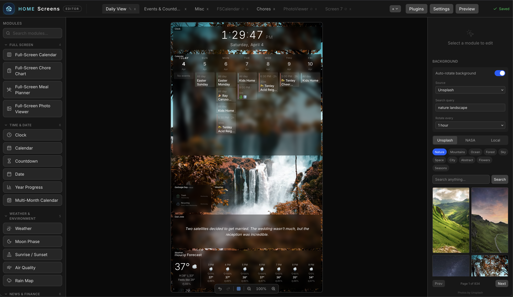
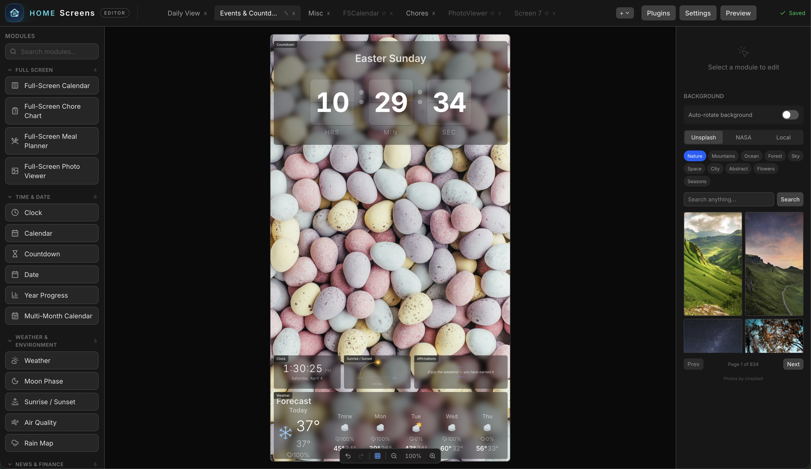
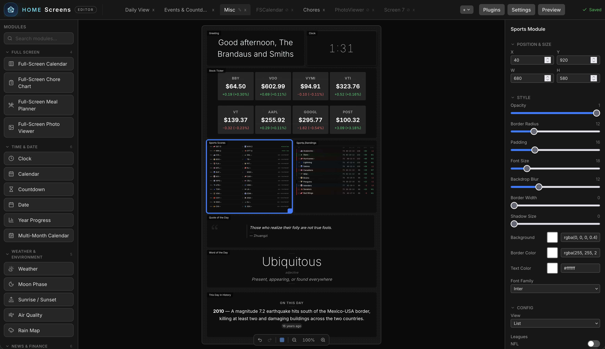

<p align="center">
  
</p>

<p align="center">
  <a href="https://discord.gg/KafmFuSNU"></a>
</p>

# Home Screens

An open-source smart display system built with Next.js. Runs on a Raspberry Pi in Chromium kiosk mode — a fully self-hosted, web-based replacement for Dakboard and MagicMirror.

## Screenshots







## Features

- **44 built-in modules** — clock (18 views), calendar, weather (8 views), countdown, dad jokes, text (rich with gradient/marquee), image, video (library file, direct URL, or YouTube link), quote, todo, sticky note, greeting, news, stock ticker, crypto, word of the day, this day in history, moon phase, sunrise/sunset, photo slideshow (photos, videos, or both), QR code (custom + WiFi), year progress, traffic/commute, sports scores, air quality, todoist, rain map, multi-month calendar, garbage day, standings (12 leagues), affirmations (4 views), date (5 views), display control (touch widget for wake/sleep/brightness/navigation), meal planner (5 views), chore chart (5 views), iframe, icon (Font Awesome picker), shape & divider (15 views), and 6 fullscreen modules — fullscreen calendar (8 views), fullscreen weather (5 views), fullscreen news (2 views), fullscreen chore chart, fullscreen meal planner, and fullscreen photo viewer
- **Drag-and-drop editor** — visually arrange modules on a configurable canvas
- **Multi-screen rotation** — cycle through screens with 8 transition effects
- **Multi-display hub-and-spoke** — one hub Pi can drive several physical displays, each with its own screens, dimensions, rotation, and active profile; spoke Pis are adopted from the editor and can be targeted individually from `/remote`
- **9 weather providers** — OpenWeatherMap, WeatherAPI, Pirate Weather, NOAA (free, US), Open-Meteo (free, global), Yr.no (free, global), SMHI (free, Nordic), Met Office (free, UK), Environment Canada (free, Canada)
- **Plugin system** — extend with custom modules via runtime-loaded plugins, installable from a URL or uploaded bundle ([template](https://github.com/home-screens/home-screens-plugin-template), [example](https://github.com/home-screens/home-screens-plugin-standings))
- **Profile system** — named screen groups with schedule-based auto-activation
- **Remote display control** — wake, sleep, brightness, navigation, and alerts via HTTP
- **Visual timers & routines** — start a quick timer or a saved routine (get dressed, brush teeth, shoes on) from your phone and it takes over the display with one of 4 kid-friendly countdown views, step-by-step, with an optional chime and a celebration at the end
- **Touch-friendly display** — swipe left or right to change screens, tap a calendar event for its details, tap chores done, all on the display itself
- **Per-module scheduling** — show or hide modules by day of week and time window
- **Conditional module visibility** — show or hide any module based on live values published by plugins (e.g. a Home Assistant sensor), with and/or/not condition logic in the editor
- **Google Calendar, iCloud + iCal** — display events from Google Calendar (OAuth device flow), your iCloud calendars (sign in with an app-specific password, contact birthdays included), or any iCal/ICS feed
- **Background management** — upload images and videos, browse Unsplash or NASA APOD, pull from an Immich library or iCloud shared album, or import hand-picked photos from Google Photos, with auto-rotation
- **Per-module styling** — opacity, blur, colors, fonts, border radius, padding
- **System management** — upgrade, rollback, backup/restore, power control, and network settings (WiFi scan/connect, IP/hostname, diagnostics) from the UI
- **Raspberry Pi kiosk** — one-command setup with boot splash, auto-login, and display orientation
- **Password-protected editor** — optional authentication for the configuration interface
- **Multi-language UI** — ships in 7 languages: English, German, French, Spanish, Dutch, Brazilian Portuguese, and Danish; date and number formatting can be locked to a separate locale
- **Opt-in update notifications** — toggle a per-tag toast in the editor and banner on `/remote` when a newer release is on GitHub
- **No cloud required** — all data stored locally as JSON, no accounts or external services needed

## Quick Start

### Raspberry Pi — pre-built image

The fastest path. Flash the latest `.img.xz` from [Releases](https://github.com/home-screens/home-screens/releases) with Raspberry Pi Imager, drop a `wifi.txt` on the boot partition if you are not on Ethernet, and power on. Up in 2 to 3 minutes with no terminal. Step-by-step in [Getting Started](https://homescreens.dev/docs/getting-started).

Images ship for major and minor releases. For a patch release, or an existing Pi OS install, use the script below.

### Raspberry Pi — install script

Built for [Raspberry Pi OS Lite 64-bit (Trixie)](https://www.raspberrypi.com/software/operating-systems/). Desktop also works.

```bash
curl -fsSL https://raw.githubusercontent.com/home-screens/home-screens/main/scripts/install.sh | bash
```

Or clone first if you would rather read the script before you run it. From a clone, the options are:

```bash
sudo apt install git
git clone https://github.com/home-screens/home-screens.git

# Raspberry Pi OS Lite (default)
~/home-screens/scripts/install.sh

# Raspberry Pi OS with Desktop
~/home-screens/scripts/install.sh --desktop

# Custom port (default is 3000)
~/home-screens/scripts/install.sh --port 8080

# Pin a specific release tag instead of the latest
~/home-screens/scripts/install.sh --version v1.3.0

# Take the defaults instead of prompting for display settings
~/home-screens/scripts/install.sh --non-interactive

# Display-only spoke (no Node, kiosk only, points at a hub Pi)
~/home-screens/scripts/install.sh --display-only --backend http://home-screens.local:3000
```

Every flag works with the piped form too, using `bash -s --`:

```bash
curl -fsSL https://raw.githubusercontent.com/home-screens/home-screens/main/scripts/install.sh | bash -s -- --desktop
```

The script installs Node.js 22, Chromium, system dependencies, creates the systemd service, and configures the kiosk with display orientation. Reboot to start:

```bash
sudo reboot
```

### Local Development

```bash
git clone https://github.com/home-screens/home-screens.git
cd home-screens
npm install
npm run dev
```

Then visit:
- `http://localhost:3000/editor` — configure your screens
- `http://localhost:3000/display` — fullscreen display view

## Configuration

All API keys and credentials are managed through the editor UI at **Settings > API keys**. No `.env.local` file needed. Configuration is stored as a single JSON file (`data/config.json`) — no database.

### Google Calendar

Uses **OAuth 2.0 Device Flow** — authorize from any device, no redirect URI required:

1. [Google Cloud Console](https://console.cloud.google.com) > **APIs & Services > Credentials** > Create OAuth Client ID
2. Application type: **TVs and Limited Input devices**
3. Enter Client ID and Secret in **Settings > API keys**
4. Enable the **Google Calendar API** in APIs & Services > Library
5. **Settings > Calendar > Sign in with Google** — enter the code at `google.com/device`

### iCloud Calendar

Sign in with an **app-specific password** — no public sharing links needed:

1. Create an app-specific password at [account.apple.com](https://account.apple.com) > **Sign-In and Security > App-Specific Passwords**
2. In **Settings > Calendar > iCloud Accounts**, add your Apple ID and the app-specific password (multiple accounts supported)
3. Pick which calendars to show — Apple's calendar colors carry over, and you can add a birthdays calendar built from your contacts

### iCal Feeds

Add any iCal/ICS URL in **Settings > Calendar** — works with Outlook, Fastmail, and any service that provides an ICS subscription URL.

## Multi-Display Setup

Home Screens runs in two modes. A normal install is a single Pi that serves and renders its own display — nothing changes for that case, and the rest of this section is optional.

For more than one screen, pick one Pi as the **hub** (the one running Next.js) and install additional **spoke** Pis as kiosks pointed at it. Each display owns its own screens, dimensions, rotation, and active profile — a portrait kitchen touchscreen and a landscape living-room TV can coexist on one hub without squashing each other.

### Add a spoke Pi

On the new Pi:

```bash
sudo apt install git
git clone https://github.com/home-screens/home-screens.git

# Install kiosk only — no Node.js, no server
~/home-screens/scripts/install.sh --display-only --backend http://home-screens.local:3000

# Or pin a specific display ID instead of the auto-generated one
~/home-screens/scripts/install.sh --display-only --backend http://hub:3000 --display-id kitchen
```

The `--display-only` flag installs just Chromium, labwc, wtype, wlr-randr, and fonts — no Node.js, no release tarball. The Pi auto-generates a display ID from its hostname (e.g. `home-screens-hysd`) unless you pass `--display-id`. Reboot and it will boot straight to a "Connecting…" splash, then auto-launch into the real display URL the moment the hub answers.

### Adopt the spoke

On the hub, open the editor and go to **Settings > Per display > All displays**. Any spoke that's powered on and pointed at this hub shows up in the unadopted list — click to adopt it, give it a name, and pick its resolution and rotation. The display appears in the editor's **Display Switcher** pill in the toolbar so you can flip between which display you're editing, and in the sidebar's **Per display** group as its own drill-down page with Overview and Overrides sub-tabs.

Each display card has an **Edit screens** shortcut, an online/offline dot driven by live heartbeats, and the spoke's reported viewport — including its source IP — so you can tell which physical Pi is reporting at a glance.


## Managing the Pi

### SSH Access (Pre-Built Image)

| | |
|---|---|
| **Hostname** | `home-screens.local` |
| **Username** | `hs` |
| **Password** | `screens` |

```bash
ssh hs@home-screens.local
passwd  # change the default password
```

### Service Management

```bash
sudo systemctl start home-screens     # start the server
sudo systemctl stop home-screens      # stop server + kiosk
sudo systemctl status home-screens    # check status
journalctl -u home-screens -f         # view logs
```

### Backups

The editor has built-in backups at **Settings > Backups & data**. For a copy off the Pi:

```bash
# Settings, screens, keys, chores, meals, timers, plugins
scp -r hs@home-screens.local:/opt/home-screens/current/data/ ./hs-backup/

# Uploaded photos and videos live outside data/
scp -r hs@home-screens.local:/opt/home-screens/current/public/backgrounds/ ./hs-backup/
```

Copy whole directories rather than picking out files. Some data is split across more files than you would guess: chore definitions and chore completions are separate, so grabbing only `chores.json` leaves every earned point behind. [Configuration](https://homescreens.dev/docs/configuration) lists every file and what writes it.

### Custom Port

Default is **3000**. Change during install (`--port 8080`) or afterward:

```bash
echo 8080 > /opt/home-screens/current/data/port.conf
bash /opt/home-screens/current/scripts/upgrade.sh setup-system
sudo reboot
```

### Display Resolution

From the editor: **Settings > Screen** — adjust width, height, and rotation.

From SSH:

```bash
nano /opt/home-screens/current/data/kiosk.conf
# DISPLAY_MODE="1920x1080"
# DISPLAY_TRANSFORM="90"   (90=portrait CW, 270=portrait CCW, 180=inverted)
sudo reboot
```

### Forgot Password

```bash
home-screens-reset-password
```

Home Screens then opens without a password, and a new one can be set in
Settings > Security. On installs that predate the command, deleting the file
does the same thing:

```bash
rm /opt/home-screens/current/data/auth.json
```

## Documentation

Full documentation at **[homescreens.dev/docs](https://homescreens.dev/docs)**

- [Getting Started](https://homescreens.dev/docs/getting-started) — installation and setup
- [Editor Guide](https://homescreens.dev/docs/editor) — visual editor walkthrough
- [Modules](https://homescreens.dev/docs/modules) — overview of the 44 built-in modules
- [Module Reference](https://homescreens.dev/docs/module-reference) — every setting, default value, and allowed option for each module
- [Backgrounds](https://homescreens.dev/docs/backgrounds) — uploads, Unsplash, NASA APOD, Immich, iCloud, rotation
- [Profiles & Scheduling](https://homescreens.dev/docs/profiles) — automation and time-based layouts
- [Remote Control](https://homescreens.dev/docs/remote-control) — the phone remote: display control, chores, meals, timers, photos
- [Multi-Display](https://homescreens.dev/docs/multi-display) — hub-and-spoke setup for driving several displays from one Pi
- [Voice Control](https://homescreens.dev/docs/voice-control) — drive displays, chores, and grocery lists from Home Assistant voice
- [Raspberry Pi](https://homescreens.dev/docs/raspberry-pi) — kiosk deployment
- [Networking](https://homescreens.dev/docs/networking) — reverse proxy, remote access, multi-display
- [Troubleshooting](https://homescreens.dev/docs/troubleshooting) — common issues and fixes
- [API Reference](https://homescreens.dev/docs/api) — all endpoints
- [Configuration](https://homescreens.dev/docs/configuration) — JSON schema reference
- [Plugins](https://homescreens.dev/docs/plugins) — custom module development
- [Development](https://homescreens.dev/docs/development) — architecture and contributing
- [FAQ](https://homescreens.dev/docs/faq) — frequently asked questions

## Architecture

```mermaid
graph TB
    subgraph Clients
        Editor["Editor<br/>(browser)"]
        Display["Display(s)<br/>(1 hub or N spoke kiosks)"]
    end

    subgraph "Next.js Server (hub)"
        API["API Routes"]
        ConfigAPI["/api/config"]
        DisplaysAPI["/api/displays<br/>(read-only registry)"]
        DisplayAPI["/api/display/*<br/>(commands + status)"]
        SecretsAPI["/api/secrets"]
        PluginProxy["/api/plugins/proxy"]
        StatusMap["statusMap<br/>(in memory)"]
    end

    subgraph "Local Storage"
        Config["data/config.json"]
        Secrets["data/secrets.json"]
        Meals["data/meals.json"]
        Plugins["data/plugins/"]
        Tokens["data/plugin-tokens/"]
    end

    subgraph "External Services"
        Weather["Weather Providers<br/>(OWM, WeatherAPI, Pirate Weather,<br/>NOAA, Open-Meteo, Yr.no, SMHI,<br/>Met Office, Environment Canada)"]
        ESPN["ESPN<br/>(scores, standings)"]
        Google["Google<br/>(Calendar, Routes)"]
        Other["RSS, CoinGecko,<br/>Yahoo Finance, etc."]
    end

    Editor -- "Zustand store<br/>PUT /api/config<br/>(adoption writes here)" --> ConfigAPI
    Editor -- "GET registry +<br/>unadopted Pis" --> DisplaysAPI
    Editor -- "queue commands" --> DisplayAPI
    ConfigAPI -- "read / write" --> Config
    DisplaysAPI -- "read" --> Config
    Display -- "GET /api/config<br/>(filtered per display)" --> ConfigAPI
    Display -- "poll commands<br/>POST status + viewport" --> DisplayAPI
    DisplayAPI -- "heartbeats stay in RAM,<br/>never touch config.json" --> StatusMap
    DisplaysAPI -. "merges live status" .-> StatusMap
    API -- "read keys" --> Secrets
    API -- "read / write" --> Meals
    SecretsAPI -- "read / write" --> Secrets
    PluginProxy -- "load manifest" --> Plugins
    PluginProxy -- "read" --> Tokens
    PluginProxy -- "inject keys + tokens" --> Other
    API --> Weather
    API --> ESPN
    API --> Google
    API --> Other
```



## Tech Stack

- Next.js 16 / React 19 (App Router)
- Tailwind CSS v4
- @dnd-kit (drag-and-drop)
- Zustand (editor state)
- Vitest (testing)

## API Routes

Every API route is a server-side proxy, so credentials never reach the browser. See the [API Reference](https://homescreens.dev/docs/api) for the full endpoint list.

## Adding a Module

A module is a component, a registry entry, and an E2E fixture. Full walkthrough in the [Development docs](https://homescreens.dev/docs/development).

Or build it as a [plugin](https://homescreens.dev/docs/plugins) — no core changes required.

## License

[MIT](LICENSE)
