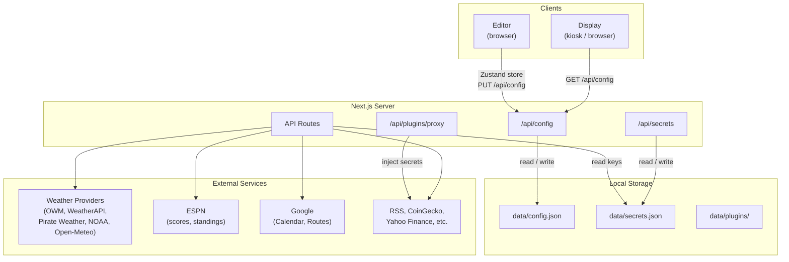

<p align="center">
  
</p>

# Home Screens

An open-source smart display system built with Next.js. Runs on a Raspberry Pi in Chromium kiosk mode — a fully self-hosted, web-based replacement for Dakboard and MagicMirror.

## Screenshots


## Features

- **34 built-in modules** — clock (18 views), calendar, weather (8 views), countdown, dad jokes, text (rich with gradient/marquee), image, quote, todo, sticky note, greeting, news, stock ticker, crypto, word of the day, this day in history, moon phase, sunrise/sunset, photo slideshow, QR code (custom + WiFi), year progress, traffic/commute, sports scores, air quality, todoist, rain map, multi-month calendar, garbage day, standings (12 leagues), affirmations (4 views), date (5 views), meal planner (5 views), chore chart (5 views), and iframe
- **Drag-and-drop editor** — visually arrange modules on a configurable canvas
- **Multi-screen rotation** — cycle through screens with 8 transition effects
- **5 weather providers** — OpenWeatherMap, WeatherAPI, Pirate Weather, NOAA (free), and Open-Meteo (free)
- **Plugin system** — extend with custom modules via runtime-loaded plugins ([template](https://github.com/home-screens/home-screens-plugin-template), [example](https://github.com/home-screens/home-screens-plugin-standings))
- **Profile system** — named screen groups with schedule-based auto-activation
- **Remote display control** — wake, sleep, brightness, navigation, and alerts via HTTP
- **Per-module scheduling** — show or hide modules by day of week and time window
- **Google Calendar + iCal** — display events from Google Calendar (OAuth device flow) or any iCal/ICS feed
- **Background management** — upload images, browse Unsplash, or use NASA APOD with auto-rotation
- **Per-module styling** — opacity, blur, colors, fonts, border radius, padding
- **System management** — upgrade, rollback, backup/restore, and power control from the UI
- **Raspberry Pi kiosk** — one-command setup with boot splash, auto-login, and display orientation
- **Password-protected editor** — optional authentication for the configuration interface
- **No cloud required** — all data stored locally as JSON, no accounts or external services needed

## Quick Start

### Raspberry Pi

Built for [Raspberry Pi OS Lite 64-bit (Trixie)](https://www.raspberrypi.com/software/operating-systems/). Desktop also works.

```bash
git clone https://github.com/home-screens/home-screens.git

# Raspberry Pi OS Lite (default)
~/home-screens/scripts/install.sh

# Raspberry Pi OS with Desktop
~/home-screens/scripts/install.sh --desktop

# Custom port (default is 3000)
~/home-screens/scripts/install.sh --port 8080
```

The script installs Node.js 22, Chromium, system dependencies, creates the systemd service, and configures the kiosk with display orientation. Reboot to start:

```bash
sudo reboot
```

### Local Development

```bash
git clone https://github.com/home-screens/home-screens.git
cd home-screens
npm install
npm run dev
```

Then visit:
- `http://localhost:3000/editor` — configure your screens
- `http://localhost:3000/display` — fullscreen display view

## Configuration

All API keys and credentials are managed through the editor UI at **Settings > Integrations**. No `.env.local` file needed. Configuration is stored as a single JSON file (`data/config.json`) — no database.

### Google Calendar

Uses **OAuth 2.0 Device Flow** — authorize from any device, no redirect URI required:

1. [Google Cloud Console](https://console.cloud.google.com) > **APIs & Services > Credentials** > Create OAuth Client ID
2. Application type: **TVs and Limited Input devices**
3. Enter Client ID and Secret in **Settings > Integrations**
4. Enable the **Google Calendar API** in APIs & Services > Library
5. **Settings > Calendar > Sign in with Google** — enter the code at `google.com/device`

### iCal Feeds

Add any iCal/ICS URL in **Settings > Calendar** — works with Outlook, Apple iCloud, Fastmail, and any service that provides an ICS subscription URL.

## Managing the Pi

### SSH Access (Pre-Built Image)

| | |
|---|---|
| **Hostname** | `home-screens.local` |
| **Username** | `hs` |
| **Password** | `screens` |

```bash
ssh hs@home-screens.local
passwd  # change the default password
```

### Service Management

```bash
sudo systemctl start home-screens     # start the server
sudo systemctl stop home-screens      # stop server + kiosk
sudo systemctl status home-screens    # check status
journalctl -u home-screens -f         # view logs
```

### Backups

Your data lives in `data/` (`/opt/home-screens/current/data/` on the Pi):

| File | Contents |
|---|---|
| `config.json` | Screen layouts, module settings, display configuration |
| `secrets.json` | API keys (weather, Unsplash, Todoist, TomTom, etc.) |
| `auth.json` | Editor password hash and session secret |
| `google-tokens.json` | Google Calendar OAuth tokens |

The editor has built-in backups at **Settings > Data**, but for a full backup:

```bash
# Copy off the Pi
scp hs@home-screens.local:/opt/home-screens/current/data/config.json ./
scp hs@home-screens.local:/opt/home-screens/current/data/secrets.json ./
```

### Custom Port

Default is **3000**. Change during install (`--port 8080`) or afterward:

```bash
echo 8080 > /opt/home-screens/current/data/port.conf
bash /opt/home-screens/current/scripts/upgrade.sh setup-system
sudo reboot
```

### Display Resolution

From the editor: **Settings > Display** — adjust width, height, and rotation.

From SSH:

```bash
nano /opt/home-screens/current/data/kiosk.conf
# DISPLAY_MODE="1920x1080"
# DISPLAY_TRANSFORM="90"   (90=portrait CW, 270=portrait CCW, 180=inverted)
sudo reboot
```

### Forgot Password

```bash
rm /opt/home-screens/current/data/auth.json
sudo systemctl restart home-screens
```

### SD Card Longevity

Writes are minimized automatically: journal in RAM, zram swap, tmpfs for temp dirs, config written only on save.

## Documentation

Full documentation at **[homescreens.dev/docs](https://homescreens.dev/docs)**

- [Getting Started](https://homescreens.dev/docs/getting-started) — installation and setup
- [Editor Guide](https://homescreens.dev/docs/editor) — visual editor walkthrough
- [Modules](https://homescreens.dev/docs/modules) — all 34 modules and their options
- [Backgrounds](https://homescreens.dev/docs/backgrounds) — uploads, Unsplash, NASA APOD, rotation
- [Profiles & Scheduling](https://homescreens.dev/docs/profiles) — automation and time-based layouts
- [Configuration](https://homescreens.dev/docs/configuration) — JSON schema reference
- [Raspberry Pi](https://homescreens.dev/docs/raspberry-pi) — kiosk deployment
- [Networking](https://homescreens.dev/docs/networking) — reverse proxy, remote access, multi-display
- [API Reference](https://homescreens.dev/docs/api) — all endpoints
- [Plugins](https://homescreens.dev/docs/plugins) — custom module development
- [Development](https://homescreens.dev/docs/development) — architecture and contributing
- [Troubleshooting](https://homescreens.dev/docs/troubleshooting) — common issues and fixes
- [FAQ](https://homescreens.dev/docs/faq) — frequently asked questions

## Architecture



## Tech Stack

- Next.js 16 / React 19 (App Router)
- Tailwind CSS v4
- @dnd-kit (drag-and-drop)
- Zustand (editor state)
- Framer Motion (screen transitions)
- Vitest (testing)

## API Routes

All API routes are server-side proxies that keep credentials off the client.

| Route | Methods | Description |
|---|---|---|
| `/api/config` | GET, PUT | Read/write screen configuration |
| `/api/calendar` | GET | Google Calendar / iCal event proxy |
| `/api/calendars` | GET | List available Google Calendars |
| `/api/weather` | GET | Weather data (5 providers) |
| `/api/geocode` | GET | Location geocoding |
| `/api/jokes` | GET | Dad jokes proxy |
| `/api/quote` | GET | ZenQuotes daily quote |
| `/api/news` | GET | RSS feed parser |
| `/api/stocks` | GET | Yahoo Finance stock prices |
| `/api/crypto` | GET | CoinGecko crypto prices |
| `/api/history` | GET | This day in history |
| `/api/backgrounds` | GET, POST, DELETE | Background image management |
| `/api/backgrounds/directories` | GET, POST, DELETE | Background directory management |
| `/api/unsplash` | GET, POST | Unsplash photo search and download |
| `/api/nasa` | GET, POST | NASA APOD and image library |
| `/api/traffic` | GET | Traffic/commute times (Google Routes / TomTom) |
| `/api/sports` | GET | Live sports scores (ESPN) |
| `/api/standings` | GET | League standings (ESPN, 12 leagues) |
| `/api/air-quality` | GET | Air quality and UV index |
| `/api/todoist` | GET | Todoist tasks |
| `/api/rain-map` | GET | RainViewer precipitation tiles |
| `/api/chores` | GET, POST | Chore chart completions |
| `/api/holidays` | GET | Public holidays by country |
| `/api/time` | GET | Server time |
| `/api/image-proxy` | GET | External image proxy |
| `/api/secrets` | GET, PUT | API key management |
| `/api/display/*` | GET, POST | Remote display control |
| `/api/auth/*` | GET, POST | Authentication (password + Google OAuth) |
| `/api/system/*` | GET, POST, DELETE | System management (version, upgrade, rollback, backups, power, stats) |
| `/api/plugins/*` | GET, POST, PUT, DELETE | Plugin registry, install, proxy, secrets |

## Adding a Module

1. Create a component in `src/components/modules/`
2. Add the type to `ModuleType` in `src/types/config.ts`
3. Define its config interface in `src/types/config.ts`
4. Add a default size in `src/lib/constants.ts`
5. Register it in `src/lib/module-registry.ts`
6. Add a dynamic import in `src/lib/module-components.ts`
7. Add an editor config section in `src/components/editor/PropertyPanel.tsx`
8. (Optional) Create an API route in `src/app/api/` if external data is needed

Or build it as a [plugin](https://homescreens.dev/docs/plugins) — no core changes required.

## License

[MIT](LICENSE)
