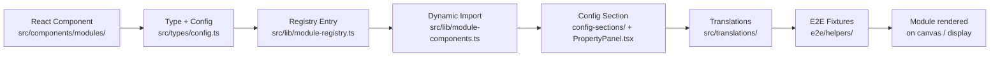
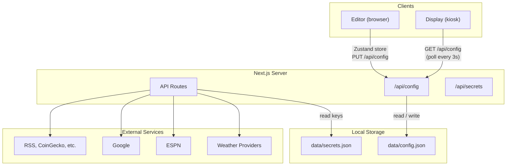

## Project Structure

```
src/
  app/
    (display)/display/       # Fullscreen kiosk view
    (editor)/editor/         # Configuration editor
    (auth)/login/            # Login page
    (remote)/remote/         # Remote control + chore tracking
    api/                     # API routes (see API Routes section below)
  components/
    modules/                 # All 43 module components + ModuleWrapper
    display/                 # ScreenRotator, ScreenRenderer, SleepOverlay
    editor/                  # Canvas, palette, property panel, settings, backgrounds
    ui/                      # Shared UI primitives (Button, Slider, Toggle, ColorPicker)
  hooks/                     # Custom React hooks
  i18n/                      # i18n runtime (provider, loader, manifest, formatters)
  lib/                       # Core logic (config, weather, calendar, registry, etc.)
  stores/                    # Zustand state management
  translations/              # One folder per locale: core, editor, modules, remote, weather
  types/                     # TypeScript type definitions
data/                        # All runtime state; never committed
  config.json                # Live configuration file
  secrets.json               # API keys
  meals.json                 # Meal planner state + shared settings
  todo-state.json            # Interactive todo tap state
  icloud-accounts.json       # iCloud CalDAV credentials
  plugins/                   # Installed plugin bundles + installed.json
  plugin-secrets/            # Per-plugin secret stores
  plugin-tokens/             # Per-plugin auth tokens
public/
  backgrounds/               # Uploaded background images
e2e/                         # Playwright suite + fixture registries
scripts/                     # Install, deploy, and management scripts
website/                     # Marketing site + these docs (separate Next.js app)
```

The `@/` import prefix resolves to `src/` (tsconfig `paths`, mirrored in `vitest.config.ts`), so `@/lib/config` means `src/lib/config`.

## Architecture

### Route Groups

The app uses Next.js route groups to separate concerns:

- `(display)` — no layout chrome, just the fullscreen display
- `(editor)` — includes toolbar, sidebars, and editor controls
- `(auth)` — login and authentication pages
- `(remote)` — mobile remote control and chore tracking

### Module System

There are currently ** modules** organized into  categories:

| Category | Modules |
|---|---|
| **Full Screen** | fullscreen-calendar, fullscreen-chore-chart, fullscreen-meal-planner, fullscreen-photo |
| **Time & Date** | clock, calendar, countdown, year-progress, multi-month, date |
| **Weather & Environment** | weather, moon-phase, sunrise-sunset, air-quality, rain-map |
| **News & Finance** | news, stock-ticker, crypto, sports, standings |
| **Knowledge & Fun** | dad-joke, quote, word-of-day, history |
| **Personal** | todo, sticky-note, greeting, todoist, garbage-day, affirmations, meal-planner, chore-chart |
| **Health & Fitness** | *(no built-ins; reserved for plugins such as Strava and Garmin. The palette hides the category while it is empty.)* |
| **Media & Display** | text, image, video, photo-slideshow, qr-code, iframe, icon, shape, display-control |
| **Travel** | traffic |

The module system follows a registry pattern. Each module is a self-contained unit, wired together in sequence:



Each module requires eight pieces, plus an optional API route:

1. React Component (`src/components/modules/MyModule.tsx`)
2. ModuleType union member (`src/types/config.ts`)
3. Config interface (`src/types/config.ts`)
4. Registry entry (`src/lib/module-registry.ts`) — this is also where `defaultSize` lives
5. Dynamic import (`src/lib/module-components.ts`)
6. Config section component + a `CONFIG_SECTIONS` entry (`src/components/editor/config-sections/`, `PropertyPanel.tsx`)
7. Translation keys in every shipped locale (`src/translations/<locale>/editor.json` and `modules.json`)
8. E2E fixture rows (`e2e/helpers/`) — the `meta` coverage checks fail the suite for any module type without them
9. (Optional) API route (`src/app/api/*/route.ts`)

Steps 1 through 9 are walked through in [Adding a New Module](#adding-a-new-module) below.

### State Management

- **Editor** — Zustand store (`src/stores/editor-store.ts`) manages config, selection, and dirty state
- **Display** — server-fetched config with client-side polling (no Zustand needed)

### Data Flow



#### Editor Flow

User interactions flow through the editor canvas, which dispatches actions to the Zustand store. The store saves changes via `PUT /api/config`, which writes to `data/config.json`.

#### Display Flow

The display reads `data/config.json` via `GET /api/config` (polling every 3 seconds). The `ScreenRotator` selects the active screen, the `ScreenRenderer` lays out modules, and each `ModuleWrapper` renders its individual module component.

When `config.displays` is populated, the global `config.screens` is no longer the source of truth: each `DisplayNode` in that array owns its own `screens`, dimensions, and optionally its own profiles, and the server filters the config down to the requesting display before rendering. With `config.displays` unset the app stays in single-display mode and reads `config.screens` directly. See [Multi-Display](/docs/multi-display).

#### API Data Flow

Module components use the `useFetchData` hook to call API routes (e.g., `/api/weather`, `/api/calendar`), which in turn fetch data from external services (OpenWeatherMap, Google, ESPN, etc.).

### Weather Provider Abstraction

Weather data comes from a pluggable provider system in `src/lib/weather/`.

The `WeatherProvider` interface defines four methods: `getHourly`, `getForecast`, and optionally `getMinutely` and `getAlerts`.  implementations exist:

- **OpenMeteoProvider** — free, no API key, global coverage; provides hourly and forecast data (the default)
- **NOAAProvider** — free, no API key, US only; provides hourly, forecast, and alerts
- **YrProvider** — free, no API key, global; provides hourly and forecast data (Norwegian Meteorological Institute)
- **SMHIProvider** — free, no API key, Nordic coverage; provides hourly and forecast data (Swedish Meteorological and Hydrological Institute)
- **EnvCanadaProvider** — free, no API key, Canadian cities; provides hourly and forecast data (ECCC citypage feeds)
- **MetOfficeProvider** — **requires an API key** (free tier on the Met Office DataHub Site-Specific API), UK coverage; provides hourly and forecast data. The constructor throws when no key is configured.
- **OpenWeatherMapProvider** — requires API key; provides hourly and forecast data
- **WeatherAPIProvider** — requires API key; provides hourly and forecast data
- **PirateWeatherProvider** — requires API key; provides hourly, forecast, minutely precipitation, and alerts (Dark Sky replacement)

The factory function `createWeatherProvider(provider, apiKey)` instantiates the correct one. The key-less providers cover most use cases: Open-Meteo is the global default; NOAA, Yr.no, SMHI, and Environment Canada provide higher-accuracy regional forecasts within their coverage areas. The key-required providers (Met Office, OpenWeatherMap, WeatherAPI, and Pirate Weather) round out the options when a user wants a specific data source. Pirate Weather is the only one that provides minutely precipitation data.

A fresh install does not ship coordinates: `settings.weather.latitude` and `longitude` seed to `0`, so the weather module returns nothing useful until a location is set in the editor's weather settings. The default provider needs no key, but it does need a location.

### API Routes

API routes live in `src/app/api/*/route.ts` and serve as server-side proxies for external services. There are 111 route files; the table below groups them by area. Request and response shapes for each one are documented on the [API Reference](/docs/api) page, which is the authoritative list.

| Category | Routes | Purpose |
|---|---|---|
| **Auth** | `auth/login`, `auth/logout`, `auth/status`, `auth/password`, `auth/display-token`, `auth/revoke-sessions`, `auth/google`, `auth/ip-allowlist` | Authentication, session management, display token, IP allowlist |
| **System** | `system/status`, `system/version`, `system/build-id`, `system/changelog`, `system/power`, `system/upgrade`, `system/rollback`, `system/backups`, `system/update-notification` | Server management and deployment |
| **Config** | `config`, `secrets`, `backup`, `backup/reminder` | Read/write config, manage API keys, config backups |
| **Weather** | `weather`, `rain-map` | Weather data ( providers) and rain radar tiles |
| **Calendar** | `calendar`, `calendar/status`, `calendars`, `icloud/accounts`, `icloud/calendars`, `holidays` | Google Calendar events and per-source health, iCloud CalDAV accounts and calendars, holiday feeds |
| **Data** | `jokes`, `quote`, `news`, `history`, `stocks`, `crypto`, `sports`, `standings`, `todoist`, `air-quality`, `traffic`, `nasa` | External data proxies |
| **Family data** | `chores`, `rewards`, `meals`, `timers/routines`, `timers/session`, `todo/state`, `todo/toggle` | Local chore, reward, meal-plan, timer-routine, and interactive-todo state |
| **Displays** | `displays`, `display/[action]`, `display/hw-stats`, `display/console-log`, `display/kiosk-bundle`, `display/kiosk-bootstrap` | Display registry and heartbeats, remote control, hardware telemetry, log capture, kiosk self-update bundle for display-only spokes |
| **Plugins** | `plugins/registry`, `plugins/installed`, `plugins/install`, `plugins/install-external`, `plugins/manifest/*`, `plugins/bundle/*`, `plugins/asset/*`, `plugins/dev`, `plugins/migrate-config`, `plugins/proxy/*`, `plugins/secrets/*`, `plugins/settings/*`, `plugins/auth/*` | Plugin registry, install lifecycle, asset serving, API proxy, secrets, settings, server-side auth |
| **Network** | `system/network`, `system/network/wifi/*`, `system/network/hostname`, `system/network/ip`, `system/network/confirm`, `system/network/diagnostics` | WiFi scan and connect, hostname, static IP, and connectivity checks |
| **Photos** | `google-picker/auth`, `google-picker/session`, `google-picker/import`, `google-picker/status`, `immich/*`, `icloud/photos`, `icloud/import` | Google Photos Picker import, Immich and iCloud photo sources |
| **i18n** | `i18n/[locale]` | Serves locale dictionaries by namespace |
| **Utility** | `backgrounds`, `geocode`, `image-proxy`, `time`, `unsplash`, `immich` | Background images, geocoding, image proxying, server time, Unsplash and Immich photos |

### Display Control

Remote control uses a command queue pattern where the editor (or any HTTP client) pushes commands and the display polls to execute them.

**Command flow:** The client sends a POST request (e.g., `POST /api/display/wake`), which enqueues the command in memory. The display polls `GET /api/display/commands`, which drains the queue and returns pending commands. The display then executes each command locally.

**Status reporting:** The display periodically sends `POST /api/display/status` with its current state (screen index, screen name, display state, etc.). The editor can then read the display status via `GET /api/display/status`.

**Display targeting:** Every action resolves a target from `?display=<id>`, so the full form is `/api/display/<action>?display=<id>`. Command-enqueue actions accept `all` to broadcast to every display; `__default__` is the queue used by legacy single-display callers that omit the parameter. `status` and `profile` are per-display only and reject the broadcast keyword. Command queues are keyed by display id in `src/lib/display-commands.ts`, and heartbeats live in an in-memory `statusMap` rather than `config.json`, so status posts never contend with editor saves. See [Multi-Display](/docs/multi-display) for the rest.

### Auth System

An authentication layer (`src/lib/auth.ts`) protects the editor and API routes. Google OAuth device flow is used for Google Calendar integration via `auth/google`.

**Password auth:** The browser sends `POST /api/auth/login` with a password, and the API responds with a session cookie.

**Google OAuth device flow:** The browser requests a device code via `POST /api/auth/google/device`, which returns a `user_code` and `verification_url`. The user enters the code at `google.com/device`. The browser polls `PUT /api/auth/google/device` until the authorization is complete, at which point tokens are stored on disk.

### Profile & Schedule System

Profiles group screens together and can activate on a schedule. Individual screens and modules also support their own scheduling so they can show/hide by day and time independent of profiles.

**Profile structure:** Each profile has an `id`, `name`, a list of `screenIds`, and an optional `schedule` (with `daysOfWeek`, `startTime`, `endTime`, and `invert` fields).

**Screen schedule:** Each screen can define an optional `schedule` (same `ModuleSchedule` shape as profiles and modules). Scheduled-off screens are filtered out of the rotation pool *before* profile resolution, so a profile that explicitly references a hidden screen still skips it. If every screen has a schedule and none currently match, the rotator falls back to all enabled screens so the kiosk never goes blank.

**Module schedule:** Each module can define a schedule with `daysOfWeek` (0=Sun through 6=Sat), `startTime`, `endTime`, and an `invert` flag (hide during the window if true).

**Screen resolution order:** Screens are first filtered by their own schedules, then profile resolution runs against the remaining set. If a scheduled profile matches the current time, the first matching profile wins; otherwise the manually selected `activeProfile` is used; otherwise all (schedule-filtered) screens rotate. Within each visible screen, modules are then filtered by their individual schedules.

## Adding a New Module

### 1. Create the component

```tsx
// src/components/modules/MyModule.tsx
'use client'

interface MyModuleProps {
  config: { myOption: string }
}

export default function MyModule({ config }: MyModuleProps) {
  return <div>{config.myOption}</div>
}
```

The component receives its `config` object as a prop. It may also receive `weather`, `calendar`, `settings`, or location props. Which ones is decided by the `dataRequirements` array on your registry entry (step 3), not by a lookup table. `ScreenRenderer.tsx` reads that field to pass the matching props, and the same field drives prefetch.

User-visible strings belong in `src/translations/<locale>/modules.json` and are read with `useTranslate('modules')` from `@/i18n`, not hard-coded in the component. See step 6.

### 2. Add the type

In `src/types/config.ts`, add to the `ModuleType` union:

```typescript
export type ModuleType =
  | 'clock'
  | 'calendar'
  // ...
  | 'my-module'
```

And define the config interface:

```typescript
export interface MyModuleConfig {
  myOption: string
}
```

### 3. Add the registry entry

Built-in modules are literal entries in the `MODULE_DEFINITIONS` array in `src/lib/module-registry.ts`. Import your Lucide icon at the top of that file and add an object to the array, inside the block for your category:

```typescript
import { Sparkles } from 'lucide-react'

// ...inside const MODULE_DEFINITIONS: ModuleDefinition[] = [ ... ]
{
  type: 'my-module',
  label: 'My Module',
  icon: Sparkles,
  category: 'Personal',
  defaultConfig: { myOption: 'Hello' },
  defaultSize: { w: 400, h: 300 },
  // defaultStyle: { fontSize: 26 },      // optional style overrides
  // fillsCanvas: true,                   // optional: snaps to the full canvas on add
  // dataRequirements: ['weather'],       // optional: 'location' | 'weather' | 'calendar'
},
```

There is no `registerModule()` API to call. `registerPluginModule()` is exported, but it is for runtime-loaded plugins only; built-ins never use it.

`defaultSize` lives here, on the entry. It used to live in `src/lib/constants.ts`; that map is gone, and anything needing a module's default size calls `getModuleDefinition(type).defaultSize` so plugin-registered modules resolve through the same lookup.

The `label` field is a fallback used for plugin modules. Built-in labels come from the translation dictionaries instead; see step 6.

### 4. Add the dynamic import

In `src/lib/module-components.ts`:

```typescript
'my-module': dynamic(() => import('@/components/modules/MyModule')),
```

### 5. Add editor controls

Config controls are one small component per module type, under `src/components/editor/config-sections/`. Three edits:

**(a) Create the section component.** `AirQualityConfigSection.tsx` is the shortest model to copy. Props are `{ mod, screenId }`; read and write config with `useModuleConfig(mod, screenId)`, and label everything through `useTranslate('editor')` against `configSections.<type>.*` keys.

```tsx
// src/components/editor/config-sections/MyModuleConfigSection.tsx
'use client'

import { useModuleConfig } from '@/hooks/useModuleConfig'
import { useTranslate } from '@/i18n'
import type { ModuleInstance } from '@/types/config'

export function MyModuleConfigSection({ mod, screenId }: { mod: ModuleInstance; screenId: string }) {
  const t = useTranslate('editor')
  const { config: c, set } = useModuleConfig<{ myOption?: string }>(mod, screenId)

  return (
    <input
      value={c.myOption ?? ''}
      placeholder={t('configSections.my-module.myOption')}
      onChange={(e) => set({ myOption: e.target.value })}
    />
  )
}
```

**(b) Re-export it** from `src/components/editor/config-sections/index.ts`.

**(c) Register it** in `src/components/editor/PropertyPanel.tsx`:

```typescript
export const CONFIG_SECTIONS: Record<BuiltinModuleType, ConfigSectionFC> = {
  // ...
  'my-module': MyModuleConfigSection,
}
```

Step (c) is compiler-enforced: `CONFIG_SECTIONS` is an exhaustive `Record` keyed by `BuiltinModuleType`, so a module type added without an entry fails `npx tsc --noEmit` rather than silently rendering an empty property panel.

### 6. Add translations

Built-in module names and config labels come from the dictionaries, not from the registry `label`. Add:

- `registry.types.my-module` in `src/translations/<locale>/editor.json`, which is the name shown in the palette, property panel, canvas, and template picker
- any `configSections.my-module.*` keys your config section reads, also in `editor.json`
- any strings your display component renders, to `src/translations/<locale>/modules.json`

Do this for all  shipped locales. `src/i18n/manifest.ts` is the source of truth for which locales are registered. A missing key renders the raw dot path (`registry.types.my-module`) in the UI, and the `meta` E2E ratchets fail when a manifest locale is missing from a surface's i18n spec.

### 7. Add E2E coverage

The `meta` Playwright project holds coverage ratchets that fail the whole suite when a new module skips its registries. **Run it first**, because the failure output names the exact entries you need to add:

```bash
npx playwright test --project=meta
```

The registries it polices:

| Registry | File | Fails when |
|---|---|---|
| `MODULE_FIXTURES` | `e2e/helpers/module-fixtures.ts` | a built-in module type has no fixture row |
| `CONFIG_VARIANTS` | `e2e/helpers/config-variants/` | a config field has neither a variant row nor a reasoned `FIELD_DECISIONS` entry |
| `EXTRA_DISCRIMINATORS` | `e2e/meta/coverage.spec.ts` | a member of a mode-like string union goes untested |
| `EMPTY_STATE_FIXTURES` | `e2e/helpers/empty-state-fixtures.ts` | a component using `ModuleEmptyState` or `LocationRequired` has no row |
| `ROUTE_DECISIONS` | `e2e/meta/coverage.spec.ts` | a new API route is neither E2E-exercised, nor unit-tested, nor given a written reason |

If your module fetches data, also add a JSON fixture under `e2e/fixtures/module-data/` and a `stubKey` on your fixture row so `stubModuleData` serves it. Module data is fetched client-side, so the stub intercepts at the browser boundary and the suite makes zero real upstream calls. Modules backed by local data (chore-chart, meal-planner, todo) seed through their real APIs instead of stubbing.

The ratchets also fail on *stale* entries: a `ROUTE_DECISIONS` or `FIELD_DECISIONS` line that a real test now covers has to be deleted.

### 8. Add an API route (optional)

If your module needs external data, create a route:

```
src/app/api/my-data/route.ts
```

Then fetch it in your component using the `useFetchData` hook:

```tsx
const [data] = useFetchData('/api/my-data?param=value', 60000)
```

A new route needs test coverage of its own, or the `ROUTE_DECISIONS` ratchet from step 7 will fail.

## Custom Hooks

| Hook | Purpose |
|---|---|
| `useFetchData(url, interval)` | Polls an API endpoint at a set interval |
| `useModuleConfig(mod, screenId)` | Returns `{ config, set }` for one module instance; reads *and* writes config through the editor store |
| `useRotatingIndex(length, interval)` | Cycles through an array index on a timer |
| `useScaledFontSize(base, ratio)` | Calculates responsive font sizes |
| `useSleepManager(sleep, timezone)` | Manages display sleep/dim state. The second argument is the display timezone, used to evaluate sleep schedule windows against the same zone as screen and module schedules |
| `useDisplayCommands(handlers, displayId?)` | Polls for remote commands and reports display status. Passing `displayId` targets that display's queue and registers it with the hub |
| `useTZClock(timezone)` | Provides a live-updating `Date` for a given timezone |
| `useIdleCursor(seconds)` | Hides cursor after idle period, restores on mousemove |
| `useLiveConfig(screens, settings, profiles)` | Polls for config changes on the display |
| `useCanvasZoom()` | Manages editor canvas zoom/pan state with trackpad and keyboard support |
| `useUndoRedoShortcuts()` | Keyboard shortcuts for undo/redo (Cmd+Z, Cmd+Shift+Z) |
| `useAuthImage(src)` | Converts API-served image URLs to authenticated blob URLs |
| `useFocusTrap(ref)` | Traps keyboard focus within a modal or dialog |

`useLiveConfig` and `useAuthImage` live under `src/components/display/` rather than `src/hooks/`; everything else in the table is in `src/hooks/`.

## Setup

The repo sets a minimum npm version, not an exact one. `package.json` declares `"engines": { "node": ">=22", "npm": ">=11.6.3" }` and `.npmrc` sets `engine-strict=true`, so an npm below that floor stops the install with an error instead of a warning. Any newer npm works as-is.

Two reasons for the floor:

- npm 10 ignores the `cpu` and `os` fields on optional dependencies, so it downloads every platform's prebuilt binaries: roughly 114 extra packages of ARM, s390x and BSD builds this machine will never run. npm 11 filters them to the host platform, which matters most when building on a Raspberry Pi. Node 22 still bundles npm 10, so CI and the Pi upgrade scripts raise npm to the floor before installing.
- npm 11.6.2 specifically drops nested entries for transitive optional dependencies when it rewrites `package-lock.json`, which leaves a lockfile that every other npm rejects with `Missing: ... from lock file`. Fixed in 11.6.3, which is why that is the floor.

```bash
npm i -g npm@11.6.3   # only if `npm -v` reports something older
npm install
```

## Testing

```bash
npm run dev            # dev server
npm run build          # production build
npx tsc --noEmit       # typecheck, part of the pre-commit gate
npm run lint           # ESLint (flat config)
npm test               # all unit tests (Vitest)
npm run test:watch     # watch mode
npx vitest run src/lib/__tests__/config.test.ts   # a single test file

npm run build && npm run test:e2e     # full Playwright suite (needs a production build)
npx playwright test --project=meta    # coverage ratchets only, run this first
npx playwright test --project=editor  # one surface
```

Vitest runs in a `node` environment with the `@` → `src` alias mirrored from `tsconfig.json`. Every test file's working directory is sandboxed by `vitest.setup.ts`, so unit tests cannot write to the real `data/` or `public/` directories.

The E2E suite (`e2e/`, Playwright) boots each test worker against its own production server with a private `data/` sandbox, so it never touches your real config either. It is split into seven projects (`meta`, `smoke`, `editor`, `display`, `remote`, `chores`, and `auth`), each runnable on its own with `--project=<name>`. It covers every module type, config field, empty state, and locale via data-driven fixture registries; the `meta` coverage ratchets fail the suite if a new module, field, discriminator, empty state, or API route lacks a fixture or an explicit opt-out entry. Step 7 of [Adding a New Module](#adding-a-new-module) lists the registries.

## Website & Docs

The marketing site and this documentation live in `website/`, a separate Next.js app that static-exports to Cloudflare Pages.

```bash
cd website
npm install
npm run dev     # next dev --webpack
npm run build   # next build --webpack
```

The `--webpack` flag is **required**, not optional: the docs search index is built by a webpack loader (`website/src/markdoc/search.mjs`), which Turbopack cannot run, so a bare `next build` fails. Both scripts in `website/package.json` already carry it, so use them rather than calling `next` directly.

- Docs pages are Markdoc files at `website/content/docs/<slug>.md`, rendered by the `/docs/[slug]` route
- Blog posts live alongside them at `website/content/blog/<slug>.md`
- The sidebar order lives in `website/src/lib/docs-navigation.ts`
- Product counts (module count, category count, weather-provider count, locale count) come from `website/src/lib/stats.ts` and are written into pages as Markdoc variables, for example `$stats.moduleCount` in a Markdoc interpolation. Never hard-code these numbers in prose; a Vitest test in the main repo asserts the values against the live module registry, so a stale literal fails `npm test`.

## Scripts

| Script | Description |
|---|---|
| `scripts/install.sh` | Full Raspberry Pi setup |
| `scripts/start-display.sh` | Manual server + kiosk start |
| `scripts/rotate-display.sh` | Change screen orientation |
| `scripts/deploy.sh` | Production deployment |
| `scripts/release.sh` | Version release process |
| `scripts/upgrade.sh` | Download, deploy, and restart |
| `scripts/reporter.sh` | Per-Pi hardware telemetry posted to `/api/display/hw-stats`, run by `home-screens-reporter.service` and its timer |
| `scripts/emulate-install.sh` | Boot a Debian ARM64 image in QEMU, run `install.sh` against it, and verify the result |
| `scripts/check-config.mjs` | Validate `data/config.json` (`npm run config:check`) |
| `scripts/copy-font-awesome.mjs` | Copy Font Awesome assets into `public/`; runs automatically on `postinstall` |
