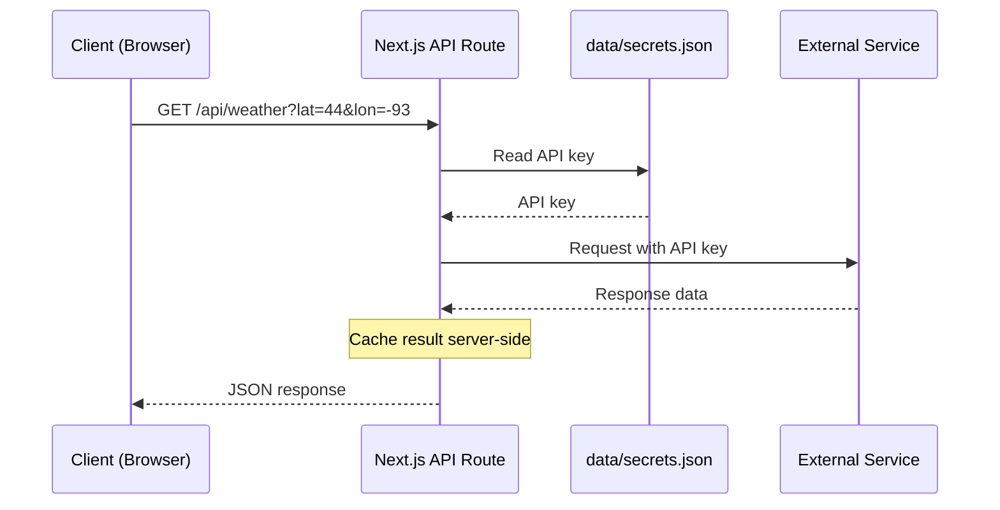

All API routes are served under `/api/`. They act as server-side proxies to protect API keys and avoid CORS issues. API keys and credentials are managed through the editor UI (Settings > API keys) and stored server-side; no `.env.local` file is needed.

All external API calls include **automatic retry with exponential backoff**. Transient failures (5xx errors, 429 rate limits, network errors, and timeouts) are retried up to 2 times with increasing delays (500ms base, capped at 5s). The `Retry-After` header is respected when present. Client errors (4xx) and caller-initiated aborts are not retried. Individual routes can opt out of retry when the request is non-idempotent (e.g. traffic route POST calls).



---

## Access

Most endpoints are protected, but **only once you set a password** in Settings > Security. On a fresh install with no password, every check described here does nothing and the whole API is open to anyone on your network. That is the default, and it is why the endpoints below say "requires a valid session" rather than "always requires a valid session".

There are three levels of protection:

| Level | What it accepts | Used by |
|---|---|---|
| Session | The `hs-session` cookie set by `POST /api/auth/login` | Endpoints that change settings or read credentials |
| Display | The session cookie **or** a display token | Everything a screen polls: config, weather, calendar, commands, chore data |
| Media | Display access **or** a signed `mt` token bound to one file | The routes that serve photos and videos into `` and `<video>` tags |

Endpoints below that say "requires a valid session" are the first level. Endpoints that say "display access" are the second, and a browser session works for those too.

A few endpoints are open at every level on purpose, and each one says so where it appears: `GET`/`POST /api/chores` and `GET`/`POST /api/rewards` (so the kid-facing `/chores` page keeps working when a password is set), `GET /api/plugins/registry`, `GET /api/system/build-id`, and `GET /api/plugins/auth/callback`.

### Using the display token

`GET /api/auth/display-token` returns the token (session required). Send it as a header:

```
Authorization: Bearer hs_abc123...
```

For bookmarkable links, the `/api/display/*` routes also accept the token as a `?token=` query parameter, for example `/api/display/wake?display=kitchen&token=hs_abc123...`. That shortcut is scoped to `/api/display/*` and nowhere else; every other endpoint needs the header or the session cookie. Query tokens end up in browser history and server logs, so use the header wherever you can send one.

If you have an IP allowlist configured with **Bypass authentication for trusted IPs** turned on, requests from those addresses clear display access with no token at all.

---

## Configuration

### GET /api/config

Returns the current screen configuration. Display access, so a screen can poll it with its token.

**Response:** `ScreenConfiguration` object (see [Configuration](/docs/configuration))

### PUT /api/config

Saves the screen configuration. Requires a valid session; unlike the `GET`, a display token is not enough to write config. Performs an atomic write (temp file + rename) to prevent corruption. Also syncs kiosk.conf for the kiosk launcher and applies display settings (rotation/resolution) immediately via wlr-randr when they change.

**Body:** `ScreenConfiguration` object

Three checks run before anything is written, each returning `400 { "error": "..." }`:

- The body must include a `screens` array and a `settings` object.
- If a `displays` registry is present it must pass validation: unique URL-safe IDs of 64 characters or less, at most 64 displays, at most 256 screens per display, and dimensions within the allowed range.
- Every screen schedule, module schedule, and module visibility condition must be well formed.

**Response:** The full `ScreenConfiguration` object as saved.

---

## Weather

### GET /api/weather

Fetches weather data from the configured provider. Supports  providers: OpenWeatherMap, WeatherAPI, Pirate Weather, NOAA, Open-Meteo, Yr.no, SMHI, Met Office, and Environment Canada. Results are cached for 5 minutes. Display access.

| Parameter | Type | Default | Description |
|---|---|---|---|
| `type` | string | `"both"` | `hourly`, `forecast`, or `both` |
| `provider` | string | from config | `openweathermap`, `weatherapi`, `pirateweather`, `noaa`, `open-meteo`, `yr`, `smhi`, `metoffice`, or `envcanada` |
| `lat` | number | from config | Latitude |
| `lon` | number | from config | Longitude |
| `units` | string | from config (`imperial`) | `metric` or `imperial` |

**Response:**
```json
{
  "hourly": [
    { "time": "2pm", "temp": 72, "icon": "sun", "precipitation": 0, "humidity": 45, "wind": 8, "feelsLike": 70 }
  ],
  "forecast": [
    { "day": "Mon", "date": "2026-03-09", "high": 75, "low": 55, "icon": "cloud-sun", "precipitation": 20, "humidity": 50, "wind": 12, "precipAmount": 0.1 }
  ],
  "minutely": [],
  "alerts": []
}
```

The example above is what `type=both` returns. With `type=forecast` only the `forecast` key is present, and with `type=hourly` only `hourly`. The `minutely` and `alerts` fields are included when the provider supports them (e.g. Pirate Weather).

If no location is set (in the query or in your weather settings), the route returns `400 { "error": "Missing required query params: lat, lon" }`.

---

## Calendar

### GET /api/calendar

Fetches a merged event stream from all configured sources — Google Calendar OAuth calendars, iCal/ICS feeds, **and** iCloud calendars (including the optional contact-birthdays source) — plus optional public holidays. Each iCloud calendar fails in isolation, so one broken calendar doesn't blank the rest. Returns 400 if no source is configured. Display access. Results are cached for 2 minutes.

| Parameter | Type | Default | Description |
|---|---|---|---|
| `calendarIds` | string | your configured Google calendars | Comma-separated calendar IDs |
| `timeMin` | string | now, rounded down to the minute | ISO 8601 start time |
| `timeMax` | string | `timeMin` plus your **days ahead** setting | ISO 8601 end time |

Values that can't be parsed as dates fall back to the defaults, and a `timeMax` at or before `timeMin` is reset to the default window. The span between them is capped at 400 days; anything wider is trimmed to that.

If every configured source fails at once, the route returns an error rather than caching an empty list, so a temporary outage doesn't blank your calendar for the next two minutes.

**Response:**
```json
[
  {
    "id": "event-id",
    "title": "Team Meeting",
    "start": "2026-03-08T10:00:00-06:00",
    "end": "2026-03-08T11:00:00-06:00",
    "allDay": false,
    "location": "Room 42",
    "calendarColor": "#4285f4",
    "sourceId": "ical-1",
    "sourceName": "Soccer Schedule"
  }
]
```

`title` and `allDay` are always present. `location`, `description`, `calendarColor`, `sourceId`, and `sourceName` are optional; `sourceId` and `sourceName` are how a client tells a feed's events apart from a Google calendar's.

### GET /api/calendars

Lists the authenticated user's Google Calendars (OAuth only — used by the editor's calendar picker). Requires a valid session.

**Response:**
```json
[
  { "id": "primary", "summary": "My Calendar", "backgroundColor": "#4285f4", "primary": true }
]
```

If Google isn't connected, this returns `403` with an `error` string explaining which of the three cases applies: no tokens saved yet, tokens saved without a refresh token, or a refresh that Google rejected.

---

## Holidays

### GET /api/holidays

Fetches public holidays for a country using the [Nager.Date API](https://date.nager.at/). Results are cached for 30 days. No API key required.

#### List available countries

Pass the `countries` query parameter (no value needed) to get the list of supported countries.

**Example:** `GET /api/holidays?countries`

**Response:**
```json
[
  { "countryCode": "US", "name": "United States" },
  { "countryCode": "DE", "name": "Germany" }
]
```

#### Get holidays for a country

| Parameter | Type | Default | Description |
|---|---|---|---|
| `country` | string | required | Two-letter country code (e.g. `US`, `DE`, `GB`) |
| `year` | number | current year | Year to fetch holidays for |

**Example:** `GET /api/holidays?country=US&year=2026`

**Response:** Array of `CalendarEvent` objects (only public holidays, not observances).
```json
[
  {
    "id": "holiday-US-2026-01-01",
    "title": "New Year's Day",
    "start": "2026-01-01",
    "end": "2026-01-02",
    "allDay": true,
    "sourceId": "holidays",
    "sourceName": "Public Holidays",
    "calendarColor": "#10b981"
  }
]
```

---

## Chores

### GET /api/chores

Returns chore completion records. Automatically purges entries older than 90 days. Public on the LAN with no authentication so the kid-facing `/chores` view works even when the editor password is set.

**Response:**
```json
{
  "completions": [
    {
      "choreId": "chore-1",
      "memberId": "member-1",
      "date": "2026-03-08"
    }
  ]
}
```

### POST /api/chores

Toggles a chore completion. If the completion already exists for the given choreId + memberId + date, it is removed; otherwise it is added. Public on the LAN (no session required) so kids can mark chores done from the `/chores` view.

**Body:**
```json
{
  "choreId": "chore-1",
  "memberId": "member-1",
  "date": "2026-03-08",
  "direction": "complete"
}
```

The `date` field must be a real `YYYY-MM-DD` calendar date within the last 90 days. Future dates, invalid calendar dates (e.g. `2026-02-30`), and dates outside the retention window are rejected with `400`. Toggling a chore with a non-zero point value also credits or debits the member's reward balance; if removing a past completion would drive the balance negative, the response includes a `warning` string explaining the deficit.

`direction` is optional. Omitted, the call is the flip described above. Set to `"complete"` or `"uncomplete"`, the call only ever moves the chore in that direction and is a no-op when it's already there — so a repeated "mark it done" (a voice assistant, a retried request) can never accidentally un-complete a chore and take the points back. Any other value is rejected with `400`.

**Response:**
```json
{
  "completions": [ ... ],
  "changed": true,
  "rewards": { "rewards": [ ... ], "balances": { "member-1": 122 }, "redemptions": [ ... ] },
  "warning": "..."
}
```

`changed` reports whether this call actually flipped anything — `false` means the directional request found the chore already in the requested state (and no points moved). `rewards` is the full updated reward state and is included whenever the toggled chore is worth more than zero points, so the client doesn't have to re-fetch `/api/rewards`. It is omitted for zero-point chores. `warning` is only present in the deficit case described above.

### GET /api/chores/today

Returns the **resolved** per-member chore list for one day — who actually owes what, with rotation (daily/weekly/schedule grids) and frequency rules already applied server-side, plus each chore's completion state. This is what the chore chart renders; use it instead of re-deriving assignments from `/api/chores/data`. Powers the "what chores does Alice have left?" question in the [Voice Control guide](/docs/voice-control). Display access.

| Parameter | Type | Description |
|---|---|---|
| `date` | string | Optional `YYYY-MM-DD`. Defaults to today (hub-local). Invalid or impossible dates return `400`. |

**Response:**
```json
{
  "date": "2026-08-03",
  "members": [
    {
      "id": "member-1",
      "name": "Alice",
      "chores": [
        { "id": "chore-1", "name": "Make bed", "points": 2, "timeOfDay": "morning", "completed": true }
      ]
    }
  ]
}
```

Every member appears, including those with no chores that day (empty `chores` array).

### GET /api/chores/data

Returns the shared chore member and chore definition data from `data/chores.json`. This is the source of truth used by the chore chart module, the fullscreen chore chart module, and the remote Chores tab. Display access.

**Response:**
```json
{
  "members": [
    { "id": "member-1", "name": "Alice", "emoji": "🦊", "color": "#f59e0b" }
  ],
  "chores": [
    {
      "id": "chore-1",
      "name": "Make bed",
      "emoji": "🛏️",
      "points": 2,
      "frequency": "daily",
      "daysOfWeek": [1, 2, 3, 4, 5],
      "timeOfDay": "morning",
      "assigneeIds": ["member-1"],
      "rotation": "fixed"
    }
  ]
}
```

### PUT /api/chores/data

Updates the shared chore member and definition data. Requires a valid session.

**Body:**
```json
{
  "members": [ ... ],
  "chores": [ ... ],
  "force": false
}
```

Both `members` and `chores` must be arrays. The full set replaces the existing data.

If **both** arrays are empty and there is existing data to lose, the write is refused with `409 { "error": "Refusing to overwrite non-empty chore data with empty payload. Send { force: true } to confirm." }`. Send `force: true` to go ahead anyway. Sending one empty array alongside a non-empty one is a normal write and is not blocked.

Removing a member here also clears their point balance and redemption history from the reward data, so the two stores don't drift apart.

**Response:** The saved `{ members, chores }` object.

---

## Meals

### GET /api/meals/data

Returns saved meals, weekly plan, grocery checked state, and shared meal-planner settings from `data/meals.json`. Accessible by the display (display token auth).

**Response:**
```json
{
  "savedMeals": [
    { "id": "meal-1", "name": "Tacos", "emoji": "🌮", "tags": ["quick"], "prepTime": 20, "difficulty": "easy" }
  ],
  "plan": [
    { "date": "2026-04-04", "slot": "dinner", "mealId": "meal-1" }
  ],
  "groceryChecked": ["tortillas"],
  "settings": {
    "enabledSlots": ["breakfast", "lunch", "dinner"],
    "weekStartDay": "monday",
    "defaultSlotTimes": { "breakfast": "07:30", "lunch": "12:00", "dinner": "18:00" },
    "timeFormat": "12h"
  }
}
```

The `plan` array uses ISO date strings (e.g. `"2026-04-04"`) for multi-week support. Entries older than 12 weeks are pruned on write.

### PUT /api/meals/data

Partial update — every writable field is optional, and omitted fields are preserved from the existing on-disk data. The request must include at least one of `savedMeals`, `plan`, `groceryChecked`, or `settings`, or the server returns `400`. Requires a valid session.

The entire read-modify-write cycle runs inside the meal-data store queue, so cross-surface writers (editor settings sheet, `/remote`, grocery checks) cannot interleave and silently lose each other's edits.

**Body (all fields optional):**
```json
{
  "savedMeals": [ ... ],
  "plan": [ ... ],
  "groceryChecked": [ ... ],
  "settings": { "enabledSlots": ["breakfast", "lunch", "dinner"], "weekStartDay": "monday", "defaultSlotTimes": { "dinner": "18:00" }, "timeFormat": "12h" },
  "force": false
}
```

When present, `savedMeals`, `plan`, and `groceryChecked` must be arrays. An empty-overwrite guard fires when every `savedMeals` / `plan` field present in the body is `[]` and the existing data is not empty; the write is refused with `409` and you can resend with `force: true` to override. If the body sends both fields and only one of them is empty, that is a normal write and the guard stays out of the way. Settings-only and grocery-only writes skip the guard entirely.

**Response:** The full `{ savedMeals, plan, groceryChecked, settings }` object after the write.

### GET /api/meals/grocery

Returns just the grocery checked state.

**Response:** `{ "groceryChecked": ["tortillas", "cheese"] }`

### GET /api/meals/grocery/list

Returns the **resolved** grocery list for the current week — ingredients aggregated from every meal planned this week, grouped by aisle, with each item's checked state. This is what the remote's Grocery tab shows; the aggregation runs server-side with the same generator, so external callers don't have to re-derive it from the meal plan. "Current week" follows the shared week-start meal setting. Powers "what's on the grocery list?" in the [Voice Control guide](/docs/voice-control). Display access.

**Response:**
```json
{
  "week": { "start": "2026-08-02", "end": "2026-08-08" },
  "categories": [
    { "category": "bakery", "items": [ { "name": "Tortillas", "amount": "12", "checked": false } ] }
  ],
  "total": 4,
  "checked": 1
}
```

### POST /api/meals/grocery

Toggles a grocery item's checked state. If the item is already checked, it is unchecked; otherwise it is checked. Display access — a display token works, so an automation or voice assistant can check items off. The item name is matched after trimming and lowercasing, so senders can use the display-cased name from `/api/meals/grocery/list`.

**Body:**
```json
{
  "item": "tortillas",
  "direction": "check"
}
```

`direction` is optional. Omitted, the call is the historical flip. Set to `"check"` or `"uncheck"`, the call only ever moves the item in that direction and is a no-op when it's already there — so a repeated voice "check off milk" can never silently un-check it. Any other value is rejected with `400`.

**Response:** `{ "groceryChecked": [...], "changed": true }` — `changed` reports whether this call actually flipped anything.

---

## Rewards

### GET /api/rewards

Returns reward definitions, point balances, and redemption history from `data/rewards.json`. Public on the LAN with no authentication so the `/chores` kid view can display balances and redemption history.

**Response:**
```json
{
  "rewards": [
    { "id": "reward-1", "name": "Ice Cream", "emoji": "🍦", "cost": 50, "description": "Pick any flavor", "memberIds": [], "enabled": true }
  ],
  "balances": { "member-1": 120 },
  "redemptions": [
    { "id": "r-1", "rewardId": "reward-1", "rewardName": "Ice Cream", "memberId": "member-1", "memberName": "Alice", "cost": 50, "redeemedAt": "2026-04-01T18:00:00.000Z" }
  ]
}
```

### POST /api/rewards

Redeems a reward for a member. Checks eligibility (member restriction) and sufficient point balance. Public on the LAN so the `/chores` view can redeem rewards without a session. Editing reward definitions and manual balance adjustments still live at `/api/rewards/data` and remain session-gated.

**Body:**
```json
{
  "rewardId": "reward-1",
  "memberId": "member-1"
}
```

**Response:** `{ "balances": { ... }, "redemptions": [ ... ] }` — the updated point balances for all members and the updated redemption history after the redeem. Reward definitions are not returned here (they didn't change); re-fetch them via `GET /api/rewards` if needed.

### PUT /api/rewards/data

Updates reward definitions (add, edit, remove rewards). Requires a valid session.

**Body:**
```json
{
  "rewards": [ ... ],
  "force": false
}
```

`rewards` must be an array. Sending an empty array when there are existing rewards is refused with `409 { "error": "Refusing to overwrite non-empty reward data with empty payload. Send { force: true } to confirm." }`; resend with `force: true` to clear the list on purpose.

**Response:** `{ "rewards": [...] }` (the saved reward definitions)

### POST /api/rewards/data

Manual point balance adjustment. Requires a valid session.

**Body:**
```json
{
  "memberId": "member-1",
  "amount": 10
}
```

Positive amounts credit points; negative amounts debit. Amount must be non-zero.

**Response:** `{ "balances": { ... } }` — only the updated balances map. Reward definitions and redemption history are unchanged by this endpoint, so they are not returned.

---

## Timers

Visual timers and routines, managed from the remote's Timers tab. Routines are family data like meals and chores — they live in `data/routines.json`, not in the display config. A running timer is a **session**: a snapshot of the steps plus epoch timestamps, so clients derive the countdown locally and editing a routine mid-run can't corrupt it. There is at most one active session household-wide.

### GET /api/timers/routines

Returns the saved routine list. Display access.

**Response:** `{ "routines": [ { "id": "...", "name": "...", "icon": "...", "view": "ring", "sound": true, "steps": [ { "id": "...", "label": "...", "icon": "...", "durationSec": 120, "waitForTap": true } ] } ] }`

`view` is one of `ring`, `face`, `cascade`, or `path`. A step with `waitForTap: true` holds at 0:00 with a "Done!" tap target instead of auto-advancing.

### PUT /api/timers/routines

Replaces the routine list wholesale (the list is capped at 50 and edited from a single form, so replace-the-list avoids partial-update merge rules). Validation is all-or-nothing: one bad routine rejects the whole write with `400`. An empty list is a legitimate write — it's how the last routine is deleted. Requires a valid session.

**Body:** `{ "routines": [ ... ] }` — same shape as the GET response.

### GET /api/timers/session

Returns the active session with elapsed auto-advancing steps already applied, or `{ "session": null }` when nothing is running. Displays poll this every few seconds and compute the live countdown locally from the returned timestamps, so poll latency only delays the start — it never affects countdown accuracy. Display access.

### POST /api/timers/session

Starts a session or controls the running one, selected by `action`:

- `start` — begin a timer. For a routine: `{ "action": "start", "kind": "routine", "routineId": "...", "targets": "all" }`. For a quick timer: `{ "action": "start", "kind": "quick", "durationSec": 300, "targets": "all" }`, with optional `view` and `sound`. `targets` is required and picks which displays the timer takes over: `"all"` or a non-empty array of display IDs. Starting while a session is already running replaces it — one active session at a time is the intended family-display behavior.
- `pause`, `resume` — pause and resume the countdown
- `skip` and `step-done` — the same transition (advance to the next step now); both names exist because remotes skip and touch displays tap Done
- `add-minute` — add a minute to the current step
- `cancel` — stop the session

Display access on purpose — touch kiosks post `step-done` when a kid taps Done. Every mutation runs through an atomic queue, so overlapping taps from multiple displays can't interleave.

**Response:** `{ "session": { ... } }` with the updated session.

---

## Authentication

### GET /api/auth/status

Returns whether password authentication is enabled, whether the current session is authenticated, whether a display token exists, and whether the caller is blocked by the optional IP allowlist. Open to anyone; the login page calls it before you sign in.

**Response:**
```json
{ "authEnabled": true, "authenticated": true, "hasDisplayToken": true, "ipRestricted": false }
```

`hasDisplayToken` is always `false` when no password is set, since there is nothing to protect. The `ipRestricted` field is `true` when the **Restrict access by IP** toggle is on and the caller's IP is not in the configured allowlist. The login page uses this to show an explanatory banner instead of a sign-in form, since no amount of correct credentials would let the caller through.

### POST /api/auth/login

Authenticates with a password. Sets a session cookie on success. Rate-limited to 5 failed attempts per 15-minute window, counted per caller IP. The limit is this endpoint's own; `POST /api/auth/password` keeps a separate count of the same size.

**Body:** `{ "password": "...", "rememberMe": false }`

| Field | Type | Default | Description |
|---|---|---|---|
| `password` | string | required | The authentication password |
| `rememberMe` | boolean | `false` | If `true`, session lasts 90 days instead of 30 |

**Response:** `{ "ok": true }` (with `Set-Cookie` header)

### POST /api/auth/logout

Clears the session cookie.

**Response:** `{ "ok": true }` (with `Set-Cookie` header clearing the session)

### POST /api/auth/password

Sets, changes, or disables the password. Requires a valid session if auth is already enabled.

**Body (set/change):** `{ "currentPassword": "...", "newPassword": "..." }`

**Body (disable):** `{ "currentPassword": "...", "action": "disable" }`

**Constraints:** Password must be at least 8 characters. A wrong `currentPassword` returns `401` and counts against this endpoint's own limit of 5 failed attempts per 15-minute window.

**Response:** `{ "ok": true, "authEnabled": true }`, with a `Set-Cookie` header carrying a fresh session. The disable path returns `{ "ok": true, "authEnabled": false }` and a `Set-Cookie` that clears the session instead.

### GET /api/auth/display-token

Returns the current display token used by the kiosk view and remote to authenticate API requests. Requires a valid session.

**Response:**
```json
{ "displayToken": "hs_abc123..." }
```

Returns `{ "displayToken": null }` if authentication is not enabled.

### POST /api/auth/display-token

Regenerates the display token. The previous token is immediately invalidated — the display must reload to pick up the new token. Requires a valid session.

**Response:**
```json
{ "displayToken": "hs_xyz789..." }
```

### POST /api/auth/revoke-sessions

Revokes all active sessions by bumping the session epoch. All users (including the caller) will need to log in again. Requires a valid session.

**Response:** `{ "ok": true }`

### GET /api/auth/ip-allowlist

Returns the current IP allowlist configuration along with the caller's detected IP (useful so an admin can see which address they should add before saving). Requires a valid session.

**Response:**
```json
{
  "allowlist": ["192.168.1.0/24", "10.0.0.5/32"],
  "bypassAuth": true,
  "restrictAccess": false,
  "callerIp": "192.168.1.42"
}
```

IPv4-mapped IPv6 addresses are normalized to IPv4 before being returned in `callerIp` (so `::ffff:127.0.0.1` becomes `127.0.0.1`). The feature is IPv4-only; IPv6 callers see their raw address and the restriction will block them.

### PUT /api/auth/ip-allowlist

Updates the IP allowlist configuration. Requires a valid session.

**Body:**
```json
{
  "allowlist": ["192.168.1.0/24", "10.0.0.5"],
  "bypassAuth": true,
  "restrictAccess": true,
  "force": false
}
```

| Field | Type | Required | Description |
|---|---|---|---|
| `allowlist` | string[] | yes | The addresses and ranges to trust |
| `bypassAuth` | boolean | yes | Let these addresses skip the password |
| `restrictAccess` | boolean | yes | Block every address that is not on the list |
| `force` | boolean | no | Save even if it would lock you out (see below) |

All three of `allowlist`, `bypassAuth`, and `restrictAccess` must be present and the right type, or the request is rejected with `400 { "error": "Invalid request body" }`.

Each entry is either a bare IPv4 address (matched as a single address, the same as `/32`) or CIDR notation with a prefix of 0–32. Leading-zero octets like `192.168.001.5` are rejected. A bad entry returns `400 { "error": "Invalid entry \"...\": ..." }`.

#### The lockout guard

Turning **Restrict access by IP** on while your own address is missing from the list would lock you out of the editor with no way back in short of editing files on the Pi. To stop that, the route checks your address before it saves anything. If `restrictAccess` is `true`, the list is not empty, and your address does not match any entry, nothing is written and you get:

```json
{
  "error": "Lockout warning",
  "reason": "your_ip_not_in_allowlist",
  "callerIp": "192.168.1.42"
}
```

with status `409`. The `callerIp` in that response is the address you'd need to add. If you meant it (you're setting this up from a different machine than the one you'll use later, for instance), resend the same body with `force: true` and it saves.

**Response:** `{ "saved": true }` on success. An `ip_allowlist_change` audit event is recorded on every successful save.

---

## Google Auth

Google sign-in uses the **OAuth 2.0 device flow** exclusively — there is no browser redirect endpoint, since the display itself is a kiosk with no keyboard. The editor calls `POST /api/auth/google/device` to get a `user_code`, the user enters that code at `google.com/device` on their phone or laptop, and the editor polls `PUT /api/auth/google/device` until Google returns a token.

### GET /api/auth/google/status

Returns whether Google OAuth is currently authenticated and whether client credentials are configured. Requires a valid session.

**Response:**
```json
{ "connected": true, "credentialsConfigured": true }
```

### DELETE /api/auth/google/status

Disconnects the Google OAuth integration. Requires a valid session.

**Response:** `{ "connected": false }`

### POST /api/auth/google/device

Initiates the OAuth 2.0 device flow. Returns a user code for the user to enter at the verification URL. Requires a valid session.

**Response:**
```json
{
  "verification_url": "https://www.google.com/device",
  "user_code": "ABCD-EFGH",
  "device_code": "...",
  "expires_in": 1800,
  "interval": 5
}
```

### PUT /api/auth/google/device

Polls for device flow token completion. Requires a valid session.

**Body:** `{ "device_code": "..." }`

---

## Secrets

### GET /api/secrets

Returns which API keys are configured (as booleans, not the actual values). Requires a valid session.

**Response:**
```json
{
  "openweathermap_key": true,
  "weatherapi_key": false,
  "pirateweather_key": false,
  "metoffice_key": false,
  "unsplash_access_key": true,
  "nasa_api_key": false,
  "todoist_token": false,
  "google_maps_key": false,
  "tomtom_key": false,
  "google_client_id": true,
  "google_client_secret": true,
  "google_web_client_id": false,
  "google_web_client_secret": false,
  "github_token": false,
  "immich_url": false,
  "immich_api_key": false
}
```

Every key is always present with a `true` or `false` value, so the response is the full list of key names the other two methods accept.

### PUT /api/secrets

Saves an API key or credential. Validates Todoist tokens before saving. Requires a valid session.

**Body:** `{ "key": "openweathermap_key", "value": "abc123..." }`

`key` must be one of the names returned by `GET /api/secrets`; anything else is rejected with `400 { "error": "Invalid secret key: <key>" }`. A Todoist token that Todoist itself rejects also comes back as a `400` with the reason.

**Response:** `{ "ok": true }`

### DELETE /api/secrets

Deletes an API key or credential. Requires a valid session. As with `PUT`, an unrecognized `key` is rejected with `400`.

**Body:** `{ "key": "openweathermap_key" }`

**Response:** `{ "ok": true }`

---

## To-Do

### GET /api/todo/state

Returns the runtime completion map for interactive To-Do items, keyed by item ID. To-Do modules with `interactive` enabled poll this endpoint so a tap on one display surfaces on every other display within the poll interval. The map is global; each module filters it to its own item IDs client-side. Completion state lives in `data/todo-state.json`, separate from `config.json`, so editor saves never clobber taps. Requires display auth.

**Response:**
```json
{
  "completed": {
    "item-uuid-1": true,
    "item-uuid-2": false
  }
}
```

An absent key means the item uses its authored default from the editor.

### POST /api/todo/toggle

Atomically flips one To-Do item's completion state. The addressed module must exist, be a To-Do module, and have `interactive` enabled — a stale or forged request cannot flip a read-only instance. Returns the full updated state map so the tapping client can reconcile its optimistic update against server truth. Requires display auth.

**Body:**
```json
{
  "displayId": "kitchen",
  "screenId": "screen-1",
  "moduleId": "module-uuid",
  "itemId": "item-uuid"
}
```

`displayId` is optional in legacy single-display mode but required to disambiguate in multi-display mode; an unknown `displayId` returns 404 rather than falling back.

**Response:** the full updated completion map (same shape as `GET /api/todo/state`).

---

## Todoist

### GET /api/todoist

Fetches all tasks, projects, sections, and labels from the Todoist API. Enriches tasks with project names, colors, section names, and label colors. Requires a Todoist API token to be configured in Settings > API keys. Display access. Results are cached for 1 minute.

**Response:**
```json
{
  "tasks": [
    {
      "id": "123",
      "content": "Buy groceries",
      "description": "",
      "priority": 1,
      "due": { "date": "2026-03-09", "datetime": "2026-03-09T17:00:00Z", "isRecurring": false },
      "labels": ["errands"],
      "labelColors": { "errands": "#ff9933" },
      "projectId": "456",
      "projectName": "Personal",
      "projectColor": "#4073ff",
      "sectionId": "",
      "sectionName": "",
      "parentId": null,
      "order": 1,
      "commentCount": 0
    }
  ],
  "projects": [
    { "id": "456", "name": "Personal", "color": "#4073ff", "order": 1 }
  ],
  "truncated": true
}
```

A task with no due date has `due: null`, and a task due on a day rather than at a time has `due.datetime: null`.

`truncated` only appears, and is only ever `true`, when the account has more tasks than one request can walk. The list you get back is a partial one; anything relying on a complete task set should treat it as incomplete rather than as "that's everything".

### PUT /api/todoist

Saves a Todoist API token. Validates the token against the Todoist API before storing. Requires a valid session.

**Body:** `{ "token": "..." }`

**Response:** `{ "ok": true }`

### POST /api/todoist/close

Marks a Todoist task complete. This is what an interactive Todoist module calls when someone taps a task on a screen. Display access, since it changes data in your real Todoist account; a plain LAN request without a token is refused.

**Body:** `{ "taskId": "123" }`

`taskId` must be present and made up of letters and digits only, or you get `400 { "error": "Invalid taskId" }`. A successful close clears the cached task list so the next `GET /api/todoist` reflects it right away.

**Response:** `{ "ok": true }`. If Todoist rejects the request you get its `401` or `403` back; anything else upstream becomes a `502`, both with an `error` and a `detail` string.

---

## Data Feeds

### GET /api/stocks

Fetches stock prices from Yahoo Finance. Cached for 30 seconds.

| Parameter | Type | Default | Description |
|---|---|---|---|
| `symbols` | string | `"AAPL"` | Comma-separated stock symbols (e.g. `AAPL,GOOGL`) |

**Response:**
```json
{
  "stocks": [
    { "symbol": "AAPL", "price": 178.52, "change": 2.31, "changePercent": 1.31 }
  ],
  "failedSymbols": ["NOTREAL"]
}
```

Symbols are fetched independently, so one bad ticker doesn't sink the rest: the ones that worked come back in `stocks` and the ones that didn't are listed in `failedSymbols`, which is omitted when everything succeeded. If every symbol fails you get `502 { "error": "Failed to fetch any stock data" }`.

### GET /api/crypto

Fetches cryptocurrency prices from CoinGecko. Cached for 30 seconds.

| Parameter | Type | Default | Description |
|---|---|---|---|
| `ids` | string | `"bitcoin,ethereum"` | Comma-separated CoinGecko IDs (e.g. `bitcoin,ethereum`) |

**Response:**
```json
{
  "prices": [
    { "id": "bitcoin", "name": "Bitcoin", "symbol": "BTC", "price": 67234.00, "change24h": -2.1 }
  ]
}
```

### GET /api/news

Parses an RSS feed and returns articles. Cached for 5 minutes per feed URL.

| Parameter | Type | Default | Description |
|---|---|---|---|
| `feed` | string | BBC News (`https://feeds.bbci.co.uk/news/rss.xml`) | RSS feed URL |

The feed has to be a public internet address. Feeds on your own network, on `localhost`, or on link-local addresses are turned away with `400 { "error": "Invalid or blocked feed URL" }`; that guard is there so nobody can use this endpoint to poke around inside your network. A feed that exists but doesn't respond returns `502`.

**Response:**
```json
{
  "items": [
    { "title": "Article Title", "link": "https://...", "pubDate": "2026-03-08T12:00:00Z" }
  ]
}
```

### GET /api/jokes

Returns a random dad joke.

**Response:**
```json
{ "joke": "Why don't skeletons fight each other? They don't have the guts." }
```

### GET /api/quote

Returns a random inspirational quote from ZenQuotes. Cached for 1 hour, so the quote changes hourly rather than daily.

**Response:**
```json
{ "quote": "The only way to do great work is to love what you do.", "author": "Steve Jobs" }
```

### GET /api/history

Returns historical events for today's date. Fetches from Wikipedia "On This Day" and MuffinLabs in parallel, deduplicates by year, and shuffles. Results are cached daily per source combination.

**Query parameters:**

| Parameter | Type | Default | Description |
|---|---|---|---|
| `sources` | string | `"muffinlabs,wikipedia"` | Comma-separated list of sources to fetch from |

**Response:**
```json
{
  "events": [
    { "year": "1983", "text": "The first mobile phone call was made.", "source": "wikipedia" }
  ]
}
```

---

## Traffic

### GET /api/traffic

Fetches estimated travel times. Supports Google Routes API or TomTom. Results are cached for 5 minutes.

| Parameter | Type | Description |
|---|---|---|
| `routes` | string | JSON-encoded array of `{ label, origin, destination }` objects, required |

A missing `routes` parameter, a value that isn't valid JSON, or an empty array each return `400` with an `error` explaining which.

**Response:**
```json
{
  "routes": [
    { "label": "To Work", "durationMinutes": 25, "durationInTrafficMinutes": 30, "delayMinutes": 5 }
  ]
}
```

All three numbers are whole minutes. `durationMinutes` is the drive with no traffic, `durationInTrafficMinutes` is the drive right now, and `delayMinutes` is the difference (never below zero). There is no distance field; only travel times are requested.

**Without an API key you get sample data, not real travel times.** If neither a Google Maps nor a TomTom key is configured, the route makes up plausible-looking numbers so the module has something to show, and flags them:

```json
{
  "routes": [ ... ],
  "mock": true,
  "note": "Add a Google Maps or TomTom API key in Settings > Integrations for real traffic data"
}
```

Check for `mock` before trusting anything in `routes`. Those minutes are random, and a display showing them looks exactly like a display showing real ones.

---

## Sports

### GET /api/sports

Fetches live scores from ESPN. Results are cached for 1 minute.

| Parameter | Type | Default | Description |
|---|---|---|---|
| `leagues` | string | `"nfl,nba"` | Comma-separated, from: `nfl`, `nba`, `wnba`, `mlb`, `nhl`, `mls`, `epl`, `laliga`, `bundesliga`, `seriea`, `ligue1`, `liga_mx` |

A league name that isn't in that list contributes no games rather than causing an error.

**Response:**
```json
{
  "games": [
    {
      "id": "401584701",
      "league": "NBA",
      "status": "In Progress",
      "detail": "4th Quarter",
      "shortDetail": "4th - 3:42",
      "state": "in",
      "startTime": "2026-03-08T00:00:00Z",
      "homeTeam": "Lakers",
      "homeTeamAbbr": "LAL",
      "homeTeamLogo": "https://a.espncdn.com/...",
      "homeTeamColor": "552583",
      "homeScore": 98,
      "homeRecord": "38-22",
      "awayTeam": "Celtics",
      "awayTeamAbbr": "BOS",
      "awayTeamLogo": "https://a.espncdn.com/...",
      "awayTeamColor": "007A33",
      "awayScore": 102,
      "awayRecord": "42-18",
      "broadcast": "ESPN"
    }
  ]
}
```

The `state` field indicates game state: `pre` (not started), `in` (in progress), or `post` (final).

### GET /api/standings

Fetches league standings from ESPN. Results are cached for 5 minutes. Team colors are fetched from the ESPN teams API and cached for 1 hour.

| Parameter | Type | Default | Description |
|---|---|---|---|
| `league` | string | `"nfl"` | One of: `nfl`, `nba`, `wnba`, `mlb`, `nhl`, `mls`, `epl`, `laliga`, `bundesliga`, `seriea`, `ligue1`, `liga_mx` |
| `grouping` | string | `"division"` | `division`, `conference`, or `league` |

Unlike the scores endpoint, an unrecognized league here returns `400 { "error": "Unknown league: <name>" }`.

**Response:**
```json
{
  "groups": [
    {
      "name": "NFC North",
      "league": "NFL",
      "entries": [
        {
          "rank": 1,
          "team": "Detroit Lions",
          "teamAbbr": "DET",
          "teamShort": "Lions",
          "teamLogo": "https://a.espncdn.com/...",
          "teamColor": "0076B6",
          "wins": 14,
          "losses": 3,
          "winPct": 0.824,
          "streak": "W3",
          "playoffSeed": 1,
          "clincher": "z"
        }
      ]
    }
  ]
}
```

Entries include sport-specific fields: `ties`, `pointsFor`, `pointsAgainst`, `differential` (NFL); `otLosses`, `points`, `homeRecord`, `awayRecord`, `last10` (NHL); `draws`, `points`, `goalDiff`, `gamesPlayed` (soccer); `gamesBack`, `streak`, `last10`, `homeRecord`, `awayRecord` (NBA/MLB).

---

## Air Quality

### GET /api/air-quality

Returns air quality data from OpenWeatherMap. Results are cached for 5 minutes. Requires an OpenWeatherMap key.

This endpoint takes no parameters. The location always comes from the location in your weather settings; there is no way to ask it for somewhere else. If no location is set you get `400 { "error": "Missing latitude/longitude in weather settings" }`.

**Response:**
```json
{
  "aqi": 2,
  "pm25": 12.5,
  "pm10": 18.3,
  "o3": 45.2,
  "no2": 15.8
}
```

---

## Rain Map

### GET /api/rain-map

Returns precipitation map tile data from RainViewer. Results are cached for 5 minutes. No API key required.

**Response:**
```json
{
  "version": "2.0",
  "generated": 1709913600,
  "host": "https://tilecache.rainviewer.com",
  "radar": {
    "past": [
      { "time": 1709913000, "path": "/v2/radar/..." }
    ],
    "nowcast": [
      { "time": 1709914200, "path": "/v2/radar/..." }
    ]
  },
  "satellite": {
    "infrared": [
      { "time": 1709913000, "path": "/v2/satellite/..." }
    ]
  }
}
```

---

## Image Proxy

### GET /api/image-proxy

Proxies external images through the server to avoid CORS and mixed-content issues. Responses are cached in-memory for 24 hours, up to 50 entries (the shared limit every server-side cache in the app uses). Only allows requests to whitelisted hosts (currently `a.espncdn.com`).

| Parameter | Type | Description |
|---|---|---|
| `url` | string | Full URL of the image to proxy |

**Response:** The image binary with appropriate `Content-Type` header and a 7-day browser cache.

---

## Server Time

### GET /api/time

Returns the current server time. Useful for synchronizing display clocks with the server.

**Response:**
```json
{
  "iso": "2026-03-09T14:30:00.000Z",
  "timezone": "America/Chicago",
  "formatted": "2:30:00 PM"
}
```

---

## Backgrounds

### GET /api/backgrounds

Lists uploaded backgrounds as ready-to-use URLs, not bare filenames. Display access.

| Parameter | Type | Default | Description |
|---|---|---|---|
| `media` | string | none | `photos`, `videos`, or `both`. Changes the response shape (see below) |
| `directory` | string | the top level | List a subfolder instead |
| `file` | string | none | Look up one known file instead of listing a folder |

Without `media`, you get images only, as a plain list of URLs:

```json
[
  "/api/backgrounds/serve?file=sunset.jpg",
  "/api/backgrounds/serve?file=mountains.png"
]
```

With `media` set, you get one object per item instead, and video URLs arrive with a short-lived `mt` token already attached so a `<video>` tag can play them:

```json
[
  { "url": "/api/backgrounds/serve?file=sunset.jpg", "type": "image" },
  { "url": "/api/backgrounds/serve?file=clip.mp4&mt=...", "type": "video" }
]
```

The `file` form always returns the object shape, as a one-item list, and an empty list when the file is missing or filtered out by `media`. A subfolder that doesn't exist also comes back as an empty list; an unusable `media`, `directory`, or `file` value is a `400`.

Because of the token, build video URLs from this endpoint rather than assembling them by hand.

### POST /api/backgrounds

Uploads one or more background images or videos. Requires a valid session.

**Body:** `multipart/form-data` with one or more `file` fields, plus an optional `directory` field naming the subfolder to upload into.

**Constraints:**
- Max size: 10 MB per image, 200 MB per video
- Accepted types: JPEG, PNG, WebP, GIF, AVIF, MP4, WebM, MOV
- A request whose declared size is over 200 MB is turned away before the upload is read, with `413 { "error": "File too large (max 200 MB)" }`

Every file is checked before any of them are written, so a batch with one bad file saves nothing. Names are cleaned up on the way in: anything outside letters, digits, `.`, `-`, and `_` becomes an underscore.

**Response (201):** `{ "path": "/api/backgrounds/serve?file=sunset.jpg" }` for a single file, or `{ "paths": [ ... ] }` when several were sent in one request.

### DELETE /api/backgrounds

Deletes a background file. Requires a valid session.

**Body:**
```json
{ "file": "sunset.jpg", "directory": "Nature" }
```

`file` is required and is the field name to use (not `filename`, and not a query parameter); `directory` is optional and defaults to the top level. A missing `file` returns `400`, and a file that isn't there returns `404 { "error": "File not found" }`.

**Response:** `{ "deleted": "sunset.jpg" }`

### GET /api/backgrounds/serve

Serves a background image or video from disk. Media-level access: a session or display token works, and so does a signed `mt` token bound to this exact file.

| Parameter | Type | Description |
|---|---|---|
| `file` | string | Path to serve, relative to the backgrounds folder. Required |
| `mt` | string | Media token, needed when a password is set and the request can't send a header |

Images are returned whole. Videos stream with range support, so a `<video>` element can seek: a ranged request gets `206` with the slice, and a range past the end of the file gets `416`. Both get a 24-hour browser cache.

A bare `<video src="...">` can't send an `Authorization` header, which is why the `mt` token exists. Take video URLs from `GET /api/backgrounds?media=videos`, which mints the token for you, rather than building them yourself.

### GET /api/backgrounds/rotate

Returns the current rotating background for a screen, fetching a new one from Unsplash, NASA APOD, Immich, or a shared iCloud album only when that screen's rotation interval has elapsed. Display access.

| Parameter | Type | Description |
|---|---|---|
| `screenId` | string | Which screen's rotation to read. Required |

A missing `screenId` returns `400 { "error": "screenId required" }`.

**Response:**
```json
{ "path": "/api/backgrounds/serve?file=unsplash-1709913600000.jpg", "fresh": true }
```

`fresh` is `true` when a new image was just fetched and `false` when the previous one is still within its interval. If the screen has no rotation set up, the screen ID is unknown, or the fetch fails, you get `{ "path": ... }` with no `fresh` field, falling back to the screen's own background image, and `path` is `null` when there isn't one.

### GET /api/backgrounds/directories

Lists all subdirectories in the backgrounds folder, including image counts per directory. Scans up to 2 levels deep. Requires a valid session.

**Response:**
```json
{
  "directories": [
    { "name": "All Photos", "path": "", "imageCount": 12 },
    { "name": "Nature", "path": "Nature", "imageCount": 5 },
    { "name": "Landscapes", "path": "Nature/Landscapes", "imageCount": 3 }
  ]
}
```

### POST /api/backgrounds/directories

Creates a new subdirectory in the backgrounds folder. Directory names are sanitized (only alphanumeric, `.`, `-`, `_` allowed). Maximum nesting depth is 2. Requires a valid session.

**Body:** `{ "name": "Nature", "parent": "" }`

The `parent` field is optional; omit it or pass `""` to create a top-level directory.

**Response (201):** `{ "path": "Nature" }`

### DELETE /api/backgrounds/directories

Deletes an empty subdirectory. Refuses to delete directories that still contain files. Requires a valid session.

**Body:** `{ "path": "Nature/Landscapes" }`

**Response:** `{ "deleted": "Nature/Landscapes" }`

---

## Immich

Immich is a self-hosted Google Photos alternative. These endpoints proxy requests to your Immich server so the display can fetch photos without exposing credentials. Requires `immich_url` and `immich_api_key` configured in Settings > API keys.

### GET /api/immich/validate

Validates the Immich server connection and API key. Pings the server, then checks authentication.

**Response:**
```json
{
  "reachable": true,
  "authenticated": true,
  "version": "1.106.4"
}
```

Returns `reachable: false` if the server cannot be reached, or `authenticated: false` if the API key is invalid.

### GET /api/immich/albums

Lists all albums from the Immich library. Cached for 60 seconds.

**Response:**
```json
[
  { "id": "abc-123", "name": "Vacation 2025", "assetCount": 142 },
  { "id": "def-456", "name": "Family", "assetCount": 89 }
]
```

### GET /api/immich/people

Lists all recognized people (faces) from the Immich library. Hidden people and unnamed entries are excluded. Cached for 60 seconds.

**Response:**
```json
[
  { "id": "person-1", "name": "Alice", "thumbnailUrl": "/api/immich/serve?assetId=person-1&type=person" },
  { "id": "person-2", "name": "Bob", "thumbnailUrl": "/api/immich/serve?assetId=person-2&type=person" }
]
```

### GET /api/immich/photos

Returns random photos from the Immich library with optional filters. Cached for 5 minutes per unique filter combination. Used by photo slideshow, fullscreen photo, and background rotation.

| Parameter | Type | Default | Description |
|---|---|---|---|
| `albumId` | string | — | Filter to a specific album |
| `personId` | string | — | Filter to a recognized person |
| `favorites` | boolean | `false` | Only return favorites |
| `count` | number | `50` | Number of photos (max 200) |
| `media` | string | — | `photos`, `videos`, or `both`. Changes the response shape (see below) |

Without `media`, the response is a plain array of image URLs served through the proxy:
```json
[
  "/api/immich/serve?assetId=abc123&size=preview",
  "/api/immich/serve?assetId=def456&size=preview"
]
```

With `media` set, you get one object per item instead, and videos carry a still to show before playback starts plus their length in milliseconds when Immich reports one:
```json
[
  { "url": "/api/immich/serve?assetId=abc123&size=preview", "type": "image" },
  {
    "url": "/api/immich/video?assetId=def456&mt=...",
    "type": "video",
    "posterUrl": "/api/immich/serve?assetId=def456&size=preview",
    "durationMs": 8400
  }
]
```

Any other `media` value returns `400 { "error": "Invalid media parameter" }`. Results are cached for 5 minutes per combination of filters.

Every filter combination is served by Immich's `search/random` endpoint, with `albumId` passed along as `albumIds`. Because that endpoint takes exactly one asset type per call, `media=both` runs two searches, one for photos and one for videos, then shuffles the two sets together.

### GET /api/immich/serve

Proxies an Immich image through the server. Validates the asset ID format and caches the response on the server for 24 hours.

| Parameter | Type | Default | Description |
|---|---|---|---|
| `assetId` | string | *(required)* | UUID of the Immich asset |
| `size` | string | `"preview"` | Image size: `preview` (1080px) or `thumbnail` (250px) |
| `type` | string | `"asset"` | Asset type: `asset` (photo) or `person` (face thumbnail) |

**Response:** The image binary with appropriate `Content-Type` header and a 7-day browser cache (`Cache-Control: public, max-age=604800, immutable`). The 24 hours above is how long the server holds its own copy; the browser keeps it longer.

### GET /api/immich/video

Streams a video asset from Immich. The incoming `Range` header is forwarded and the response body is piped straight through — never buffered or cached — so seeking works and large files can't exhaust the server's memory.

| Parameter | Type | Default | Description |
|---|---|---|---|
| `assetId` | string | *(required)* | UUID of the Immich video asset |
| `mt` | string | — | Media token bound to this asset, for `<video src>` playback where a Bearer header can't be sent |

**Response:** The video stream with `Content-Type`, `Content-Range`, `Content-Length`, and `Accept-Ranges` passed through from Immich.

---

## iCloud

There are two iCloud integrations. **Shared albums** (photos) work without an Apple account or API key — the album's public share link is all that's needed, and asset URLs are Apple-signed and public, so displays load media straight from Apple's CDN. **Calendar sync** signs in to an iCloud account with an app-specific password; credentials live in `data/icloud-accounts.json` (never in the config file) and are never returned by the API.

### GET /api/icloud/photos

Lists media from an iCloud shared album. Album contents are cached for 5 minutes per token; results are shuffled per request. A missing or malformed album link returns an empty list rather than an error.

| Parameter | Type | Default | Description |
|---|---|---|---|
| `album` | string | *(required)* | Shared album link (`icloud.com/sharedalbum/#TOKEN`) or bare token |
| `media` | string | — | Filter: `photos`, `videos`, or `both`. Omitted = photos only, returned as a plain URL array |
| `count` | number | `50` | Number of items to return (1–200) |

**Response (with `media`):**
```json
[
  { "url": "https://cvws.icloud-content.com/...", "type": "image" },
  { "url": "https://cvws.icloud-content.com/...", "type": "video" }
]
```

### POST /api/icloud/import

Starts downloading everything an Apple link (Shared Album or "Copy iCloud Link") contains into the local media library. Requires a valid editor session. Returns `202` with a job descriptor, `409` if another import is already running.

**Request body:**
```json
{ "url": "https://www.icloud.com/sharedalbum/#B0abc...", "folder": "family" }
```

### GET /api/icloud/import?jobId=...

Polls a running import job's progress: `state` (`running`, `done`, or `error`) plus `total`, `done`, `skipped` (already in the library), and `failed` counts.

### GET /api/icloud/accounts

Lists connected iCloud accounts as credential-free `{ id, appleId }` pairs. Requires a valid editor session.

**Response:**
```json
[
  { "id": "a1b2c3...", "appleId": "user@icloud.com" }
]
```

### POST /api/icloud/accounts

Connects an iCloud account. The credentials are verified against iCloud before saving — a failed sign-in returns `400` with a friendly message (not `401`, which the editor would treat as an expired session). Re-adding an existing Apple ID replaces its stored password instead of duplicating the account. Requires a valid editor session.

**Request body:**
```json
{ "appleId": "user@icloud.com", "appPassword": "abcd-efgh-ijkl-mnop" }
```

**Response:** the new account's `{ id, appleId }` — the password is never echoed back.

### DELETE /api/icloud/accounts

Removes a connected account by `id` (request body: `{ "id": "a1b2c3..." }`). Requires a valid editor session.

### GET /api/icloud/calendars

Lists one account's calendars for the editor picker, plus whether a contact-birthdays calendar is available. Requires a valid editor session.

| Parameter | Type | Default | Description |
|---|---|---|---|
| `account` | string | *(required)* | Account `id` from `/api/icloud/accounts` |

**Response:**
```json
{
  "calendars": [
    { "url": "https://caldav.icloud.com/...", "name": "Family", "color": "#ff2d55" }
  ],
  "birthdaysAvailable": true
}
```

Returns `404` if the account has been removed.

---

## Unsplash

### GET /api/unsplash

Searches Unsplash photos. Requires an Unsplash access key in settings. Requires a valid session.

| Parameter | Type | Default | Description |
|---|---|---|---|
| `query` | string | `"nature landscape"` | Search query |
| `page` | number | `1` | Page number |
| `per_page` | number | `20` | Results per page |
| `orientation` | string | `"portrait"` | `portrait`, `landscape`, or `squarish` |

**Response:**
```json
{
  "photos": [
    {
      "id": "abc123",
      "description": "Mountain landscape at sunset",
      "thumb": "https://images.unsplash.com/...",
      "small": "https://images.unsplash.com/...",
      "regular": "https://images.unsplash.com/...",
      "full": "https://images.unsplash.com/...",
      "raw": "https://images.unsplash.com/...",
      "authorName": "Jane Doe",
      "authorUrl": "https://unsplash.com/@janedoe",
      "downloadUrl": "https://api.unsplash.com/photos/abc123/download"
    }
  ],
  "totalPages": 42,
  "total": 830
}
```

### POST /api/unsplash

Downloads a chosen Unsplash photo to the local backgrounds directory and fires Unsplash's download-tracking pixel (required by the Unsplash API terms — the hit only fires when `downloadUrl` points at the real `api.unsplash.com` host, to prevent credential leakage). Requires a valid session.

**Body:**
```json
{
  "imageUrl": "https://images.unsplash.com/...",
  "downloadUrl": "https://api.unsplash.com/photos/abc123/download",
  "filename": "optional-base-name"
}
```

A missing `imageUrl`, or one that points somewhere on your own network rather than the public internet, is rejected with `400`.

**Response (201):** `{ "path": "/api/backgrounds/serve?file=unsplash-1709913600000.jpg" }`

The `path` is a serve URL you can use directly as an image source. The extension follows what the source actually sent, so it may be `.png` or `.webp` rather than `.jpg`.

---

## NASA

### GET /api/nasa

Fetches NASA images. Supports two modes: Image Library search and Astronomy Picture of the Day (APOD). Requires a valid session.

#### Image Library search (no API key needed)

| Parameter | Type | Default | Description |
|---|---|---|---|
| `type` | string | `"search"` | Set to `"search"` |
| `query` | string | `"nebula"` | Search query |
| `page` | number | `1` | Page number |

**Response:**
```json
{
  "photos": [
    {
      "id": "PIA12345",
      "title": "Nebula Image",
      "description": "A beautiful nebula...",
      "date": "2026-03-08T00:00:00Z",
      "thumb": "https://images-assets.nasa.gov/image/PIA12345/PIA12345~thumb.jpg",
      "nasaId": "PIA12345"
    }
  ],
  "totalPages": 42,
  "total": 500
}
```

Search results come back 12 per page, and `totalPages` is `total` divided by that.

#### Astronomy Picture of the Day (requires NASA API key)

| Parameter | Type | Default | Description |
|---|---|---|---|
| `type` | string | | Set to `"apod"` |
| `count` | number | `12` | Number of random APOD images to return |

**Response:**
```json
{
  "photos": [
    {
      "id": "2026-03-08",
      "title": "The Horsehead Nebula",
      "description": "One of the most identifiable nebulae...",
      "date": "2026-03-08",
      "url": "https://apod.nasa.gov/apod/image/2603/horsehead.jpg",
      "hdurl": "https://apod.nasa.gov/apod/image/2603/horsehead_full.jpg",
      "thumb": "https://apod.nasa.gov/apod/image/2603/horsehead.jpg"
    }
  ]
}
```

### POST /api/nasa

Downloads a NASA image and saves it as a background. Requires a valid session.

**Body:** `{ "imageUrl": "https://...", "filename": "nasa-horsehead" }`

A missing `imageUrl`, or one that points somewhere on your own network rather than the public internet, is rejected with `400`.

**Response (201):** `{ "path": "/api/backgrounds/serve?file=nasa-horsehead.jpg" }`

As with the Unsplash download, `path` is a serve URL and the extension follows what the source sent.

### GET /api/nasa/asset

Resolves a NASA Image Library asset ID to the best available image URL. Picks the highest-resolution variant available (orig > large > medium). Requires a valid session.

| Parameter | Type | Description |
|---|---|---|
| `nasaId` | string | NASA Image Library asset ID (e.g. `PIA12345`) |

**Response:**
```json
{ "imageUrl": "https://images-assets.nasa.gov/image/PIA12345/PIA12345~orig.jpg" }
```

Returns `{ "imageUrl": null }` if no image files are found for the asset.

---

## Plugins

The plugin system allows third-party modules to be installed from a central registry. Plugins are distributed as tarballs containing a manifest, a JavaScript bundle, and optional assets.

### GET /api/plugins/registry

Fetches the plugin registry listing all available plugins and their versions. This is the one plugin endpoint that stays open when a password is set, so the browse-and-install screen can load before you sign in.

**Response:**
```json
{
  "schemaVersion": 1,
  "lastUpdated": "2026-03-08T00:00:00Z",
  "plugins": [
    {
      "id": "example-plugin",
      "name": "Example Plugin",
      "description": "An example widget plugin",
      "author": "Author Name",
      "repo": "https://github.com/...",
      "license": "MIT",
      "category": "data",
      "tags": ["example"],
      "icon": "puzzle",
      "verified": true,
      "permissions": ["network", "secrets"],
      "versions": [
        {
          "version": "1.0.0",
          "minAppVersion": "0.18.0",
          "releaseDate": "2026-03-08",
          "downloadUrl": "https://...",
          "sha256": "abc123...",
          "changelog": "Initial release"
        }
      ]
    }
  ]
}
```

### GET /api/plugins/installed

Returns the list of installed plugins and a hash for cache invalidation.

**Response:**
```json
{
  "schemaVersion": 1,
  "plugins": [
    {
      "id": "example-plugin",
      "version": "1.0.0",
      "installedAt": "2026-03-08T12:00:00.000Z",
      "enabled": true,
      "moduleType": "example-widget"
    }
  ],
  "pluginHash": "a1b2c3d4"
}
```

### POST /api/plugins/install

Installs a plugin from the registry. Downloads the tarball, verifies its SHA-256 checksum against the registry entry, and extracts it into `data/plugins/<pluginId>/`. Requires a valid session.

**Body:** `{ "pluginId": "example-plugin", "version": "1.0.0" }`

**Response:** `{ "ok": true }`

### POST /api/plugins/install-external

Installs a plugin from any HTTPS tarball URL — for private plugins, pre-release builds, or forks that aren't in the public registry. `http://localhost` and `http://127.0.0.1` are also accepted, so you can test a build you're serving locally. Runs through the same extract / validate pipeline as the registry install and cannot overwrite an ID already installed from the marketplace (the collision check is re-run after acquiring the per-ID lock to close a TOCTOU window). Requires a valid session.

**Body:** `{ "tarballUrl": "https://example.com/my-plugin-{version}.tgz", "version": "1.2.0" }`

`version` is optional; when omitted, the URL must not contain a `{version}` placeholder or the server returns `400`. When present, `{version}` in the URL is substituted before download.

**Response:**
```json
{ "ok": true, "pluginId": "example-plugin", "version": "1.2.0", "sha256": "abc123..." }
```

`sha256` is the checksum of the tarball that was actually downloaded, so you can compare it against what the build produced. Query-string tokens on the tarball URL are stripped from all error messages and audit-log entries.

An ID that is already installed returns `409`, a download that redirects somewhere unsafe returns `400`, and too many redirects (more than five) or a failed download returns `502`.

### DELETE /api/plugins/install

Uninstalls a plugin. Requires a valid session.

**Body:** `{ "pluginId": "example-plugin" }`

**Response:** `{ "ok": true }`

### PATCH /api/plugins/install

Updates a plugin's state (enable/disable or clear previous version after config migration). Requires a valid session.

**Body:**
```json
{
  "pluginId": "example-plugin",
  "enabled": true,
  "clearPrevVersion": false
}
```

Both `enabled` and `clearPrevVersion` are optional.

**Response:** `{ "ok": true }`

### GET /api/plugins/manifest/:pluginId

Returns the full manifest for an installed plugin.

**Response:** `PluginManifest` object (includes `id`, `name`, `version`, `description`, `author`, `license`, `moduleType`, `category`, `icon`, `defaultConfig`, `defaultSize`, `configSchema`, `exports`, `secrets`, `allowedDomains`, `permissions`, etc.)

### GET /api/plugins/bundle/:pluginId

Serves the plugin's JavaScript bundle.

**Response:** `application/javascript` content.

### POST /api/plugins/proxy/:pluginId

Server-side proxy for plugin API requests. Handles domain validation (only requests to the plugin's declared `allowedDomains` are allowed), secret injection (replaces `{{secret_key}}` placeholders with stored values), rate limiting (60 requests/minute per plugin; 240 for plugins with the `localNetwork` permission), and response caching. Maximum response size is 5 MB.

**Body:**
```json
{
  "url": "https://api.example.com/data",
  "method": "GET",
  "headers": {},
  "payload": "",
  "secretInjections": {
    "header": { "Authorization": "Bearer {{api_key}}" },
    "query": { "appid": "{{api_key}}" }
  },
  "cacheTtlMs": 60000
}
```

| Field | Type | Default | Description |
|---|---|---|---|
| `url` | string | required | Upstream URL (must match plugin's `allowedDomains`) |
| `method` | string | `"GET"` | HTTP method (`GET`, `POST`, `PUT`, or `PATCH`) |
| `headers` | object | `{}` | Additional request headers |
| `payload` | string | | Request body for POST/PUT/PATCH |
| `secretInjections.header` | object | | Headers with `{{key}}` placeholders replaced by stored secrets |
| `secretInjections.query` | object | | Query params with `{{key}}` placeholders replaced by stored secrets |
| `cacheTtlMs` | number | `60000` | Cache TTL in ms (0 to disable, max 1 hour) |
| `skipAuth` | boolean | `false` | Skip token injection for this one request (see below) |

`payload` is capped at 1 MB; anything larger returns `413 { "error": "Payload too large (max 1MB)" }`.

Four situations return `403`: the plugin's manifest declares no `allowedDomains` at all; it declares `"*"` without also asking for the `localNetwork` permission; the URL's domain isn't on the list; or the URL resolves to an address the server refuses to reach.

**Response:** The upstream response body with its original `Content-Type`, and the upstream's status code passed through, so a `404` from the API you called arrives at the plugin as a `404`, not as a `200` wrapping an error.

Only successful `GET` responses that are text, JSON, or XML are cached. Binary responses are never cached, whatever `cacheTtlMs` says.

#### Plugins that sign in

When a plugin declares a [server-side auth adapter](/docs/plugins#server-side-auth), the proxy attaches its access token automatically for the domains that adapter covers; the plugin never sees or handles the token. If the upstream answers `401`, the proxy refreshes the token once and retries the request before giving up.

If tokens exist but can no longer be refreshed, the proxy returns `401`:

```json
{ "error": "auth_expired", "message": "Plugin authentication expired. Reconnect in the module settings." }
```

That is the plugin's cue to prompt for a reconnect. A plugin that has never signed in gets its request sent through unauthenticated, since it may be calling a public endpoint. Set `skipAuth: true` on a request that should go out without the token, for a public endpoint on the same domain that would reject one.

### GET /api/plugins/secrets/:pluginId

Returns which secrets are configured for a plugin (booleans, never raw values). Requires a valid session.

**Response:**
```json
{
  "keys": {
    "api_key": true,
    "client_secret": false
  }
}
```

### PUT /api/plugins/secrets/:pluginId

Saves a secret value for a plugin. Requires a valid session.

**Body:** `{ "key": "api_key", "value": "abc123..." }`

**Response:** `{ "ok": true }`

### DELETE /api/plugins/secrets/:pluginId

Deletes a secret for a plugin. Requires a valid session.

**Body:** `{ "key": "api_key" }`

**Response:** `{ "ok": true }`

### GET /api/plugins/settings/:pluginId

Returns a plugin's stored plugin-level settings — the non-secret values shared by every instance of the plugin, shaped by its manifest [`settingsSchema`](/docs/plugins#settings-schema). Requires a valid session. Returns 404 if the plugin isn't installed.

Unlike secrets, these values are returned in full; secrets belong in the `secrets` endpoints above.

**Response:**
```json
{
  "settings": {
    "baseUrl": "http://192.168.1.50:8123",
    "pollIntervalMs": 15000
  }
}
```

### PUT /api/plugins/settings/:pluginId

Replaces a plugin's settings object, validated against the manifest's `settingsSchema`. Requires a valid session. Returns 404 if the plugin isn't installed, and 400 if the plugin declares no `settingsSchema` or the body fails validation.

**Body:** `{ "settings": { "baseUrl": "http://192.168.1.50:8123" } }`

**Response:** `{ "ok": true, "settings": { ... } }` — the stored object after validation.

### GET /api/plugins/asset/:pluginId/\*

Serves a static file from an installed plugin's directory (icons, images, translation files). Path traversal outside the plugin's own directory is rejected. Display access, so the kiosk can fetch plugin assets without an editor session.

**Response:** the file, with `Content-Type: application/json` for `.json`, `text/plain` for `.txt`, and a generic byte stream for everything else. Assets are cached by the browser for 5 minutes, short on purpose so a plugin update isn't masked by a stale icon.

### POST /api/plugins/auth/:pluginId/start

Begins the sign-in flow for a plugin that declares a [server-side auth adapter](/docs/plugins#server-side-auth). Requires a valid session. Returns 404 if the plugin isn't installed and enabled, 400 if its manifest declares no `auth` field.

**Body:** none for OAuth2 flows; `{ "email": "...", "password": "..." }` for the Garmin adapter.

**Response** (by flow):
```json
{ "authUrl": "https://...", "redirectUri": "https://..." }   // authorization_code
{ "userCode": "...", "verificationUrl": "...", "expiresIn": 600, "interval": 5 }   // device_code
{ "status": "connected" }                                     // client_credentials
{ "status": "mfa_required" }                                  // garmin, when a one-time code is needed
```

### GET /api/plugins/auth/callback

Shared OAuth redirect target for every plugin's `authorization_code` flow. The plugin ID travels inside an HMAC-signed `state` parameter, so a provider only ever needs this one callback URL registered.

Unlike the rest of this section, it is open with no sign-in, because the provider sends the browser here with no session cookie of ours; it only acts on a `state` value carrying a valid signature. It returns a small HTML page rather than JSON: the page hands the result back to the window that opened it, then closes itself.

### PUT /api/plugins/auth/:pluginId/poll

Advances a pending flow. Requires a valid session. For `device_code`, polls the provider for approval and returns `{ "status": "pending" | "connected" | "expired", ... }`, where `expired` means the user took too long and needs to start over. For the Garmin adapter, submits the one-time code as `{ "mfaCode": "..." }`; a wrong code comes back as a normal `200` with `{ "status": "mfa_required", "error": "..." }` so the user can try again, while `409` means the whole sign-in attempt has expired.

### GET /api/plugins/auth/:pluginId/status

Returns the connection state for a plugin's auth adapter. Display access as well as editor sessions (backs the SDK's `getAuthStatus`). Never returns token values. Returns 404 if the plugin declares no auth adapter.

**Response:** `{ "connected": true, "expiresAt": 1760000000000 }`

### DELETE /api/plugins/auth/:pluginId/disconnect

Revokes (best-effort, when the adapter declares a `revokeUrl`) and deletes the plugin's stored tokens and any pending sign-in state. Requires a valid session. Returns 404 if the plugin declares no auth adapter.

**Response:** `{ "connected": false }`

### POST /api/plugins/dev

Registers a development plugin on the server. Called automatically by the client-side dev plugin loader. Validates the manifest before accepting.

**Body:** `{ "manifest": { ... } }` (full `PluginManifest` object)

A manifest whose `allowedDomains` contains `"*"` without also declaring the `localNetwork` permission is rejected with `400`, matching the rule the proxy enforces at request time.

**Response:** `{ "ok": true }`

---

## System

### GET /api/system/version

Returns the current application version, available tags, and upgrade status. Requires a valid session.

| Parameter | Type | Description |
|---|---|---|
| `check` | string | Set to `"true"` to force-check for updates |
| `channel` | string | Set to `"dev"` to include prerelease versions |

**Response:**
```json
{
  "current": "0.10.0",
  "currentCommit": "a3b2e17",
  "latest": "0.11.0",
  "latestCommit": "f91d40c",
  "updateAvailable": true,
  "installedVia": "tarball",
  "channel": "release",
  "tags": [{ "tag": "v0.11.0", "version": "0.11.0", "commit": "", "hasTarball": true }],
  "upgradeRunning": false
}
```

`tags` holds the 20 most recent versions, not the whole history. `latest` and `latestCommit` are `null` when no newer version could be found.

### GET /api/system/update-notification

Returns whether an available-update notice has been dismissed, so the editor doesn't keep re-announcing a version you've already waved off. Display access.

**Response:** `{ "lastDismissedVersion": "0.11.0" }`

### POST /api/system/update-notification

Dismisses the notice for one version. Display access.

**Body:** `{ "action": "dismiss", "version": "0.11.0" }`

`action` must be `"dismiss"`, and `version` must be a non-empty string of 64 characters or fewer; anything else returns `400`.

**Response:** the updated state, the same shape the `GET` returns.

### GET /api/system/build-id

Returns the current build hash. Used by the display to detect new deployments and auto-reload. Open with no sign-in on purpose: if it needed a token, a screen running code from before a deploy could never notice the new one and would stay on the old version forever.

**Response:** Plain text build ID (e.g. `abc123`), sent with no caching.

### GET /api/system/status

Returns an SSE (Server-Sent Events) stream of upgrade/rollback progress. Used by the editor to display real-time progress during upgrades. Requires a valid session.

**Response:** `text/event-stream` with `progress` and `output` events.

### GET /api/system/changelog

Returns recent release notes from the GitHub repository. Falls back to tags if no releases are published. Requires a valid session.

| Parameter | Type | Description |
|---|---|---|
| `channel` | string | Set to `"dev"` to include prerelease versions |

**Response:**
```json
{
  "releases": [
    {
      "tag": "v0.10.0",
      "name": "v0.10.0",
      "body": "Release notes markdown...",
      "published": "2026-03-08T00:00:00Z"
    }
  ]
}
```

### POST /api/system/upgrade

Triggers an upgrade to a specific version tag. Downloads a pre-built release tarball (or falls back to git-based upgrade for older versions). Progress is streamed via the `/api/system/status` SSE endpoint. Requires a valid session.

**Body:** `{ "tag": "v0.10.0" }`

`tag` is required and must look like a version number: three numbers separated by dots, optionally with a leading `v` and a suffix such as `-beta.1`. Anything else returns `400 { "error": "Invalid tag format" }`. If an upgrade or rollback is already under way you get `409 { "error": "An upgrade is already in progress" }`.

**Response:** `{ "ok": true, "message": "Upgrade to v0.10.0 started" }`

### DELETE /api/system/upgrade

Cancels an upgrade that is still downloading or preparing. Requires a valid session.

There are three outcomes:

- Nothing is running: `404 { "error": "No upgrade is currently running" }`.
- The update has reached the install step: `409 { "error": "Cannot cancel during deploy — the update is being installed" }`. Past that point stopping halfway would leave a half-installed app, so it has to finish.
- Otherwise `{ "ok": true }` (or `{ "ok": false }` if the cancel didn't take).

### POST /api/system/rollback

Reverts to a specific previous version tag. Progress is streamed via the `/api/system/status` SSE endpoint. Requires a valid session. Same `tag` format rule and same `409` when something is already running as the upgrade endpoint.

**Body:** `{ "tag": "v0.9.0" }`

**Response:** `{ "ok": true, "message": "Rollback to v0.9.0 started" }`

### POST /api/system/power

Performs a system reboot or service restart. Requires a valid session.

**Body:** `{ "action": "reboot" }` or `{ "action": "restart-service" }`

**Response:** `{ "ok": true, "message": "System reboot scheduled" }`

The `restart-service` action requires the app to be managed by systemd (as the `home-screens` service).

### GET /api/system/stats

Returns system statistics including disk usage, OS info, memory usage, app configuration summary, telemetry status, and a snapshot of the **hub's own hardware** (CPU usage/temperature, memory, disk, uptime). Requires a valid session.

The top-level `hardware` field is gathered in-process via `getLocalHardwareStats()` — this is the hub's own hardware, not that of remote display-only Pis. Per-Pi hardware for spokes lives on `/api/displays` → each display's `hwStats` (posted by `scripts/reporter.sh` to `/api/display/hw-stats`).

**Response:**
```json
{
  "disk": {
    "total": 31268536320,
    "used": 15634268160,
    "free": 15634268160,
    "dataDir": {
      "config": 4096,
      "backups": 24576,
      "backgrounds": 10485760,
      "total": 10514432
    }
  },
  "os": {
    "hostname": "raspberrypi",
    "platform": "linux",
    "arch": "arm64",
    "uptime": 86400,
    "nodeVersion": "v22.0.0"
  },
  "memory": {
    "total": 4294967296,
    "free": 2147483648,
    "used": 2147483648
  },
  "app": {
    "screens": 3,
    "modules": 12,
    "moduleTypes": { "clock": 2, "weather": 3, "calendar": 1 },
    "profiles": 2,
    "configuredSecrets": ["openweathermap_key", "google_client_id"],
    "configSize": 4096
  },
  "telemetry": {
    "installId": "a1b2c3d4...",
    "lastBeaconAt": "2026-03-08T00:00:00Z",
    "enabled": true
  },
  "hardware": {
    "cpuUsagePercent": 14.2,
    "cpuTemperatureC": 52.1,
    "memoryUsagePercent": 46.0,
    "uptimeSeconds": 86400,
    "model": "Raspberry Pi 5 Model B Rev 1.0"
  }
}
```

`hardware` is `null` on hosts where the local collector cannot read `/proc`/`/sys` (e.g. non-Linux dev machines).

### GET /api/system/diagnostics

Streams a ZIP bundle containing everything you'd want for triaging an install: a redacted copy of `config.json`, a per-key map of which secrets are present (no values), a snapshot of `/api/system/stats`, per-display `hwStats` / `browserStats` / `currentScreen`, the last 500 lines of `journalctl -u home-screens`, installed plugin manifests (URL fields stripped), recent telemetry metadata, and a grepped error summary. Requires a valid session.

Before composing the bundle, the hub broadcasts `dump-console-log` to every adopted display and polls for 5 seconds so displays that are currently online can upload their browser console buffer. Displays that don't respond within the window are annotated `[timeout]` in the archive.

**Response:** `application/zip` download (`home-screens-diagnostics-<iso-ts>.zip`).

### GET/POST /api/backup

Full household backup bundle — exports `config`, `chores`, `choreCompletions`, `meals`, and `rewards` as a single JSON file with a `_type: "home-screens-backup"` envelope and a `_version` marker. POST accepts the same shape (plus a legacy config-only format) to restore everything at once. Session required.

Secrets in `data/secrets.json` are **not** included; you'll re-enter API keys after restore. This is what **Settings > Backups & data > Full Backup** uses, and it is distinct from the upgrade-time config-only snapshots under `/api/system/backups`.

A restore body is capped at 25 MB. The config inside it is checked for shape and for a valid display registry before anything is written, and if a later part of the bundle fails partway through, the parts that already landed are put back the way they were, so a failed restore doesn't leave a mix of old and new data.

**POST response:** `{ "restored": { "config": true, "chores": true, "choreCompletions": true, "meals": false, "rewards": false } }`, one flag per section, `true` for the ones the bundle actually contained. A body that is neither a backup bundle nor a bare configuration returns `400 { "error": "Unrecognized backup format" }`.

### GET /api/backup/reminder

Returns when you last took a backup and when you last dismissed the reminder about it, which is how the editor decides whether to nudge you. Display access.

**Response:** `{ "lastBackupDate": "2026-03-08T12:00:00.000Z", "lastDismissedDate": null }`

Both fields are `null` until the corresponding thing has happened.

### POST /api/backup/reminder

Updates that state. Display access.

**Body:** `{ "action": "dismiss" }` to put the reminder off, or `{ "action": "backed-up" }` to record that a backup was taken (which also clears the dismissal). Any other `action` returns `400 { "error": "Invalid action" }`.

**Response:** the updated state, the same shape the `GET` returns.

### GET /api/system/backups

Lists available configuration backups. Requires a valid session.

**Response:**
```json
{
  "backups": [
    { "name": "config-v0.9.0-20260308-120000.json", "size": 4096, "date": "2026-03-08T12:00:00Z" }
  ]
}
```

Pass `?download=config-v0.9.0-20260308-120000.json` to download a specific backup file.

### POST /api/system/backups

Restores a configuration backup. Requires a valid session.

**Body:** `{ "name": "config-v0.9.0-20260308-120000.json" }`

**Response:** `{ "ok": true }`

---

## Network

Read and write the Pi's network configuration — WiFi, static IP, hostname, and diagnostics. All endpoints require a valid session and shell out to `nmcli` / `hostnamectl` on the host. Every write that touches the **management interface** (the one the request arrived on) has a two-phase commit: the hub inhibits the connectivity watchdog, schedules a 60-second auto-rollback, applies the change, and waits for the client to POST `/api/system/network/confirm` before discarding the rollback. If the client never confirms (because the change broke connectivity), the original settings are restored automatically.

### GET /api/system/network

Returns a snapshot of every non-loopback network interface, including wired/wireless type, link state, assigned connection, IPv4 configuration (including whether `ipv4.method` is `auto` or `manual`), WiFi association details when connected, detected kernel driver, and which interface the request arrived on (`isManagementInterface: true`). When `nmcli` is not installed the endpoint returns `{ "available": false, "reason": "..." }`.

### GET /api/system/network/wifi/scan

Triggers a fresh WiFi scan on the given interface and returns the nearby networks. Rate-limited to one scan per interface every 15 seconds (cached results are returned inside the window).

**Query:** `?iface=wlan0` (required — validated against an interface-name regex)

**Response:** Array of `{ ssid, bssid, signal (0–100), frequency, security, inUse, saved }`. Hidden SSIDs are filtered. When `nmcli` is unavailable, returns `[]` rather than an error so the UI can render "no networks found."

### POST /api/system/network/wifi/connect

Connects the given interface to an SSID. When the target interface is the management interface, the call is two-phase: the first request returns `{ requiresConfirmation: true, warning: "..." }` and the client must resubmit with `confirmed: true`. A 60-second rollback is scheduled on the management-interface path whenever the current connection could be captured first; if it couldn't, the change is applied with no safety net.

If a previous change is still waiting to be confirmed, this returns `409 { "error": "A network change is already pending confirmation. Wait for it to complete or be reverted." }`. Confirm or wait out the pending one first.

**Body:**
```json
{ "ssid": "MyNetwork", "password": "secret", "iface": "wlan0", "confirmed": false }
```

`password` is optional for open networks. `confirmed` is required when changing the management interface.

**Response:** `{ "ok": true, "connection": "wifi-home-ssid", "rollbackId": "<uuid>" }`. `rollbackId` is only present when a rollback was scheduled.

### POST /api/system/network/wifi/disconnect

Brings down a saved WiFi connection by UUID. Like `connect`, management-interface disconnects require `confirmed: true`.

**Body:** `{ "connectionId": "<uuid>", "confirmed": false }`

**Response:** `{ "ok": true }`

### GET /api/system/network/wifi/saved

Lists saved WiFi connection profiles with last-used timestamps. Pass `?showPasswords=true` to include the PSK — only honored when editor auth is enabled and the host can read NetworkManager secrets via sudo.

**Response:** Array of `{ id, name, ssid, autoconnect, lastUsed, password? }`. A profile that has never been connected has `lastUsed` set to the literal string `"never"` rather than a date.

### DELETE /api/system/network/wifi/saved

Deletes a saved WiFi profile.

**Body:** `{ "connectionId": "<uuid>" }`

**Response:** `{ "ok": true }`

### PUT /api/system/network/hostname

Sets the system hostname via `hostnamectl`, rewrites the matching line in `/etc/hosts`, and restarts `avahi-daemon` so mDNS re-advertises under the new name. Hostname is validated (RFC-952/RFC-1123 style). `/etc/hosts` and avahi restart are best-effort — hostname change still succeeds even if those steps fail.

**Body:** `{ "hostname": "kitchen-display" }`

**Response:** `{ "ok": true, "hostname": "kitchen-display" }`

### PUT /api/system/network/ip

Switches a connection between DHCP and static IP, then cycles the connection to apply the change. Like WiFi changes, management-interface edits require `confirmed: true`, schedule a 60-second rollback when the previous settings could be captured, and return `409` if another change is already awaiting confirmation.

**Body (auto / DHCP):** `{ "connectionId": "<uuid>", "method": "auto", "confirmed": false }`

**Body (manual / static):**
```json
{
  "connectionId": "<uuid>",
  "method": "manual",
  "address": "192.168.1.50",
  "prefix": 24,
  "gateway": "192.168.1.1",
  "dns": ["1.1.1.1", "8.8.8.8"],
  "confirmed": false
}
```

In manual mode `address`, `prefix`, and `gateway` are all required; `dns` is optional. A missing or malformed one of the three returns `400` naming the field.

**Response:** `{ "ok": true, "rollbackId": "<uuid>" }` (`rollbackId` only when scheduled).

### GET /api/system/network/diagnostics

Pings the default gateway and `1.1.1.1`, and reports the status + last run of the `wifi-watchdog.timer` systemd unit.

**Response:**
```json
{
  "available": true,
  "gateway": { "ip": "192.168.1.1", "reachable": true, "latencyMs": 1.2 },
  "internet": { "ip": "1.1.1.1", "reachable": true, "latencyMs": 14.3 },
  "watchdog": { "active": true, "lastRun": "2026-04-18T02:00:00Z" }
}
```

### GET /api/system/network/confirm

Returns whether a management-interface change is pending confirmation and how many milliseconds remain on the rollback timer.

**Response:** `{ "pending": true, "rollbackId": "<uuid>", "remainingMs": 42000 }` or `{ "pending": false }`.

### POST /api/system/network/confirm

Confirms a pending network change. Cancels the 60-second auto-revert timer and uninhibits the connectivity watchdog.

**Body:** `{ "rollbackId": "<uuid>" }`

**Response:** `{ "ok": true }` (404 if no matching rollback is pending).

---

## Display Control

Remote control endpoints for the kiosk display. The display polls for pending commands; the editor or any HTTP client can enqueue commands.

If you're scripting a display — a Home Assistant automation, a bookmark on your phone — the endpoints you want are [`/api/display/:command`](#get-api-display-command) (wake, sleep, next-screen, prev-screen), [goto-screen](#post-api-display-goto-screen), [brightness](#post-api-display-brightness), [sleep-override](#post-api-display-sleep-override), [profile](#post-api-display-profile), and [alert](#post-api-display-alert). For a ready-made Home Assistant package built on them — voice sentences included — see the [Voice Control guide](/docs/voice-control). The rest of this section documents the protocol the kiosk itself speaks and is marked **Client protocol** where it applies; you only need it if you're writing your own display client.

### Targeting a display (multi-display)

When the hub has more than one display registered, every display-control endpoint accepts an optional display target. There are two ways to provide it:

- **Query string** — append `?display=<id>` (works on GET and POST). Useful for bookmarkable simple commands like `/api/display/wake?display=kitchen`.
- **JSON body field** — `{ "displayId": "<id>", … }` (POST only).

Use the reserved word `all` as the display target to broadcast to every registered display plus the legacy default queue. Broadcast is allowed for command-enqueue actions (simple commands, brightness, sleep-override, alert) and rejected for read-only or mutate-config actions (status, profile). It is also rejected for goto-screen, even though that enqueues a command, because screen sets differ per display and a broadcast jump would be meaningless on most of them.

Calls with no display target continue to drive the legacy single-display queue, so single-display installs and existing scripts keep working unchanged. See the [Multi-display guide](/docs/multi-display) for the full hub-and-spoke setup.

**Bookmarks need a token once you set a password.** Every endpoint in this section is protected at the display level, and a link you tap from your phone can't send an `Authorization` header. Add the display token to the link instead:

```
/api/display/wake?display=kitchen&token=hs_abc123...
```

Get the token from `GET /api/auth/display-token`. This `?token=` shortcut works on `/api/display/*` and nowhere else; anything outside that path needs the header or a signed-in browser session. With no password set, none of this is needed and the plain URL works.

### GET /api/displays

Read-only registry of all configured displays plus runtime heartbeat data the hub has collected from polling spokes. Used by the editor's **Per display > All displays** page and by display-only Pis waiting for adoption. Display access.

The configuration behind this response is re-read at most every 1.5 seconds, so a change you just saved can take one poll cycle to show up here.

| Parameter | Type | Description |
|---|---|---|
| `id` | string | Optional. When provided, returns a minimal `{adopted, displayId}` shape used by spoke Pis to poll for adoption. Without `id`, returns the full registry. |

**Response (full):**

```json
{
  "displays": [
    {
      "id": "kitchen",
      "name": "Kitchen",
      "screenCount": 3,
      "activeProfile": "evening",
      "settings": { "rotationInterval": 30, "transitionEffect": "fade" },
      "displayWidth": 1080,
      "displayHeight": 1920,
      "displayTransform": "90",
      "lastSeen": 1709913600000,
      "reportedViewport": { "width": 1080, "height": 1920 },
      "viewportReports": [
        { "width": 1080, "height": 1920, "address": "192.168.86.187", "tabCount": 1 }
      ],
      "status": {
        "currentScreen": { "id": "abc-123", "name": "Main" },
        "displayState": "active",
        "activeProfile": null
      }
    }
  ],
  "unadopted": [
    { "id": "home-screens-hysd", "lastSeen": 1709913600000, "reportedViewport": { "width": 1920, "height": 1080 } }
  ]
}
```

**Response (`?id=kitchen`):**

```json
{ "adopted": true, "displayId": "kitchen" }
```

`settings` is that display's full set of [per-display overrides](/docs/multi-display): rotation interval, transitions, sleep schedule, screensaver, theme, alerts, and so on. It only contains the values that display actually overrides. `lastSeen` is `null`, rather than missing, for a display that has never checked in.

This endpoint is read-only — all writes go through `PUT /api/config` so undo/redo and validation stay consistent.

### GET /api/display/commands

**Client protocol.** Returns and drains all pending commands from the queue. The display polls this endpoint every 3 seconds. Pass `?display=<id>` to drain a specific display's queue; without it the legacy default queue is drained.

**Response:**
```json
{
  "commands": [
    { "type": "wake" },
    { "type": "brightness", "payload": { "value": 50 } }
  ],
  "sharedStateWatched": false
}
```

`sharedStateWatched` tells the screen whether anyone is currently watching its shared values in the editor. While it is `true`, the screen reports changes as they happen instead of waiting for its next 30-second heartbeat, so the editor sees live values; while it is `false`, it stays on the slower schedule. A display client that ignores this flag still works, it just never speeds up.

### GET /api/display/status

Returns the last-known display status as reported by the display client. Accepts `?display=<id>` for the multi-display case; without a target, the legacy default queue's status is returned. Before the first heartbeat arrives this returns `404 { "error": "No status reported yet" }`.

**Response:**
```json
{
  "currentScreen": { "index": 0, "id": "abc-123", "name": "Main" },
  "screenCount": 3,
  "activeProfile": "evening",
  "displayState": "active",
  "timestamp": 1709913600000,
  "lastSeen": 1709913600000,
  "reportedViewport": { "width": 1080, "height": 1920 },
  "hwStats": { "cpuUsagePercent": 14.2, "cpuTemperatureC": 52.1, "memoryUsagePercent": 46.0, "uptimeSeconds": 86400, "model": "..." },
  "browserStats": { "viewportWidth": 1080, "viewportHeight": 1920, "userAgent": "...", "timezone": "America/Chicago" }
}
```

`hwStats` is present only when the per-Pi reporter has posted to `/api/display/hw-stats`. `browserStats` is present once the display has sent at least one heartbeat from a modern client; older clients omit it.

### GET /api/display/shared-state

Returns the most recent snapshot of a display's [shared values](/docs/plugins#shared-state-and-visibility-conditions), the named values plugins publish and that modules can be shown or hidden by. The editor polls this while a visibility-conditions panel is open so it can show what each value currently is on the real screen.

| Parameter | Type | Description |
|---|---|---|
| `display` | string | Which display's snapshot to read. Omit it in single-display mode |

**Response:**
```json
{
  "entries": {
    "livingroom_motion": { "value": "on", "updatedAt": 1709913600000 },
    "front_door": { "value": "closed", "updatedAt": 1709913000000, "staleAt": 1709913500000 }
  },
  "reportedAt": 1709913600000,
  "providerHealth": {
    "home-assistant": { "ok": false, "message": "Can't reach Home Assistant", "since": 1709913000000 }
  }
}
```

An entry with `staleAt` is one whose publisher has let go of it: the last known value is kept for a short grace window so a plugin restarting doesn't make conditioned modules blink, and the editor badges it as no longer updating.

A display that hasn't reported yet returns `{ "entries": {}, "reportedAt": null }` rather than a `404`, because having no snapshot yet is a normal state while a screen is starting up, not an error. You'll get the same empty answer for a display that has stopped reporting for more than five minutes. `providerHealth` only appears when a plugin publishing these values is currently having trouble, and lists only the ones that are.

Polling this endpoint is also the signal that someone is watching. It marks the display as watched for the next 15 seconds, which turns on the `sharedStateWatched` flag in that display's next command drain and switches it to reporting changes as they happen. Stop polling and it drifts back to the 30-second heartbeat on its own.

### GET /api/display/:command
### POST /api/display/:command

Simple commands — bookmarkable via GET or scripted via POST. Supported commands: `wake`, `sleep`, `next-screen`, `prev-screen`, `reload`, `clear-alerts`. Pass `?display=<id>` or include `displayId` in a POST body to target a specific display; `?display=all` broadcasts.

**Response:** `{ "ok": true, "command": "wake" }`

### POST /api/display/brightness

Sets the display brightness.

**Body:** `{ "value": 50 }` (0-100)

**Response:** `{ "ok": true, "command": "brightness", "value": 50 }`

### POST /api/display/goto-screen

Jumps the display straight to a specific screen — the command behind "show the calendar" in the [Voice Control guide](/docs/voice-control) and the Display Control module's screen buttons.

**Body:** `{ "screen": "calendar", "displayId": "kitchen" }` (`displayId` optional)

`screen` is a screen **id or name**; the display client resolves it against its own rotation, matching the id first and then the name case-insensitively. The hub can't validate the target (screen sets are per-display and the queue never reads config), so an unknown target still returns `ok` here and is ignored with a console warning on the display. A screen excluded from the current rotation — for example by the active profile — is also ignored rather than jumped to. Does **not** accept `all` as a target; an empty or missing `screen` returns `400`.

**Response:** `{ "ok": true, "command": "goto-screen", "screen": "calendar" }`

### POST /api/display/sleep-override

Wakes the display and holds off the automatic sleep machinery — the sleep schedule, the dim schedule, and idle transitions — for a number of minutes. This is "keep the display on tonight": use it when you need a specific, longer duration. A plain `wake` during a scheduled sleep or dim window also holds the display awake, but only for the display's "After a wake-up, stay on for" setting (5 minutes by default). Holds only ever extend — a shorter wake never cuts an existing longer hold short. An explicit `sleep` command (or brightness `0`) cancels the hold early. Broadcast with `?display=all` is allowed.

**Body:** `{ "minutes": 480 }` (1 to 1440 — anything longer than 24 hours is rejected with `400`)

**Response:** `{ "ok": true, "command": "sleep-override", "minutes": 480 }`

### POST /api/display/profile

Switches the active profile. Persists the selection to the config file. Display access — a display token is enough, same as the other command verbs, so a Home Assistant automation can switch profiles; the write only touches the active-profile pointer, the same value the display's own rules engine flips. Accepts `?display=<id>` or `displayId` in the body; does **not** accept `all` (profile switches are per-display).

**Body:** `{ "profile": "profile-id", "displayId": "kitchen" }` (`displayId` optional)

An unknown display returns `404 { "error": "Unknown display: <id>" }`, and a profile that display can't use returns `404 { "error": "Unknown profile: <id>" }`. The config is updated in one read-modify-write step, so switching a profile here can't wipe out an editor save happening at the same moment.

**Response:** `{ "ok": true, "profile": "profile-id", "displayId": "kitchen" }`

### POST /api/display/alert

Shows an alert overlay on the display.

**Body:**
```json
{
  "type": "info",
  "title": "Alert Title",
  "message": "Alert message body",
  "duration": 10000,
  "icon": "bell",
  "dismissible": true
}
```

The `type` field accepts `info`, `warning`, or `urgent`; anything else quietly becomes `info` rather than failing. The `icon`, `duration`, and `dismissible` fields are optional. `duration` is in milliseconds; send `0` and the alert stays up until it is dismissed, whatever its type. Omit it and the display's default duration from **Settings > Screen > Alerts** applies; if that isn't set either, the per-type defaults kick in — 10 seconds for `info`, 30 seconds for `warning`, and `urgent` stays up until dismissed. At least one of `title` or `message` is required; send neither and you get `400 { "error": "title or message required" }`.

**Response:** `{ "ok": true, "command": "alert" }`

### POST /api/display/status

**Client protocol.** Reports the current display state. Called by the browser display client every 30 seconds (and on any state change). Goes through `withDisplayAuth` — the kiosk sends a display bearer token on every request.

**Body:**
```json
{
  "displayId": "kitchen",
  "clientId": "tab-a1b2",
  "currentScreen": { "index": 0, "id": "abc-123", "name": "Main" },
  "screenCount": 3,
  "activeProfile": null,
  "displayState": "active",
  "timestamp": 1709913600000,
  "browserStats": {
    "viewportWidth": 1080,
    "viewportHeight": 1920,
    "userAgent": "Mozilla/5.0 ...",
    "timezone": "America/Chicago"
  },
  "sharedState": {
    "livingroom_motion": { "value": "on", "updatedAt": 1709913600000 }
  },
  "providerHealth": {
    "home-assistant": { "ok": false, "message": "Can't reach Home Assistant", "since": 1709913000000 }
  }
}
```

Required fields: `currentScreen` (object with `id` string), `displayState` (one of `active` / `dimmed` / `asleep` — anything else is rejected), and `timestamp` (number). `displayId` is the display-registry ID; omit it in legacy single-display mode. `clientId` distinguishes multiple tabs reporting under the same display ID so the editor can surface "which tab is phantom-heartbeating."

`browserStats` is optional — when present, its `viewportWidth`/`viewportHeight` are also mirrored into a legacy top-level `reportedViewport` field so older consumers keep working. Any `hwStats` field sent to this endpoint is silently dropped — hardware telemetry now posts to `/api/display/hw-stats` instead.

`sharedState` and `providerHealth` are both optional and both ride along on the heartbeat rather than having endpoints of their own. `sharedState` is this tab's snapshot of its [shared values](/docs/plugins#shared-state-and-visibility-conditions) and `providerHealth` reports any plugin currently failing to supply them. Neither is stored with the rest of the status; they go into their own store and come back out of [`GET /api/display/shared-state`](#get-api-display-shared-state).

**Response:** `{ "ok": true }`

### POST /api/display/hw-stats

**Client protocol.** Accepts a hardware-stats snapshot from a display Pi's bash reporter (`scripts/reporter.sh`, on a systemd timer). Adoption IS authorization: the endpoint is **not** wrapped in `withDisplayAuth` because the reporter runs on a separate Pi that can't reasonably carry a display bearer token. Instead, the `displayId` must appear in `config.displays` (or be the literal `main` in legacy single-display mode). The LAN is the trust boundary.

**Body:** `{ "displayId": "kitchen", "hwStats": { "cpuUsagePercent": 14.2, "cpuTemperatureC": 52.1, "memoryUsagePercent": 46.0, "uptimeSeconds": 86400, "model": "Raspberry Pi 5 Model B Rev 1.0" } }`

**Response:** `{ "ok": true }`. Returns `403` with `Display '<id>' is not adopted` when the displayId isn't in the registry.

### POST /api/display/console-log

**Client protocol.** Uploads a batch of browser console entries for a display. Called by the kiosk in response to a `dump-console-log` command (which `/api/system/diagnostics` broadcasts before composing its bundle). Goes through `withDisplayAuth`.

**Body:**
```json
{
  "displayId": "kitchen",
  "entries": [
    { "level": "log", "message": "...", "timestamp": 1709913600000 },
    { "level": "warn", "message": "...", "timestamp": 1709913601000 },
    { "level": "error", "message": "...", "timestamp": 1709913602000 }
  ]
}
```

Entries are capped at 500 per request and messages at 2 000 characters each (longer messages are truncated). Only the three log levels `log` / `warn` / `error` are accepted; anything else is silently dropped.

**Response:** `{ "ok": true, "stored": 42 }`

---

## Geocoding

### GET /api/geocode

Turns a place name into coordinates, using OpenStreetMap's Nominatim service. No API key needed. Used by the weather location picker in settings. Requires a valid session.

| Parameter | Type | Description |
|---|---|---|
| `q` | string | Location to look up (e.g. "Minneapolis, MN", or a US ZIP code) |
| `detect` | string | Set to `"ip"` to skip the search and locate the caller instead |

**Response:**
```json
{
  "latitude": 44.9778,
  "longitude": -93.265,
  "displayName": "Minneapolis, Minnesota, US"
}
```

This is a single object, not a list: only the best match is returned. A missing `q` returns `400`, and a search with no match returns `404 { "error": "Location not found" }`.

#### Locating by IP address

`GET /api/geocode?detect=ip` ignores `q` and works out roughly where the request came from, based on your public IP address. It exists because browsers refuse to share precise location on pages served over plain `http`, which is how most people reach their hub on the home network, so the "use my location" button needs a fallback. It returns the same three fields, or `502 { "error": "IP geolocation failed" }` if the lookup service can't be reached. Expect city-level accuracy at best.

---

## Internationalization

### GET /api/i18n/[locale]

Fetches one or more translation dictionaries for a locale. Used by the client-side `<I18nProvider>` to hydrate dictionaries on the fly when the active locale changes; server-rendered pages read the same dictionaries directly without going through this route.

| Parameter | Type | Default | Description |
|---|---|---|---|
| `locale` (path) | string | — | BCP-47 tag (e.g. `en-US`, `de-DE`). See the fallback rules below; there is no 404 path. |
| `ns` (query) | string | `core` | Comma-separated namespace list. Valid namespaces are `core`, `editor`, `modules`, `remote`, `weather`. |

A tag that isn't one of the shipped locales isn't simply dropped to English: it walks its language relatives first, so `de-AT` is served the registered `de-DE`. Only a language nobody ships lands on `en-US`. A tag that doesn't look like a language tag at all goes straight to `en-US`. A namespace name outside the safe character set returns `400 { "error": "Invalid namespace \"...\"" }`.

**Response:** `{ <namespace>: <dictionary>, ... }` where each `<dictionary>` is a nested JSON object of translation keys. Missing keys fall back per-namespace through the same chain, so a partially translated locale stays usable.

Three response headers describe what happened: `X-Locale` is the tag whose chain was walked, `X-Locale-Registered` is `true` or `false` for whether that exact tag ships with the app, and `X-Available-Locales` lists every tag that does.

**Caching:** In production, responses are cached aggressively in the browser and at any CDN tier. The full URL (locale + `?ns=` query) is the cache key, so each `(locale, namespace-set)` combination is cached independently. In development nothing is cached, so edits to a dictionary show up on reload.

**Example:**
```
GET /api/i18n/de-DE?ns=core,weather
```
```json
{
  "core": { "common": { "save": "Speichern", ... }, ... },
  "weather": { "conditions": { "rain": "Regen", ... }, ... }
}
```

Plugin translations are not served by this route — they are bundled inside the plugin's own files and served through `/api/plugins/asset/...`. See the [Plugins guide](/docs/plugins) for plugin-side i18n.
