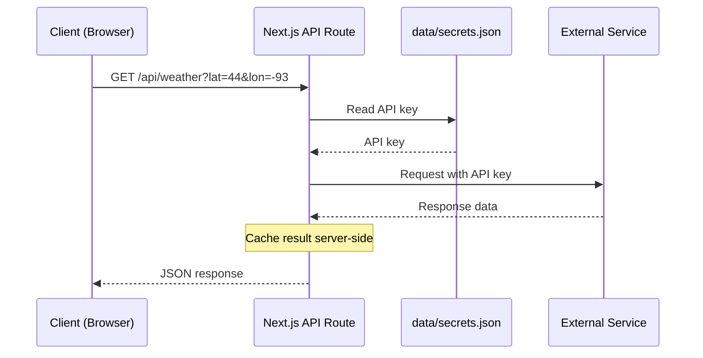

All API routes are served under `/api/`. They act as server-side proxies to protect API keys and avoid CORS issues. API keys and credentials are managed through the editor UI (Settings > Integrations) and stored server-side; no `.env.local` file is needed.

All external API calls include **automatic retry with exponential backoff**. Transient failures (5xx errors, 429 rate limits, network errors, and timeouts) are retried up to 2 times with increasing delays (500ms base, capped at 5s). The `Retry-After` header is respected when present. Client errors (4xx) and caller-initiated aborts are not retried. Individual routes can opt out of retry when the request is non-idempotent (e.g. traffic route POST calls).



## Configuration

### GET /api/config

Returns the current screen configuration.

**Response:** `ScreenConfiguration` object (see [Configuration](/docs/configuration))

### PUT /api/config

Saves the screen configuration. Performs an atomic write (temp file + rename) to prevent corruption. Also syncs kiosk.conf for the kiosk launcher and applies display settings (rotation/resolution) immediately via wlr-randr when they change.

**Body:** `ScreenConfiguration` object

**Response:** The full `ScreenConfiguration` object as saved.

---

## Weather

### GET /api/weather

Fetches weather data from the configured provider. Supports  providers: OpenWeatherMap, WeatherAPI, Pirate Weather, NOAA, Open-Meteo, Yr.no, SMHI, Met Office, and Environment Canada. Results are cached for 5 minutes.

| Parameter | Type | Default | Description |
|---|---|---|---|
| `type` | string | `"both"` | `hourly`, `forecast`, or `both` |
| `provider` | string | from config | `openweathermap`, `weatherapi`, `pirateweather`, `noaa`, `open-meteo`, `yr`, `smhi`, `metoffice`, or `envcanada` |
| `lat` | number | from config | Latitude |
| `lon` | number | from config | Longitude |
| `units` | string | `"imperial"` | `metric` or `imperial` |

**Response:**
```json
{
  "hourly": [
    { "time": "2pm", "temp": 72, "icon": "sun", "precipitation": 0, "humidity": 45, "wind": 8, "feelsLike": 70 }
  ],
  "forecast": [
    { "day": "Mon", "date": "2026-03-09", "high": 75, "low": 55, "icon": "cloud-sun", "precipitation": 20, "humidity": 50, "wind": 12, "precipAmount": 0.1 }
  ],
  "minutely": [],
  "alerts": []
}
```

The `minutely` and `alerts` fields are included when the provider supports them (e.g. Pirate Weather).

---

## Calendar

### GET /api/calendar

Fetches a merged event stream from all configured sources — Google Calendar OAuth calendars, iCal/ICS feeds, **and** iCloud calendars (including the optional contact-birthdays source) — plus optional public holidays. Each iCloud calendar fails in isolation, so one broken calendar doesn't blank the rest. Returns 400 if no source is configured.

| Parameter | Type | Description |
|---|---|---|
| `calendarIds` | string | Comma-separated calendar IDs |
| `timeMin` | string | ISO 8601 start time |
| `timeMax` | string | ISO 8601 end time |

**Response:**
```json
[
  {
    "id": "event-id",
    "summary": "Team Meeting",
    "start": "2026-03-08T10:00:00-06:00",
    "end": "2026-03-08T11:00:00-06:00",
    "location": "Room 42",
    "calendarColor": "#4285f4"
  }
]
```

### GET /api/calendars

Lists the authenticated user's Google Calendars (OAuth only — used by the editor's calendar picker).

**Response:**
```json
[
  { "id": "primary", "summary": "My Calendar", "backgroundColor": "#4285f4" }
]
```

---

## Holidays

### GET /api/holidays

Fetches public holidays for a country using the [Nager.Date API](https://date.nager.at/). Results are cached for 30 days. No API key required.

#### List available countries

Pass the `countries` query parameter (no value needed) to get the list of supported countries.

**Example:** `GET /api/holidays?countries`

**Response:**
```json
[
  { "countryCode": "US", "name": "United States" },
  { "countryCode": "DE", "name": "Germany" }
]
```

#### Get holidays for a country

| Parameter | Type | Default | Description |
|---|---|---|---|
| `country` | string | required | Two-letter country code (e.g. `US`, `DE`, `GB`) |
| `year` | number | current year | Year to fetch holidays for |

**Example:** `GET /api/holidays?country=US&year=2026`

**Response:** Array of `CalendarEvent` objects (only public holidays, not observances).
```json
[
  {
    "id": "holiday-US-2026-01-01",
    "title": "New Year's Day",
    "start": "2026-01-01",
    "end": "2026-01-02",
    "allDay": true,
    "sourceId": "holidays",
    "sourceName": "Public Holidays",
    "calendarColor": "#10b981"
  }
]
```

---

## Chores

### GET /api/chores

Returns chore completion records. Automatically purges entries older than 90 days. Public on the LAN with no authentication so the kid-facing `/chores` view works even when the editor password is set.

**Response:**
```json
{
  "completions": [
    {
      "choreId": "chore-1",
      "memberId": "member-1",
      "date": "2026-03-08"
    }
  ]
}
```

### POST /api/chores

Toggles a chore completion. If the completion already exists for the given choreId + memberId + date, it is removed; otherwise it is added. Public on the LAN (no session required) so kids can mark chores done from the `/chores` view.

**Body:**
```json
{
  "choreId": "chore-1",
  "memberId": "member-1",
  "date": "2026-03-08"
}
```

The `date` field must be a real `YYYY-MM-DD` calendar date within the last 90 days. Future dates, invalid calendar dates (e.g. `2026-02-30`), and dates outside the retention window are rejected with `400`. Toggling a chore with a non-zero point value also credits or debits the member's reward balance; if removing a past completion would drive the balance negative, the response includes a `warning` string explaining the deficit.

**Response:** `{ "completions": [...], "warning"?: "..." }`

### GET /api/chores/data

Returns the shared chore member and chore definition data from `data/chores.json`. This is the source of truth used by the chore chart module, the fullscreen chore chart module, and the remote Chores tab.

**Response:**
```json
{
  "members": [
    { "id": "member-1", "name": "Alice", "emoji": "🦊", "color": "#f59e0b" }
  ],
  "chores": [
    {
      "id": "chore-1",
      "name": "Make bed",
      "emoji": "🛏️",
      "points": 2,
      "frequency": "daily",
      "daysOfWeek": [1, 2, 3, 4, 5],
      "timeOfDay": "morning",
      "assigneeIds": ["member-1"],
      "rotation": "fixed"
    }
  ]
}
```

### PUT /api/chores/data

Updates the shared chore member and definition data. Requires a valid session.

**Body:**
```json
{
  "members": [ ... ],
  "chores": [ ... ]
}
```

Both `members` and `chores` must be arrays. The full set replaces the existing data.

**Response:** The saved `{ members, chores }` object.

---

## Meals

### GET /api/meals/data

Returns saved meals, weekly plan, grocery checked state, and shared meal-planner settings from `data/meals.json`. Accessible by the display (display token auth).

**Response:**
```json
{
  "savedMeals": [
    { "id": "meal-1", "name": "Tacos", "emoji": "🌮", "tags": ["quick"], "prepTime": 20, "difficulty": "easy" }
  ],
  "plan": [
    { "date": "2026-04-04", "slot": "dinner", "mealId": "meal-1" }
  ],
  "groceryChecked": ["tortillas"],
  "settings": {
    "enabledSlots": ["breakfast", "lunch", "dinner"],
    "weekStartDay": "monday",
    "defaultSlotTimes": { "breakfast": "07:30", "lunch": "12:00", "dinner": "18:00" },
    "timeFormat": "12h"
  }
}
```

The `plan` array uses ISO date strings (e.g. `"2026-04-04"`) for multi-week support. Entries older than 12 weeks are pruned on write.

### PUT /api/meals/data

Partial update — every writable field is optional, and omitted fields are preserved from the existing on-disk data. The request must include at least one of `savedMeals`, `plan`, `groceryChecked`, or `settings`, or the server returns `400`. Requires a valid session.

The entire read-modify-write cycle runs inside the meal-data store queue, so cross-surface writers (editor settings sheet, `/remote`, grocery checks) cannot interleave and silently lose each other's edits.

**Body (all fields optional):**
```json
{
  "savedMeals": [ ... ],
  "plan": [ ... ],
  "groceryChecked": [ ... ],
  "settings": { "enabledSlots": ["breakfast", "lunch", "dinner"], "weekStartDay": "monday", "defaultSlotTimes": { "dinner": "18:00" }, "timeFormat": "12h" },
  "force": false
}
```

When present, `savedMeals`, `plan`, and `groceryChecked` must be arrays. An empty-overwrite guard fires whenever `savedMeals` OR `plan` is being written as `[]` against non-empty existing data — set `force: true` to override. Settings-only and grocery-only writes skip the guard.

**Response:** The full `{ savedMeals, plan, groceryChecked, settings }` object after the write.

### GET /api/meals/grocery

Returns just the grocery checked state.

**Response:** `{ "groceryChecked": ["tortillas", "cheese"] }`

### POST /api/meals/grocery

Toggles a grocery item's checked state. If the item is already checked, it is unchecked; otherwise it is checked. Requires a valid session.

**Body:**
```json
{
  "item": "tortillas"
}
```

**Response:** `{ "groceryChecked": [...] }` (the full updated list)

---

## Rewards

### GET /api/rewards

Returns reward definitions, point balances, and redemption history from `data/rewards.json`. Public on the LAN with no authentication so the `/chores` kid view can display balances and redemption history.

**Response:**
```json
{
  "rewards": [
    { "id": "reward-1", "name": "Ice Cream", "emoji": "🍦", "cost": 50, "description": "Pick any flavor", "memberIds": [], "enabled": true }
  ],
  "balances": { "member-1": 120 },
  "redemptions": [
    { "id": "r-1", "rewardId": "reward-1", "rewardName": "Ice Cream", "memberId": "member-1", "memberName": "Alice", "cost": 50, "redeemedAt": "2026-04-01T18:00:00.000Z" }
  ]
}
```

### POST /api/rewards

Redeems a reward for a member. Checks eligibility (member restriction) and sufficient point balance. Public on the LAN so the `/chores` view can redeem rewards without a session. Editing reward definitions and manual balance adjustments still live at `/api/rewards/data` and remain session-gated.

**Body:**
```json
{
  "rewardId": "reward-1",
  "memberId": "member-1"
}
```

**Response:** `{ "balances": { ... }, "redemptions": [ ... ] }` — the updated point balances for all members and the updated redemption history after the redeem. Reward definitions are not returned here (they didn't change); re-fetch them via `GET /api/rewards` if needed.

### PUT /api/rewards/data

Updates reward definitions (add, edit, remove rewards). Requires a valid session.

**Body:**
```json
{
  "rewards": [ ... ]
}
```

**Response:** `{ "rewards": [...] }` (the saved reward definitions)

### POST /api/rewards/data

Manual point balance adjustment. Requires a valid session.

**Body:**
```json
{
  "memberId": "member-1",
  "amount": 10
}
```

Positive amounts credit points; negative amounts debit. Amount must be non-zero.

**Response:** `{ "balances": { ... } }` — only the updated balances map. Reward definitions and redemption history are unchanged by this endpoint, so they are not returned.

---

## Authentication

### GET /api/auth/status

Returns whether password authentication is enabled, whether the current session is authenticated, and whether the caller is blocked by the optional IP allowlist.

**Response:**
```json
{ "authEnabled": true, "authenticated": true, "ipRestricted": false }
```

The `ipRestricted` field is `true` when the **Restrict access by IP** toggle is on and the caller's IP is not in the configured allowlist. The login page uses this to show an explanatory banner instead of a sign-in form, since no amount of correct credentials would let the caller through.

### POST /api/auth/login

Authenticates with a password. Sets a session cookie on success. Rate-limited to 5 failed attempts per 15-minute window (shared with the password endpoint).

**Body:** `{ "password": "...", "rememberMe": false }`

| Field | Type | Default | Description |
|---|---|---|---|
| `password` | string | required | The authentication password |
| `rememberMe` | boolean | `false` | If `true`, session lasts 90 days instead of 30 |

**Response:** `{ "ok": true }` (with `Set-Cookie` header)

### POST /api/auth/logout

Clears the session cookie.

**Response:** `{ "ok": true }` (with `Set-Cookie` header clearing the session)

### POST /api/auth/password

Sets, changes, or disables the password. Requires a valid session if auth is already enabled.

**Body (set/change):** `{ "currentPassword": "...", "newPassword": "..." }`

**Body (disable):** `{ "currentPassword": "...", "action": "disable" }`

**Constraints:** Password must be at least 8 characters.

**Response:** `{ "success": true, "authEnabled": true }`

### GET /api/auth/display-token

Returns the current display token used by the kiosk view and remote to authenticate API requests. Requires a valid session.

**Response:**
```json
{ "displayToken": "hs_abc123..." }
```

Returns `{ "displayToken": null }` if authentication is not enabled.

### POST /api/auth/display-token

Regenerates the display token. The previous token is immediately invalidated — the display must reload to pick up the new token. Requires a valid session.

**Response:**
```json
{ "displayToken": "hs_xyz789..." }
```

### POST /api/auth/revoke-sessions

Revokes all active sessions by bumping the session epoch. All users (including the caller) will need to log in again. Requires a valid session.

**Response:** `{ "ok": true }`

### GET /api/auth/ip-allowlist

Returns the current IP allowlist configuration along with the caller's detected IP (useful so an admin can see which address they should add before saving). Requires a valid session.

**Response:**
```json
{
  "ipAllowlist": ["192.168.1.0/24", "10.0.0.5/32"],
  "ipBypassAuth": true,
  "ipRestrictAccess": false,
  "callerIp": "192.168.1.42"
}
```

IPv4-mapped IPv6 addresses are normalized to IPv4 before being returned in `callerIp` (so `::ffff:127.0.0.1` becomes `127.0.0.1`). The feature is IPv4-only; IPv6 callers see their raw address and the restriction will block them.

### PUT /api/auth/ip-allowlist

Updates the IP allowlist configuration. Requires a valid session. Validates every entry as CIDR notation (`a.b.c.d/prefix`, prefix 0–32) and rejects leading-zero octets to match Node's `net.isIPv4()` behavior. If **Restrict access by IP** is being enabled and the caller's own IP is not in the list, the route returns `409 Conflict` **without saving** so the UI can show a lockout warning; the admin can resubmit with `force: true` to override.

**Body:**
```json
{
  "ipAllowlist": ["192.168.1.0/24"],
  "ipBypassAuth": true,
  "ipRestrictAccess": true,
  "force": false
}
```

**Response:** `{ "ok": true }` on success. On lockout: `409 { "error": "...", "reason": "your_ip_not_in_allowlist", "callerIp": "..." }`. An `ip_allowlist_change` audit event is emitted on every successful save.

---

## Google Auth

Google sign-in uses the **OAuth 2.0 device flow** exclusively — there is no browser redirect endpoint, since the display itself is a kiosk with no keyboard. The editor calls `POST /api/auth/google/device` to get a `user_code`, the user enters that code at `google.com/device` on their phone or laptop, and the editor polls `PUT /api/auth/google/device` until Google returns a token.

### GET /api/auth/google/status

Returns whether Google OAuth is currently authenticated and whether client credentials are configured. Requires a valid session.

**Response:**
```json
{ "connected": true, "credentialsConfigured": true }
```

### DELETE /api/auth/google/status

Disconnects the Google OAuth integration. Requires a valid session.

**Response:** `{ "connected": false }`

### POST /api/auth/google/device

Initiates the OAuth 2.0 device flow. Returns a user code for the user to enter at the verification URL. Requires a valid session.

**Response:**
```json
{
  "verification_url": "https://www.google.com/device",
  "user_code": "ABCD-EFGH",
  "device_code": "...",
  "expires_in": 1800,
  "interval": 5
}
```

### PUT /api/auth/google/device

Polls for device flow token completion. Requires a valid session.

**Body:** `{ "device_code": "..." }`

---

## Secrets

### GET /api/secrets

Returns which API keys are configured (as booleans, not the actual values). Requires a valid session.

**Response:**
```json
{
  "openweathermap_key": true,
  "weatherapi_key": false,
  "pirateweather_key": false,
  "unsplash_access_key": true,
  "todoist_token": false,
  "google_maps_key": false,
  "tomtom_key": false,
  "google_client_id": true,
  "google_client_secret": true
}
```

### PUT /api/secrets

Saves an API key or credential. Validates Todoist tokens before saving. Requires a valid session.

**Body:** `{ "key": "openweathermap_key", "value": "abc123..." }`

**Response:** `{ "ok": true }`

### DELETE /api/secrets

Deletes an API key or credential. Requires a valid session.

**Body:** `{ "key": "openweathermap_key" }`

**Response:** `{ "ok": true }`

---

## To-Do

### GET /api/todo/state

Returns the runtime completion map for interactive To-Do items, keyed by item ID. To-Do modules with `interactive` enabled poll this endpoint so a tap on one display surfaces on every other display within the poll interval. The map is global; each module filters it to its own item IDs client-side. Completion state lives in `data/todo-state.json`, separate from `config.json`, so editor saves never clobber taps. Requires display auth.

**Response:**
```json
{
  "completed": {
    "item-uuid-1": true,
    "item-uuid-2": false
  }
}
```

An absent key means the item uses its authored default from the editor.

### POST /api/todo/toggle

Atomically flips one To-Do item's completion state. The addressed module must exist, be a To-Do module, and have `interactive` enabled — a stale or forged request cannot flip a read-only instance. Returns the full updated state map so the tapping client can reconcile its optimistic update against server truth. Requires display auth.

**Body:**
```json
{
  "displayId": "kitchen",
  "screenId": "screen-1",
  "moduleId": "module-uuid",
  "itemId": "item-uuid"
}
```

`displayId` is optional in legacy single-display mode but required to disambiguate in multi-display mode; an unknown `displayId` returns 404 rather than falling back.

**Response:** the full updated completion map (same shape as `GET /api/todo/state`).

---

## Todoist

### GET /api/todoist

Fetches all tasks, projects, sections, and labels from the Todoist API. Enriches tasks with project names, colors, section names, and label colors. Requires a Todoist API token to be configured in Settings > Integrations.

**Response:**
```json
{
  "tasks": [
    {
      "id": "123",
      "content": "Buy groceries",
      "description": "",
      "priority": 1,
      "due": { "date": "2026-03-09", "datetime": "2026-03-09T17:00:00Z", "isRecurring": false },
      "labels": ["errands"],
      "labelColors": { "errands": "#ff9933" },
      "projectId": "456",
      "projectName": "Personal",
      "projectColor": "#4073ff",
      "sectionId": "",
      "sectionName": "",
      "parentId": null,
      "order": 1,
      "commentCount": 0
    }
  ],
  "projects": [
    { "id": "456", "name": "Personal", "color": "#4073ff", "order": 1 }
  ]
}
```

### PUT /api/todoist

Saves a Todoist API token. Validates the token against the Todoist API before storing. Requires a valid session.

**Body:** `{ "token": "..." }`

**Response:** `{ "ok": true }`

---

## Data Feeds

### GET /api/stocks

Fetches stock prices from Yahoo Finance.

| Parameter | Type | Description |
|---|---|---|
| `symbols` | string | Comma-separated stock symbols (e.g. `AAPL,GOOGL`) |

**Response:**
```json
{
  "stocks": [
    { "symbol": "AAPL", "price": 178.52, "change": 2.31, "changePercent": 1.31 }
  ]
}
```

### GET /api/crypto

Fetches cryptocurrency prices from CoinGecko.

| Parameter | Type | Description |
|---|---|---|
| `ids` | string | Comma-separated CoinGecko IDs (e.g. `bitcoin,ethereum`) |

**Response:**
```json
{
  "prices": [
    { "id": "bitcoin", "name": "Bitcoin", "symbol": "BTC", "price": 67234.00, "change24h": -2.1 }
  ]
}
```

### GET /api/news

Parses an RSS feed and returns articles.

| Parameter | Type | Description |
|---|---|---|
| `feed` | string | RSS feed URL |

**Response:**
```json
{
  "items": [
    { "title": "Article Title", "link": "https://...", "pubDate": "2026-03-08T12:00:00Z" }
  ]
}
```

### GET /api/jokes

Returns a random dad joke.

**Response:**
```json
{ "joke": "Why don't skeletons fight each other? They don't have the guts." }
```

### GET /api/quote

Returns a daily inspirational quote from ZenQuotes.

**Response:**
```json
{ "quote": "The only way to do great work is to love what you do.", "author": "Steve Jobs" }
```

### GET /api/history

Returns historical events for today's date. Fetches from Wikipedia "On This Day" and MuffinLabs in parallel, deduplicates by year, and shuffles. Results are cached daily per source combination.

**Query parameters:**

| Parameter | Type | Default | Description |
|---|---|---|---|
| `sources` | string | `"muffinlabs,wikipedia"` | Comma-separated list of sources to fetch from |

**Response:**
```json
{
  "events": [
    { "year": "1983", "text": "The first mobile phone call was made.", "source": "wikipedia" }
  ]
}
```

---

## Traffic

### GET /api/traffic

Fetches estimated travel times. Supports Google Routes API or TomTom.

| Parameter | Type | Description |
|---|---|---|
| `routes` | string | JSON-encoded array of `{ label, origin, destination }` objects |

**Response:**
```json
{
  "routes": [
    { "label": "To Work", "duration": "25 mins", "distance": "18.3 mi", "trafficDelay": "5 mins" }
  ]
}
```

---

## Sports

### GET /api/sports

Fetches live scores from ESPN. Results are cached for 1 minute.

| Parameter | Type | Description |
|---|---|---|
| `leagues` | string | Comma-separated: `nfl`, `nba`, `mlb`, `nhl`, `mls`, `epl` |

**Response:**
```json
{
  "games": [
    {
      "id": "401584701",
      "league": "NBA",
      "status": "In Progress",
      "detail": "4th Quarter",
      "shortDetail": "4th - 3:42",
      "state": "in",
      "startTime": "2026-03-08T00:00:00Z",
      "homeTeam": "Lakers",
      "homeTeamAbbr": "LAL",
      "homeTeamLogo": "https://a.espncdn.com/...",
      "homeTeamColor": "552583",
      "homeScore": 98,
      "homeRecord": "38-22",
      "awayTeam": "Celtics",
      "awayTeamAbbr": "BOS",
      "awayTeamLogo": "https://a.espncdn.com/...",
      "awayTeamColor": "007A33",
      "awayScore": 102,
      "awayRecord": "42-18",
      "broadcast": "ESPN"
    }
  ]
}
```

The `state` field indicates game state: `pre` (not started), `in` (in progress), or `post` (final).

### GET /api/standings

Fetches league standings from ESPN. Results are cached for 5 minutes. Team colors are fetched from the ESPN teams API and cached for 1 hour.

| Parameter | Type | Default | Description |
|---|---|---|---|
| `league` | string | `"nfl"` | One of: `nfl`, `nba`, `wnba`, `mlb`, `nhl`, `mls`, `epl`, `laliga`, `bundesliga`, `seriea`, `ligue1`, `liga_mx` |
| `grouping` | string | `"division"` | `division`, `conference`, or `league` |

**Response:**
```json
{
  "groups": [
    {
      "name": "NFC North",
      "league": "NFL",
      "entries": [
        {
          "rank": 1,
          "team": "Detroit Lions",
          "teamAbbr": "DET",
          "teamShort": "Lions",
          "teamLogo": "https://a.espncdn.com/...",
          "teamColor": "0076B6",
          "wins": 14,
          "losses": 3,
          "winPct": 0.824,
          "streak": "W3",
          "playoffSeed": 1,
          "clincher": "z"
        }
      ]
    }
  ]
}
```

Entries include sport-specific fields: `ties`, `pointsFor`, `pointsAgainst`, `differential` (NFL); `otLosses`, `points`, `homeRecord`, `awayRecord`, `last10` (NHL); `draws`, `points`, `goalDiff`, `gamesPlayed` (soccer); `gamesBack`, `streak`, `last10`, `homeRecord`, `awayRecord` (NBA/MLB).

---

## Air Quality

### GET /api/air-quality

Returns air quality and UV data from OpenWeatherMap.

| Parameter | Type | Description |
|---|---|---|
| `lat` | number | Latitude (falls back to config) |
| `lon` | number | Longitude (falls back to config) |

**Response:**
```json
{
  "aqi": 2,
  "pm25": 12.5,
  "pm10": 18.3,
  "o3": 45.2,
  "no2": 15.8,
  "uv": 6.3
}
```

---

## Rain Map

### GET /api/rain-map

Returns precipitation map tile data from RainViewer. Results are cached for 5 minutes. No API key required.

**Response:**
```json
{
  "version": "2.0",
  "generated": 1709913600,
  "host": "https://tilecache.rainviewer.com",
  "radar": {
    "past": [
      { "time": 1709913000, "path": "/v2/radar/..." }
    ],
    "nowcast": [
      { "time": 1709914200, "path": "/v2/radar/..." }
    ]
  },
  "satellite": {
    "infrared": [
      { "time": 1709913000, "path": "/v2/satellite/..." }
    ]
  }
}
```

---

## Image Proxy

### GET /api/image-proxy

Proxies external images through the server to avoid CORS and mixed-content issues. Responses are cached in-memory for 24 hours (max 200 entries). Only allows requests to whitelisted hosts (currently `a.espncdn.com`).

| Parameter | Type | Description |
|---|---|---|
| `url` | string | Full URL of the image to proxy |

**Response:** The image binary with appropriate `Content-Type` header and a 7-day browser cache.

---

## Server Time

### GET /api/time

Returns the current server time. Useful for synchronizing display clocks with the server.

**Response:**
```json
{
  "iso": "2026-03-09T14:30:00.000Z",
  "timezone": "America/Chicago",
  "formatted": "2:30:00 PM"
}
```

---

## Backgrounds

### GET /api/backgrounds

Lists all uploaded background images.

**Response:**
```json
["sunset.jpg", "mountains.png", "city-night.webp"]
```

### POST /api/backgrounds

Uploads a new background image or video.

**Body:** `multipart/form-data` with `file` field

**Constraints:**
- Max size: 10 MB per image, 200 MB per video
- Accepted types: JPEG, PNG, WebP, GIF, AVIF, MP4, WebM, MOV

**Response:** `{ success: true, filename: "uploaded-name.jpg" }`

### DELETE /api/backgrounds

Deletes a background image.

| Parameter | Type | Description |
|---|---|---|
| `filename` | string | Name of the file to delete |

### GET /api/backgrounds/serve

Serves a background image file.

| Parameter | Type | Description |
|---|---|---|
| `file` | string | Filename to serve |

### GET /api/backgrounds/rotate

Returns a rotating background image from Unsplash, NASA APOD, or Immich.

| Parameter | Type | Description |
|---|---|---|
| `screenId` | string | Screen ID for per-screen rotation |

### GET /api/backgrounds/directories

Lists all subdirectories in the backgrounds folder, including image counts per directory. Scans up to 2 levels deep. Requires a valid session.

**Response:**
```json
{
  "directories": [
    { "name": "All Photos", "path": "", "imageCount": 12 },
    { "name": "Nature", "path": "Nature", "imageCount": 5 },
    { "name": "Landscapes", "path": "Nature/Landscapes", "imageCount": 3 }
  ]
}
```

### POST /api/backgrounds/directories

Creates a new subdirectory in the backgrounds folder. Directory names are sanitized (only alphanumeric, `.`, `-`, `_` allowed). Maximum nesting depth is 2. Requires a valid session.

**Body:** `{ "name": "Nature", "parent": "" }`

The `parent` field is optional; omit it or pass `""` to create a top-level directory.

**Response (201):** `{ "path": "Nature" }`

### DELETE /api/backgrounds/directories

Deletes an empty subdirectory. Refuses to delete directories that still contain files. Requires a valid session.

**Body:** `{ "path": "Nature/Landscapes" }`

**Response:** `{ "deleted": "Nature/Landscapes" }`

---

## Immich

Immich is a self-hosted Google Photos alternative. These endpoints proxy requests to your Immich server so the display can fetch photos without exposing credentials. Requires `immich_url` and `immich_api_key` configured in Settings > Integrations.

### GET /api/immich/validate

Validates the Immich server connection and API key. Pings the server, then checks authentication.

**Response:**
```json
{
  "reachable": true,
  "authenticated": true,
  "version": "1.106.4"
}
```

Returns `reachable: false` if the server cannot be reached, or `authenticated: false` if the API key is invalid.

### GET /api/immich/albums

Lists all albums from the Immich library. Cached for 60 seconds.

**Response:**
```json
[
  { "id": "abc-123", "name": "Vacation 2025", "assetCount": 142 },
  { "id": "def-456", "name": "Family", "assetCount": 89 }
]
```

### GET /api/immich/people

Lists all recognized people (faces) from the Immich library. Hidden people and unnamed entries are excluded. Cached for 60 seconds.

**Response:**
```json
[
  { "id": "person-1", "name": "Alice", "thumbnailUrl": "/api/immich/serve?assetId=person-1&type=person" },
  { "id": "person-2", "name": "Bob", "thumbnailUrl": "/api/immich/serve?assetId=person-2&type=person" }
]
```

### GET /api/immich/photos

Returns random photos from the Immich library with optional filters. Cached for 5 minutes per unique filter combination. Used by photo slideshow, fullscreen photo, and background rotation.

| Parameter | Type | Default | Description |
|---|---|---|---|
| `albumId` | string | — | Filter to a specific album |
| `personId` | string | — | Filter to a recognized person |
| `favorites` | boolean | `false` | Only return favorites |
| `count` | number | `50` | Number of photos (max 200) |

**Response:** Array of image URLs served through the proxy:
```json
[
  "/api/immich/serve?assetId=abc123&size=preview",
  "/api/immich/serve?assetId=def456&size=preview"
]
```

When `albumId` is specified, photos are fetched from the album directly (since Immich's random search does not support album filtering). Otherwise, photos are fetched via Immich's `search/random` endpoint.

### GET /api/immich/serve

Proxies an Immich image through the server. Validates the asset ID format and caches the response for 24 hours.

| Parameter | Type | Default | Description |
|---|---|---|---|
| `assetId` | string | *(required)* | UUID of the Immich asset |
| `size` | string | `"preview"` | Image size: `preview` (1080px) or `thumbnail` (250px) |
| `type` | string | `"asset"` | Asset type: `asset` (photo) or `person` (face thumbnail) |

**Response:** The image binary with appropriate `Content-Type` header and a 24-hour browser cache (`Cache-Control: public, max-age=86400, immutable`).

### GET /api/immich/video

Streams a video asset from Immich. The incoming `Range` header is forwarded and the response body is piped straight through — never buffered or cached — so seeking works and large files can't exhaust the server's memory.

| Parameter | Type | Default | Description |
|---|---|---|---|
| `assetId` | string | *(required)* | UUID of the Immich video asset |
| `mt` | string | — | Media token bound to this asset, for `<video src>` playback where a Bearer header can't be sent |

**Response:** The video stream with `Content-Type`, `Content-Range`, `Content-Length`, and `Accept-Ranges` passed through from Immich.

---

## iCloud

There are two iCloud integrations. **Shared albums** (photos) work without an Apple account or API key — the album's public share link is all that's needed, and asset URLs are Apple-signed and public, so displays load media straight from Apple's CDN. **Calendar sync** signs in to an iCloud account with an app-specific password; credentials live in `data/icloud-accounts.json` (never in the config file) and are never returned by the API.

### GET /api/icloud/photos

Lists media from an iCloud shared album. Album contents are cached for 5 minutes per token; results are shuffled per request. A missing or malformed album link returns an empty list rather than an error.

| Parameter | Type | Default | Description |
|---|---|---|---|
| `album` | string | *(required)* | Shared album link (`icloud.com/sharedalbum/#TOKEN`) or bare token |
| `media` | string | — | Filter: `photos`, `videos`, or `both`. Omitted = photos only, returned as a plain URL array |
| `count` | number | `50` | Number of items to return (1–200) |

**Response (with `media`):**
```json
[
  { "url": "https://cvws.icloud-content.com/...", "type": "image" },
  { "url": "https://cvws.icloud-content.com/...", "type": "video" }
]
```

### POST /api/icloud/import

Starts downloading everything an Apple link (Shared Album or "Copy iCloud Link") contains into the local media library. Requires a valid editor session. Returns `202` with a job descriptor, `409` if another import is already running.

**Request body:**
```json
{ "url": "https://www.icloud.com/sharedalbum/#B0abc...", "folder": "family" }
```

### GET /api/icloud/import?jobId=...

Polls a running import job's progress: `state` (`running`, `done`, or `error`) plus `total`, `done`, `skipped` (already in the library), and `failed` counts.

### GET /api/icloud/accounts

Lists connected iCloud accounts as credential-free `{ id, appleId }` pairs. Requires a valid editor session.

**Response:**
```json
[
  { "id": "a1b2c3...", "appleId": "user@icloud.com" }
]
```

### POST /api/icloud/accounts

Connects an iCloud account. The credentials are verified against iCloud before saving — a failed sign-in returns `400` with a friendly message (not `401`, which the editor would treat as an expired session). Re-adding an existing Apple ID replaces its stored password instead of duplicating the account. Requires a valid editor session.

**Request body:**
```json
{ "appleId": "user@icloud.com", "appPassword": "abcd-efgh-ijkl-mnop" }
```

**Response:** the new account's `{ id, appleId }` — the password is never echoed back.

### DELETE /api/icloud/accounts

Removes a connected account by `id` (request body: `{ "id": "a1b2c3..." }`). Requires a valid editor session.

### GET /api/icloud/calendars

Lists one account's calendars for the editor picker, plus whether a contact-birthdays calendar is available. Requires a valid editor session.

| Parameter | Type | Default | Description |
|---|---|---|---|
| `account` | string | *(required)* | Account `id` from `/api/icloud/accounts` |

**Response:**
```json
{
  "calendars": [
    { "url": "https://caldav.icloud.com/...", "name": "Family", "color": "#ff2d55" }
  ],
  "birthdaysAvailable": true
}
```

Returns `404` if the account has been removed.

---

## Unsplash

### GET /api/unsplash

Searches Unsplash photos. Requires an Unsplash access key in settings. Requires a valid session.

| Parameter | Type | Default | Description |
|---|---|---|---|
| `query` | string | `"nature landscape"` | Search query |
| `page` | number | `1` | Page number |
| `per_page` | number | `20` | Results per page |
| `orientation` | string | `"portrait"` | `portrait`, `landscape`, or `squarish` |

**Response:**
```json
{
  "photos": [
    {
      "id": "abc123",
      "description": "Mountain landscape at sunset",
      "thumb": "https://images.unsplash.com/...",
      "small": "https://images.unsplash.com/...",
      "regular": "https://images.unsplash.com/...",
      "full": "https://images.unsplash.com/...",
      "raw": "https://images.unsplash.com/...",
      "authorName": "Jane Doe",
      "authorUrl": "https://unsplash.com/@janedoe",
      "downloadUrl": "https://api.unsplash.com/photos/abc123/download"
    }
  ],
  "totalPages": 42,
  "total": 830
}
```

### POST /api/unsplash

Downloads a chosen Unsplash photo to the local backgrounds directory and fires Unsplash's download-tracking pixel (required by the Unsplash API terms — the hit only fires when `downloadUrl` points at the real `api.unsplash.com` host, to prevent credential leakage). Requires a valid session.

**Body:**
```json
{
  "imageUrl": "https://images.unsplash.com/...",
  "downloadUrl": "https://api.unsplash.com/photos/abc123/download",
  "filename": "optional-base-name"
}
```

**Response (201):** `{ "path": "/backgrounds/unsplash-<timestamp>.jpg" }`

---

## NASA

### GET /api/nasa

Fetches NASA images. Supports two modes: Image Library search and Astronomy Picture of the Day (APOD). Requires a valid session.

#### Image Library search (no API key needed)

| Parameter | Type | Default | Description |
|---|---|---|---|
| `type` | string | `"search"` | Set to `"search"` |
| `query` | string | `"nebula"` | Search query |
| `page` | number | `1` | Page number |

**Response:**
```json
{
  "photos": [
    {
      "id": "PIA12345",
      "title": "Nebula Image",
      "description": "A beautiful nebula...",
      "date": "2026-03-08T00:00:00Z",
      "thumb": "https://images-assets.nasa.gov/image/PIA12345/PIA12345~thumb.jpg",
      "nasaId": "PIA12345"
    }
  ],
  "totalPages": 42,
  "total": 500
}
```

#### Astronomy Picture of the Day (requires NASA API key)

| Parameter | Type | Default | Description |
|---|---|---|---|
| `type` | string | | Set to `"apod"` |
| `count` | number | `12` | Number of random APOD images to return |

**Response:**
```json
{
  "photos": [
    {
      "id": "2026-03-08",
      "title": "The Horsehead Nebula",
      "description": "One of the most identifiable nebulae...",
      "date": "2026-03-08",
      "url": "https://apod.nasa.gov/apod/image/2603/horsehead.jpg",
      "hdurl": "https://apod.nasa.gov/apod/image/2603/horsehead_full.jpg",
      "thumb": "https://apod.nasa.gov/apod/image/2603/horsehead.jpg"
    }
  ]
}
```

### POST /api/nasa

Downloads a NASA image and saves it as a background. Requires a valid session.

**Body:** `{ "imageUrl": "https://...", "filename": "nasa-horsehead" }`

**Response (201):** `{ "filename": "nasa-horsehead.jpg", "path": "..." }`

### GET /api/nasa/asset

Resolves a NASA Image Library asset ID to the best available image URL. Picks the highest-resolution variant available (orig > large > medium). Requires a valid session.

| Parameter | Type | Description |
|---|---|---|
| `nasaId` | string | NASA Image Library asset ID (e.g. `PIA12345`) |

**Response:**
```json
{ "imageUrl": "https://images-assets.nasa.gov/image/PIA12345/PIA12345~orig.jpg" }
```

Returns `{ "imageUrl": null }` if no image files are found for the asset.

---

## Plugins

The plugin system allows third-party modules to be installed from a central registry. Plugins are distributed as tarballs containing a manifest, a JavaScript bundle, and optional assets.

### GET /api/plugins/registry

Fetches the plugin registry listing all available plugins and their versions.

**Response:**
```json
{
  "schemaVersion": 1,
  "lastUpdated": "2026-03-08T00:00:00Z",
  "plugins": [
    {
      "id": "example-plugin",
      "name": "Example Plugin",
      "description": "An example widget plugin",
      "author": "Author Name",
      "repo": "https://github.com/...",
      "license": "MIT",
      "category": "data",
      "tags": ["example"],
      "icon": "puzzle",
      "verified": true,
      "permissions": ["network", "secrets"],
      "versions": [
        {
          "version": "1.0.0",
          "minAppVersion": "0.18.0",
          "releaseDate": "2026-03-08",
          "downloadUrl": "https://...",
          "sha256": "abc123...",
          "changelog": "Initial release"
        }
      ]
    }
  ]
}
```

### GET /api/plugins/installed

Returns the list of installed plugins and a hash for cache invalidation.

**Response:**
```json
{
  "schemaVersion": 1,
  "plugins": [
    {
      "id": "example-plugin",
      "version": "1.0.0",
      "installedAt": "2026-03-08T12:00:00.000Z",
      "enabled": true,
      "moduleType": "example-widget"
    }
  ],
  "pluginHash": "a1b2c3d4"
}
```

### POST /api/plugins/install

Installs a plugin from the registry. Downloads the tarball, verifies its SHA-256 checksum against the registry entry, and extracts it into `data/plugins/<pluginId>/`. Requires a valid session.

**Body:** `{ "pluginId": "example-plugin", "version": "1.0.0" }`

**Response:** `{ "ok": true }`

### POST /api/plugins/install-external

Installs a plugin from any HTTPS tarball URL — for private plugins, pre-release builds, or forks that aren't in the public registry. Runs through the same extract / validate pipeline as the registry install and cannot overwrite an ID already installed from the marketplace (the collision check is re-run after acquiring the per-ID lock to close a TOCTOU window). Requires a valid session.

**Body:** `{ "tarballUrl": "https://example.com/my-plugin-{version}.tgz", "version": "1.2.0" }`

`version` is optional; when omitted, the URL must not contain a `{version}` placeholder or the server returns `400`. When present, `{version}` in the URL is substituted before download.

**Response:** `{ "ok": true }`. Query-string tokens on the tarball URL are stripped from all error messages and audit-log entries.

### DELETE /api/plugins/install

Uninstalls a plugin. Requires a valid session.

**Body:** `{ "pluginId": "example-plugin" }`

**Response:** `{ "ok": true }`

### PATCH /api/plugins/install

Updates a plugin's state (enable/disable or clear previous version after config migration). Requires a valid session.

**Body:**
```json
{
  "pluginId": "example-plugin",
  "enabled": true,
  "clearPrevVersion": false
}
```

Both `enabled` and `clearPrevVersion` are optional.

**Response:** `{ "ok": true }`

### GET /api/plugins/manifest/:pluginId

Returns the full manifest for an installed plugin.

**Response:** `PluginManifest` object (includes `id`, `name`, `version`, `description`, `author`, `license`, `moduleType`, `category`, `icon`, `defaultConfig`, `defaultSize`, `configSchema`, `exports`, `secrets`, `allowedDomains`, `permissions`, etc.)

### GET /api/plugins/bundle/:pluginId

Serves the plugin's JavaScript bundle.

**Response:** `application/javascript` content.

### POST /api/plugins/proxy/:pluginId

Server-side proxy for plugin API requests. Handles domain validation (only requests to the plugin's declared `allowedDomains` are allowed), secret injection (replaces `{{secret_key}}` placeholders with stored values), rate limiting (60 requests/minute per plugin; 240 for plugins with the `localNetwork` permission), and response caching. Maximum response size is 5 MB.

**Body:**
```json
{
  "url": "https://api.example.com/data",
  "method": "GET",
  "headers": {},
  "payload": "",
  "secretInjections": {
    "header": { "Authorization": "Bearer {{api_key}}" },
    "query": { "appid": "{{api_key}}" }
  },
  "cacheTtlMs": 60000
}
```

| Field | Type | Default | Description |
|---|---|---|---|
| `url` | string | required | Upstream URL (must match plugin's `allowedDomains`) |
| `method` | string | `"GET"` | HTTP method (`GET`, `POST`, `PUT`, or `PATCH`) |
| `headers` | object | `{}` | Additional request headers |
| `payload` | string | | Request body for POST/PUT/PATCH |
| `secretInjections.header` | object | | Headers with `{{key}}` placeholders replaced by stored secrets |
| `secretInjections.query` | object | | Query params with `{{key}}` placeholders replaced by stored secrets |
| `cacheTtlMs` | number | `60000` | Cache TTL in ms (0 to disable, max 1 hour) |

**Response:** The upstream response body with its original `Content-Type`.

### GET /api/plugins/secrets/:pluginId

Returns which secrets are configured for a plugin (booleans, never raw values). Requires a valid session.

**Response:**
```json
{
  "keys": {
    "api_key": true,
    "client_secret": false
  }
}
```

### PUT /api/plugins/secrets/:pluginId

Saves a secret value for a plugin. Requires a valid session.

**Body:** `{ "key": "api_key", "value": "abc123..." }`

**Response:** `{ "ok": true }`

### DELETE /api/plugins/secrets/:pluginId

Deletes a secret for a plugin. Requires a valid session.

**Body:** `{ "key": "api_key" }`

**Response:** `{ "ok": true }`

### POST /api/plugins/dev

Registers a development plugin on the server. Called automatically by the client-side dev plugin loader. Validates the manifest before accepting.

**Body:** `{ "manifest": { ... } }` (full `PluginManifest` object)

**Response:** `{ "ok": true }`

---

## System

### GET /api/system/version

Returns the current application version, available tags, and upgrade status. Requires a valid session.

| Parameter | Type | Description |
|---|---|---|
| `check` | string | Set to `"true"` to force-check for updates |

**Response:**
```json
{
  "current": "0.10.0",
  "currentCommit": "a3b2e17",
  "latest": "0.11.0",
  "updateAvailable": true,
  "installedVia": "tarball",
  "channel": "release",
  "tags": [{ "tag": "v0.11.0", "version": "0.11.0", "commit": "", "hasTarball": true }],
  "upgradeRunning": false
}
```

### GET /api/system/build-id

Returns the current build hash. Used by the display to detect new deployments and auto-reload.

**Response:** Plain text build ID (e.g. `abc123`)

### GET /api/system/status

Returns an SSE (Server-Sent Events) stream of upgrade/rollback progress. Used by the editor to display real-time progress during upgrades. Requires a valid session.

**Response:** `text/event-stream` with `progress` and `output` events.

### GET /api/system/changelog

Returns recent release notes from the GitHub repository. Falls back to tags if no releases are published. Requires a valid session.

**Response:**
```json
{
  "releases": [
    {
      "tag": "v0.10.0",
      "name": "v0.10.0",
      "body": "Release notes markdown...",
      "published": "2026-03-08T00:00:00Z"
    }
  ]
}
```

### POST /api/system/upgrade

Triggers an upgrade to a specific version tag. Downloads a pre-built release tarball (or falls back to git-based upgrade for older versions). Progress is streamed via the `/api/system/status` SSE endpoint. Requires a valid session.

**Body:** `{ "tag": "v0.10.0" }`

**Response:** `{ "ok": true, "message": "Upgrade to v0.10.0 started" }`

### POST /api/system/rollback

Reverts to a specific previous version tag. Progress is streamed via the `/api/system/status` SSE endpoint. Requires a valid session.

**Body:** `{ "tag": "v0.9.0" }`

**Response:** `{ "ok": true, "message": "Rollback to v0.9.0 started" }`

### POST /api/system/power

Performs a system reboot or service restart. Requires a valid session.

**Body:** `{ "action": "reboot" }` or `{ "action": "restart-service" }`

**Response:** `{ "ok": true, "message": "System reboot scheduled" }`

The `restart-service` action requires the app to be managed by systemd (as the `home-screens` service).

### GET /api/system/stats

Returns system statistics including disk usage, OS info, memory usage, app configuration summary, telemetry status, and a snapshot of the **hub's own hardware** (CPU usage/temperature, memory, disk, uptime). Requires a valid session.

The top-level `hardware` field is gathered in-process via `getLocalHardwareStats()` — this is the hub's own hardware, not that of remote display-only Pis. Per-Pi hardware for spokes lives on `/api/displays` → each display's `hwStats` (posted by `scripts/reporter.sh` to `/api/display/hw-stats`).

**Response:**
```json
{
  "disk": {
    "total": 31268536320,
    "used": 15634268160,
    "free": 15634268160,
    "dataDir": {
      "config": 4096,
      "backups": 24576,
      "backgrounds": 10485760,
      "total": 10514432
    }
  },
  "os": {
    "hostname": "raspberrypi",
    "platform": "linux",
    "arch": "arm64",
    "uptime": 86400,
    "nodeVersion": "v22.0.0"
  },
  "memory": {
    "total": 4294967296,
    "free": 2147483648,
    "used": 2147483648
  },
  "app": {
    "screens": 3,
    "modules": 12,
    "moduleTypes": { "clock": 2, "weather": 3, "calendar": 1 },
    "profiles": 2,
    "configuredSecrets": ["openweathermap_key", "google_client_id"],
    "configSize": 4096
  },
  "telemetry": {
    "installId": "a1b2c3d4...",
    "lastBeaconAt": "2026-03-08T00:00:00Z",
    "enabled": true
  },
  "hardware": {
    "cpuUsagePercent": 14.2,
    "cpuTemperatureC": 52.1,
    "memoryUsagePercent": 46.0,
    "uptimeSeconds": 86400,
    "model": "Raspberry Pi 5 Model B Rev 1.0"
  }
}
```

`hardware` is `null` on hosts where the local collector cannot read `/proc`/`/sys` (e.g. non-Linux dev machines).

### GET /api/system/diagnostics

Streams a ZIP bundle containing everything you'd want for triaging an install: a redacted copy of `config.json`, a per-key map of which secrets are present (no values), a snapshot of `/api/system/stats`, per-display `hwStats` / `browserStats` / `currentScreen`, the last 500 lines of `journalctl -u home-screens`, installed plugin manifests (URL fields stripped), recent telemetry metadata, and a grepped error summary. Requires a valid session.

Before composing the bundle, the hub broadcasts `dump-console-log` to every adopted display and polls for 5 seconds so displays that are currently online can upload their browser console buffer. Displays that don't respond within the window are annotated `[timeout]` in the archive.

**Response:** `application/zip` download (`home-screens-diagnostics-<iso-ts>.zip`).

### GET/POST /api/backup

Full household backup bundle — exports `config`, `chores`, `choreCompletions`, `meals`, and `rewards` as a single JSON file with a `_type: "home-screens-backup"` envelope and a `_version` marker. POST accepts the same shape (plus a legacy config-only format) to restore everything at once. Session required.

Secrets in `data/secrets.json` are **not** included; you'll re-enter API keys after restore. This is what **Settings > Data > Full Backup** uses, and it is distinct from the upgrade-time config-only snapshots under `/api/system/backups`.

### GET /api/system/backups

Lists available configuration backups. Requires a valid session.

**Response:**
```json
{
  "backups": [
    { "name": "config-v0.9.0-20260308-120000.json", "size": 4096, "date": "2026-03-08T12:00:00Z" }
  ]
}
```

Pass `?download=config-v0.9.0-20260308-120000.json` to download a specific backup file.

### POST /api/system/backups

Restores a configuration backup. Requires a valid session.

**Body:** `{ "name": "config-v0.9.0-20260308-120000.json" }`

**Response:** `{ "ok": true }`

---

## Network

Read and write the Pi's network configuration — WiFi, static IP, hostname, and diagnostics. All endpoints require a valid session and shell out to `nmcli` / `hostnamectl` on the host. Every write that touches the **management interface** (the one the request arrived on) has a two-phase commit: the hub inhibits the connectivity watchdog, schedules a 60-second auto-rollback, applies the change, and waits for the client to POST `/api/system/network/confirm` before discarding the rollback. If the client never confirms (because the change broke connectivity), the original settings are restored automatically.

### GET /api/system/network

Returns a snapshot of every non-loopback network interface, including wired/wireless type, link state, assigned connection, IPv4 configuration (including whether `ipv4.method` is `auto` or `manual`), WiFi association details when connected, detected kernel driver, and which interface the request arrived on (`isManagementInterface: true`). When `nmcli` is not installed the endpoint returns `{ "available": false, "reason": "..." }`.

### GET /api/system/network/wifi/scan

Triggers a fresh WiFi scan on the given interface and returns the nearby networks. Rate-limited to one scan per interface every 15 seconds (cached results are returned inside the window).

**Query:** `?iface=wlan0` (required — validated against an interface-name regex)

**Response:** Array of `{ ssid, bssid, signal (0–100), frequency, security, inUse, saved }`. Hidden SSIDs are filtered. When `nmcli` is unavailable, returns `[]` rather than an error so the UI can render "no networks found."

### POST /api/system/network/wifi/connect

Connects the given interface to an SSID. When the target interface is the management interface, the call is two-phase: the first request returns `{ requiresConfirmation: true, warning: "..." }` and the client must resubmit with `confirmed: true`. A 60-second rollback is scheduled automatically on the management-interface path.

**Body:**
```json
{ "ssid": "MyNetwork", "password": "secret", "iface": "wlan0", "confirmed": false }
```

`password` is optional for open networks. `confirmed` is required when changing the management interface.

**Response:** `{ "ok": true, "connection": "wifi-home-ssid", "rollbackId": "<uuid>" }`. `rollbackId` is only present when a rollback was scheduled.

### POST /api/system/network/wifi/disconnect

Brings down a saved WiFi connection by UUID. Like `connect`, management-interface disconnects require `confirmed: true`.

**Body:** `{ "connectionId": "<uuid>", "confirmed": false }`

**Response:** `{ "ok": true }`

### GET /api/system/network/wifi/saved

Lists saved WiFi connection profiles with last-used timestamps. Pass `?showPasswords=true` to include the PSK — only honored when editor auth is enabled and the host can read NetworkManager secrets via sudo.

**Response:** Array of `{ id, name, ssid, autoconnect, lastUsed, password? }`.

### DELETE /api/system/network/wifi/saved

Deletes a saved WiFi profile.

**Body:** `{ "connectionId": "<uuid>" }`

**Response:** `{ "ok": true }`

### PUT /api/system/network/hostname

Sets the system hostname via `hostnamectl`, rewrites the matching line in `/etc/hosts`, and restarts `avahi-daemon` so mDNS re-advertises under the new name. Hostname is validated (RFC-952/RFC-1123 style). `/etc/hosts` and avahi restart are best-effort — hostname change still succeeds even if those steps fail.

**Body:** `{ "hostname": "kitchen-display" }`

**Response:** `{ "ok": true, "hostname": "kitchen-display" }`

### PUT /api/system/network/ip

Switches a connection between DHCP and static IP, then cycles the connection to apply the change. Like WiFi changes, management-interface edits require `confirmed: true` and schedule a 60-second rollback.

**Body (auto / DHCP):** `{ "connectionId": "<uuid>", "method": "auto", "confirmed": false }`

**Body (manual / static):**
```json
{
  "connectionId": "<uuid>",
  "method": "manual",
  "address": "192.168.1.50",
  "prefix": 24,
  "gateway": "192.168.1.1",
  "dns": ["1.1.1.1", "8.8.8.8"],
  "confirmed": false
}
```

**Response:** `{ "ok": true, "rollbackId": "<uuid>" }` (`rollbackId` only when scheduled).

### GET /api/system/network/diagnostics

Pings the default gateway and `1.1.1.1`, and reports the status + last run of the `wifi-watchdog.timer` systemd unit.

**Response:**
```json
{
  "available": true,
  "gateway": { "ip": "192.168.1.1", "reachable": true, "latencyMs": 1.2 },
  "internet": { "ip": "1.1.1.1", "reachable": true, "latencyMs": 14.3 },
  "watchdog": { "active": true, "lastRun": "2026-04-18T02:00:00Z" }
}
```

### GET /api/system/network/confirm

Returns whether a management-interface change is pending confirmation and how many milliseconds remain on the rollback timer.

**Response:** `{ "pending": true, "rollbackId": "<uuid>", "remainingMs": 42000 }` or `{ "pending": false }`.

### POST /api/system/network/confirm

Confirms a pending network change. Cancels the 60-second auto-revert timer and uninhibits the connectivity watchdog.

**Body:** `{ "rollbackId": "<uuid>" }`

**Response:** `{ "ok": true }` (404 if no matching rollback is pending).

---

## Display Control

Remote control endpoints for the kiosk display. The display polls for pending commands; the editor or any HTTP client can enqueue commands.

### Targeting a display (multi-display)

When the hub has more than one display registered, every display-control endpoint accepts an optional display target. There are two ways to provide it:

- **Query string** — append `?display=<id>` (works on GET and POST). Useful for bookmarkable simple commands like `/api/display/wake?display=kitchen`.
- **JSON body field** — `{ "displayId": "<id>", … }` (POST only).

Use the reserved word `all` as the display target to broadcast to every registered display plus the legacy default queue. Broadcast is allowed for command-enqueue actions (simple commands, brightness, alert) and rejected for read-only or mutate-config actions (status, profile).

Calls with no display target continue to drive the legacy single-display queue, so single-display installs and existing scripts keep working unchanged. See the [Multi-display guide](/docs/multi-display) for the full hub-and-spoke setup.

### GET /api/displays

Read-only registry of all configured displays plus runtime heartbeat data the hub has collected from polling spokes. Used by the editor's **Per display > All displays** page and by display-only Pis waiting for adoption.

| Parameter | Type | Description |
|---|---|---|
| `id` | string | Optional. When provided, returns a minimal `{adopted, displayId}` shape used by spoke Pis to poll for adoption. Without `id`, returns the full registry. |

**Response (full):**

```json
{
  "displays": [
    {
      "id": "kitchen",
      "name": "Kitchen",
      "screenCount": 3,
      "displayWidth": 1080,
      "displayHeight": 1920,
      "displayTransform": "90",
      "lastSeen": 1709913600000,
      "reportedViewport": { "width": 1080, "height": 1920 },
      "viewportReports": [
        { "width": 1080, "height": 1920, "address": "192.168.86.187", "tabCount": 1 }
      ],
      "status": {
        "currentScreen": { "id": "abc-123", "name": "Main" },
        "displayState": "active",
        "activeProfile": null
      }
    }
  ],
  "unadopted": [
    { "id": "home-screens-hysd", "lastSeen": 1709913600000, "reportedViewport": { "width": 1920, "height": 1080 } }
  ]
}
```

**Response (`?id=kitchen`):**

```json
{ "adopted": true, "displayId": "kitchen" }
```

This endpoint is read-only — all writes go through `PUT /api/config` so undo/redo and validation stay consistent.

### GET /api/display/commands

Returns and drains all pending commands from the queue. The display polls this endpoint every 3 seconds. Pass `?display=<id>` to drain a specific display's queue; without it the legacy default queue is drained.

**Response:**
```json
{
  "commands": [
    { "type": "wake" },
    { "type": "brightness", "payload": { "value": 50 } }
  ]
}
```

### GET /api/display/status

Returns the last-known display status as reported by the display client. Accepts `?display=<id>` for the multi-display case — without a target, the legacy default queue's status is returned.

**Response:**
```json
{
  "currentScreen": { "index": 0, "id": "abc-123", "name": "Main" },
  "screenCount": 3,
  "activeProfile": "evening",
  "displayState": "active",
  "timestamp": 1709913600000,
  "lastSeen": 1709913600000,
  "reportedViewport": { "width": 1080, "height": 1920 },
  "hwStats": { "cpuUsagePercent": 14.2, "cpuTemperatureC": 52.1, "memoryUsagePercent": 46.0, "uptimeSeconds": 86400, "model": "..." },
  "browserStats": { "viewportWidth": 1080, "viewportHeight": 1920, "userAgent": "...", "timezone": "America/Chicago" }
}
```

`hwStats` is present only when the per-Pi reporter has posted to `/api/display/hw-stats`. `browserStats` is present once the display has sent at least one heartbeat from a modern client; older clients omit it.

### GET /api/display/:command
### POST /api/display/:command

Simple commands — bookmarkable via GET or scripted via POST. Supported commands: `wake`, `sleep`, `next-screen`, `prev-screen`, `reload`, `clear-alerts`. Pass `?display=<id>` or include `displayId` in a POST body to target a specific display; `?display=all` broadcasts.

**Response:** `{ "ok": true, "command": "wake" }`

### POST /api/display/brightness

Sets the display brightness.

**Body:** `{ "value": 50 }` (0-100)

**Response:** `{ "ok": true, "command": "brightness", "value": 50 }`

### POST /api/display/profile

Switches the active profile. Persists the selection to the config file. Requires a valid session. Accepts `?display=<id>` or `displayId` in the body; does **not** accept `all` (profile switches are per-display).

**Body:** `{ "profile": "profile-id", "displayId": "kitchen" }` (`displayId` optional)

**Response:** `{ "ok": true, "profile": "profile-id", "displayId": "kitchen" }`

### POST /api/display/alert

Shows an alert overlay on the display.

**Body:**
```json
{
  "type": "info",
  "title": "Alert Title",
  "message": "Alert message body",
  "duration": 10000,
  "icon": "bell",
  "dismissible": true
}
```

The `type` field accepts `info`, `warning`, or `urgent`. The `icon`, `duration`, and `dismissible` fields are optional.

**Response:** `{ "ok": true, "command": "alert" }`

### POST /api/display/status

Reports the current display state. Called by the browser display client every 30 seconds (and on any state change). Goes through `withDisplayAuth` — the kiosk sends a display bearer token on every request.

**Body:**
```json
{
  "displayId": "kitchen",
  "clientId": "tab-a1b2",
  "currentScreen": { "index": 0, "id": "abc-123", "name": "Main" },
  "screenCount": 3,
  "activeProfile": null,
  "displayState": "active",
  "timestamp": 1709913600000,
  "browserStats": {
    "viewportWidth": 1080,
    "viewportHeight": 1920,
    "userAgent": "Mozilla/5.0 ...",
    "timezone": "America/Chicago"
  }
}
```

Required fields: `currentScreen` (object with `id` string), `displayState` (one of `active` / `dimmed` / `asleep` — anything else is rejected), and `timestamp` (number). `displayId` is the display-registry ID; omit it in legacy single-display mode. `clientId` distinguishes multiple tabs reporting under the same display ID so the editor can surface "which tab is phantom-heartbeating."

`browserStats` is optional — when present, its `viewportWidth`/`viewportHeight` are also mirrored into a legacy top-level `reportedViewport` field so older consumers keep working. Any `hwStats` field sent to this endpoint is silently dropped — hardware telemetry now posts to `/api/display/hw-stats` instead.

**Response:** `{ "ok": true }`

### POST /api/display/hw-stats

Accepts a hardware-stats snapshot from a display Pi's bash reporter (`scripts/reporter.sh`, on a systemd timer). Adoption IS authorization: the endpoint is **not** wrapped in `withDisplayAuth` because the reporter runs on a separate Pi that can't reasonably carry a display bearer token. Instead, the `displayId` must appear in `config.displays` (or be the literal `main` in legacy single-display mode). The LAN is the trust boundary.

**Body:** `{ "displayId": "kitchen", "hwStats": { "cpuUsagePercent": 14.2, "cpuTemperatureC": 52.1, "memoryUsagePercent": 46.0, "uptimeSeconds": 86400, "model": "Raspberry Pi 5 Model B Rev 1.0" } }`

**Response:** `{ "ok": true }`. Returns `403` with `Display '<id>' is not adopted` when the displayId isn't in the registry.

### POST /api/display/console-log

Uploads a batch of browser console entries for a display. Called by the kiosk in response to a `dump-console-log` command (which `/api/system/diagnostics` broadcasts before composing its bundle). Goes through `withDisplayAuth`.

**Body:**
```json
{
  "displayId": "kitchen",
  "entries": [
    { "level": "log", "message": "...", "timestamp": 1709913600000 },
    { "level": "warn", "message": "...", "timestamp": 1709913601000 },
    { "level": "error", "message": "...", "timestamp": 1709913602000 }
  ]
}
```

Entries are capped at 500 per request and messages at 2 000 characters each (longer messages are truncated). Only the three log levels `log` / `warn` / `error` are accepted; anything else is silently dropped.

**Response:** `{ "ok": true, "stored": 42 }`

---

## Geocoding

### GET /api/geocode

Geocodes a location name to coordinates. Used by the weather location picker in settings.

| Parameter | Type | Description |
|---|---|---|
| `q` | string | Location query (e.g. "Minneapolis, MN") |

**Response:**
```json
[
  {
    "name": "Minneapolis",
    "state": "Minnesota",
    "country": "US",
    "lat": 44.9778,
    "lon": -93.2650
  }
]
```

---

## Internationalization

### GET /api/i18n/[locale]

Fetches one or more translation dictionaries for a locale. Used by the client-side `<I18nProvider>` to hydrate dictionaries on the fly when the active locale changes; server-rendered pages read the same dictionaries directly without going through this route.

| Parameter | Type | Default | Description |
|---|---|---|---|
| `locale` (path) | string | — | BCP-47 tag (e.g. `en-US`, `de-DE`). Unknown tags fall back to `en-US` silently — there is no 404 path. |
| `ns` (query) | string | `core` | Comma-separated namespace list. Valid namespaces are `core`, `editor`, `modules`, `remote`, `weather`. |

**Response:** `{ <namespace>: <dictionary>, ... }` where each `<dictionary>` is a nested JSON object of translation keys. Missing keys fall back per-namespace through the locale's language siblings and finally to `en-US`, so a partially translated locale stays usable.

**Caching:** Responses are cached aggressively in the browser and at any CDN tier. The full URL (locale + `?ns=` query) is the cache key, so each `(locale, namespace-set)` combination is cached independently.

**Example:**
```
GET /api/i18n/de-DE?ns=core,weather
```
```json
{
  "core": { "common": { "save": "Speichern", ... }, ... },
  "weather": { "conditions": { "rain": "Regen", ... }, ... }
}
```

Plugin translations are not served by this route — they are bundled inside the plugin's own files and served through `/api/plugins/asset/...`. See the [Plugins guide](/docs/plugins) for plugin-side i18n.
