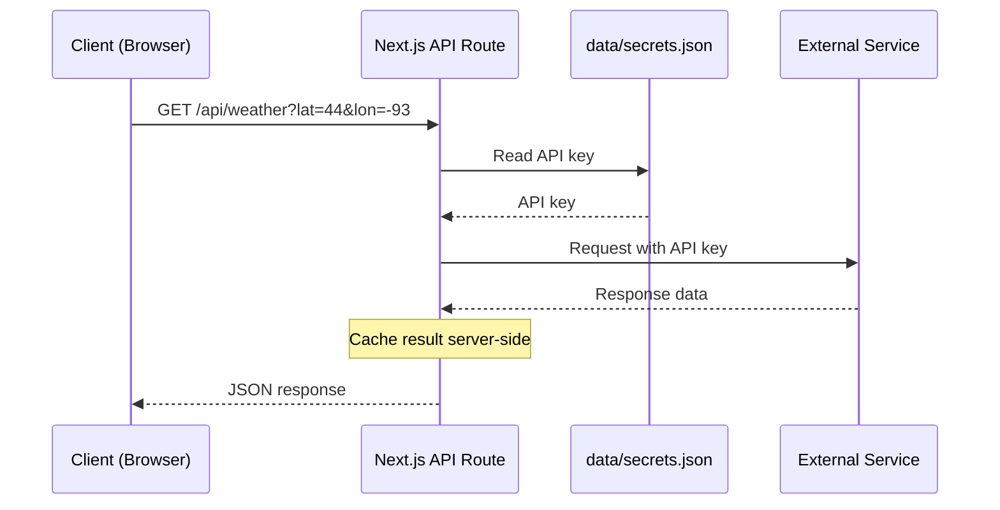

All API routes are served under `/api/`. They act as server-side proxies to protect API keys and avoid CORS issues. API keys and credentials are managed through the editor UI (Settings > Integrations) and stored server-side; no `.env.local` file is needed.



## Configuration

### GET /api/config

Returns the current screen configuration.

**Response:** `ScreenConfiguration` object (see [Configuration](/docs/configuration))

### PUT /api/config

Saves the screen configuration. Performs an atomic write (temp file + rename) to prevent corruption. Also syncs kiosk.conf for the kiosk launcher and applies display settings (rotation/resolution) immediately via wlr-randr when they change.

**Body:** `ScreenConfiguration` object

**Response:** The full `ScreenConfiguration` object as saved.

---

## Weather

### GET /api/weather

Fetches weather data from the configured provider. Supports five providers: OpenWeatherMap, WeatherAPI, Pirate Weather, NOAA, and Open-Meteo. Results are cached for 5 minutes.

| Parameter | Type | Default | Description |
|---|---|---|---|
| `type` | string | `"both"` | `hourly`, `forecast`, or `both` |
| `provider` | string | from config | `openweathermap`, `weatherapi`, `pirateweather`, `noaa`, or `open-meteo` |
| `lat` | number | from config | Latitude |
| `lon` | number | from config | Longitude |
| `units` | string | `"imperial"` | `metric` or `imperial` |

**Response:**
```json
{
  "hourly": [
    { "time": "2pm", "temp": 72, "icon": "sun", "precipitation": 0, "humidity": 45, "wind": 8, "feelsLike": 70 }
  ],
  "forecast": [
    { "day": "Mon", "date": "2026-03-09", "high": 75, "low": 55, "icon": "cloud-sun", "precipitation": 20, "humidity": 50, "wind": 12, "precipAmount": 0.1 }
  ],
  "minutely": [],
  "alerts": []
}
```

The `minutely` and `alerts` fields are included when the provider supports them (e.g. Pirate Weather).

---

## Calendar

### GET /api/calendar

Fetches events from Google Calendar. Requires OAuth to be configured.

| Parameter | Type | Description |
|---|---|---|
| `calendarIds` | string | Comma-separated calendar IDs |
| `timeMin` | string | ISO 8601 start time |
| `timeMax` | string | ISO 8601 end time |

**Response:**
```json
[
  {
    "id": "event-id",
    "summary": "Team Meeting",
    "start": "2026-03-08T10:00:00-06:00",
    "end": "2026-03-08T11:00:00-06:00",
    "location": "Room 42",
    "calendarColor": "#4285f4"
  }
]
```

### GET /api/calendars

Lists the authenticated user's Google Calendars.

**Response:**
```json
[
  { "id": "primary", "summary": "My Calendar", "backgroundColor": "#4285f4" }
]
```

---

## Holidays

### GET /api/holidays

Fetches public holidays for a country using the [Nager.Date API](https://date.nager.at/). Results are cached for 30 days. No API key required.

#### List available countries

Pass the `countries` query parameter (no value needed) to get the list of supported countries.

**Example:** `GET /api/holidays?countries`

**Response:**
```json
[
  { "countryCode": "US", "name": "United States" },
  { "countryCode": "DE", "name": "Germany" }
]
```

#### Get holidays for a country

| Parameter | Type | Default | Description |
|---|---|---|---|
| `country` | string | required | Two-letter country code (e.g. `US`, `DE`, `GB`) |
| `year` | number | current year | Year to fetch holidays for |

**Example:** `GET /api/holidays?country=US&year=2026`

**Response:** Array of `CalendarEvent` objects (only public holidays, not observances).
```json
[
  {
    "id": "holiday-US-2026-01-01",
    "title": "New Year's Day",
    "start": "2026-01-01",
    "end": "2026-01-02",
    "allDay": true,
    "sourceId": "holidays",
    "sourceName": "Public Holidays",
    "calendarColor": "#10b981"
  }
]
```

---

## Chores

### GET /api/chores

Returns chore completion records. Automatically purges entries older than 30 days.

**Response:**
```json
{
  "completions": [
    {
      "choreId": "chore-1",
      "memberId": "member-1",
      "date": "2026-03-08",
      "completedAt": "2026-03-08T14:30:00.000Z"
    }
  ]
}
```

### POST /api/chores

Toggles a chore completion. If the completion already exists for the given choreId + memberId + date, it is removed; otherwise it is added. Requires a valid session.

**Body:**
```json
{
  "choreId": "chore-1",
  "memberId": "member-1",
  "date": "2026-03-08"
}
```

The `date` field must be in `YYYY-MM-DD` format.

**Response:** `{ "completions": [...] }` (the full updated completions list)

### GET /api/chores/data

Returns the shared chore member and chore definition data from `data/chores.json`. This is the source of truth used by the chore chart widget, fullscreen chore chart module, and the remote Chores tab.

**Response:**
```json
{
  "members": [
    { "id": "member-1", "name": "Alice", "emoji": "🦊", "color": "#f59e0b" }
  ],
  "chores": [
    {
      "id": "chore-1",
      "name": "Make bed",
      "emoji": "🛏️",
      "points": 2,
      "frequency": "daily",
      "daysOfWeek": [1, 2, 3, 4, 5],
      "timeOfDay": "morning",
      "assigneeIds": ["member-1"],
      "rotation": "fixed"
    }
  ]
}
```

### PUT /api/chores/data

Updates the shared chore member and definition data. Requires a valid session.

**Body:**
```json
{
  "members": [ ... ],
  "chores": [ ... ]
}
```

Both `members` and `chores` must be arrays. The full set replaces the existing data.

**Response:** The saved `{ members, chores }` object.

---

## Meals

### GET /api/meals/data

Returns saved meals, weekly plan, and grocery checked state from `data/meals.json`. Accessible by the display (display token auth).

**Response:**
```json
{
  "savedMeals": [
    { "id": "meal-1", "name": "Tacos", "emoji": "🌮", "tags": ["quick"], "prepTime": 20, "difficulty": "easy" }
  ],
  "plan": [
    { "date": "2026-04-04", "slot": "dinner", "mealId": "meal-1" }
  ],
  "groceryChecked": ["tortillas"]
}
```

The `plan` array uses ISO date strings (e.g. `"2026-04-04"`) for multi-week support. Entries older than 12 weeks are pruned on write.

### PUT /api/meals/data

Updates saved meals and weekly plan. Requires a valid session.

**Body:**
```json
{
  "savedMeals": [ ... ],
  "plan": [ ... ],
  "groceryChecked": [ ... ],
  "force": false
}
```

Both `savedMeals` and `plan` must be arrays. The `groceryChecked` field is optional (preserves existing if omitted). Set `force: true` to allow overwriting with empty arrays (safety guard against accidental wipes).

**Response:** The saved `{ savedMeals, plan, groceryChecked }` object.

### GET /api/meals/grocery

Returns just the grocery checked state.

**Response:** `{ "groceryChecked": ["tortillas", "cheese"] }`

### POST /api/meals/grocery

Toggles a grocery item's checked state. If the item is already checked, it is unchecked; otherwise it is checked. Requires a valid session.

**Body:**
```json
{
  "item": "tortillas"
}
```

**Response:** `{ "groceryChecked": [...] }` (the full updated list)

---

## Rewards

### GET /api/rewards

Returns reward definitions, point balances, and redemption history from `data/rewards.json`. Accessible by the display (display token auth).

**Response:**
```json
{
  "rewards": [
    { "id": "reward-1", "name": "Ice Cream", "emoji": "🍦", "cost": 50, "description": "Pick any flavor", "memberIds": [], "enabled": true }
  ],
  "balances": { "member-1": 120 },
  "redemptions": [
    { "id": "r-1", "rewardId": "reward-1", "rewardName": "Ice Cream", "memberId": "member-1", "memberName": "Alice", "cost": 50, "redeemedAt": "2026-04-01T18:00:00.000Z" }
  ]
}
```

### POST /api/rewards

Redeems a reward for a member. Checks eligibility (member restriction) and sufficient point balance. Accessible by the display (display token auth).

**Body:**
```json
{
  "rewardId": "reward-1",
  "memberId": "member-1"
}
```

**Response:** The updated `{ rewards, balances, redemptions }` object.

### PUT /api/rewards/data

Updates reward definitions (add, edit, remove rewards). Requires a valid session.

**Body:**
```json
{
  "rewards": [ ... ]
}
```

**Response:** `{ "rewards": [...] }` (the saved reward definitions)

### POST /api/rewards/data

Manual point balance adjustment. Requires a valid session.

**Body:**
```json
{
  "memberId": "member-1",
  "amount": 10
}
```

Positive amounts credit points; negative amounts debit. Amount must be non-zero.

**Response:** The updated `{ rewards, balances, redemptions }` object.

---

## Authentication

### GET /api/auth/status

Returns whether password authentication is enabled and whether the current session is authenticated.

**Response:**
```json
{ "authEnabled": true, "authenticated": true }
```

### POST /api/auth/login

Authenticates with a password. Sets a session cookie on success. Rate-limited to 5 failed attempts per 15-minute window (shared with the password endpoint).

**Body:** `{ "password": "...", "rememberMe": false }`

| Field | Type | Default | Description |
|---|---|---|---|
| `password` | string | required | The authentication password |
| `rememberMe` | boolean | `false` | If `true`, session lasts 90 days instead of 30 |

**Response:** `{ "ok": true }` (with `Set-Cookie` header)

### POST /api/auth/logout

Clears the session cookie.

**Response:** `{ "success": true }` (with `Set-Cookie` header clearing the session)

### POST /api/auth/password

Sets, changes, or disables the password. Requires a valid session if auth is already enabled.

**Body (set/change):** `{ "currentPassword": "...", "newPassword": "..." }`

**Body (disable):** `{ "currentPassword": "...", "action": "disable" }`

**Constraints:** Password must be at least 8 characters.

**Response:** `{ "success": true, "authEnabled": true }`

### GET /api/auth/display-token

Returns the current display token used by the kiosk view and remote to authenticate API requests. Requires a valid session.

**Response:**
```json
{ "displayToken": "hs_abc123..." }
```

Returns `{ "displayToken": null }` if authentication is not enabled.

### POST /api/auth/display-token

Regenerates the display token. The previous token is immediately invalidated — the display must reload to pick up the new token. Requires a valid session.

**Response:**
```json
{ "displayToken": "hs_xyz789..." }
```

### POST /api/auth/revoke-sessions

Revokes all active sessions by bumping the session epoch. All users (including the caller) will need to log in again. Requires a valid session.

**Response:** `{ "ok": true }`

---

## Google Auth

### GET /api/auth/google

Initiates the OAuth 2.0 web redirect flow. Redirects the browser to Google's consent screen. Requires a valid session.

### GET /api/auth/google/callback

OAuth callback handler. Exchanges the authorization code for tokens and redirects back to the editor with a `google_auth=success` or `google_auth=error` query parameter. Validates a CSRF state cookie.

### GET /api/auth/google/status

Returns whether Google OAuth is currently authenticated and whether client credentials are configured. Requires a valid session.

**Response:**
```json
{ "connected": true, "credentialsConfigured": true }
```

### DELETE /api/auth/google/status

Disconnects the Google OAuth integration. Requires a valid session.

**Response:** `{ "connected": false }`

### POST /api/auth/google/device

Initiates the OAuth 2.0 device flow. Returns a user code for the user to enter at the verification URL. Requires a valid session.

**Response:**
```json
{
  "verification_url": "https://www.google.com/device",
  "user_code": "ABCD-EFGH",
  "device_code": "...",
  "expires_in": 1800,
  "interval": 5
}
```

### PUT /api/auth/google/device

Polls for device flow token completion. Requires a valid session.

**Body:** `{ "device_code": "..." }`

---

## Secrets

### GET /api/secrets

Returns which API keys are configured (as booleans, not the actual values). Requires a valid session.

**Response:**
```json
{
  "openweathermap_key": true,
  "weatherapi_key": false,
  "pirateweather_key": false,
  "unsplash_access_key": true,
  "todoist_token": false,
  "google_maps_key": false,
  "tomtom_key": false,
  "google_client_id": true,
  "google_client_secret": true
}
```

### PUT /api/secrets

Saves an API key or credential. Validates Todoist tokens before saving. Requires a valid session.

**Body:** `{ "key": "openweathermap_key", "value": "abc123..." }`

**Response:** `{ "ok": true }`

### DELETE /api/secrets

Deletes an API key or credential. Requires a valid session.

**Body:** `{ "key": "openweathermap_key" }`

**Response:** `{ "ok": true }`

---

## Todoist

### GET /api/todoist

Fetches all tasks, projects, sections, and labels from the Todoist API. Enriches tasks with project names, colors, section names, and label colors. Requires a Todoist API token to be configured in Settings > Integrations.

**Response:**
```json
{
  "tasks": [
    {
      "id": "123",
      "content": "Buy groceries",
      "description": "",
      "priority": 1,
      "due": { "date": "2026-03-09", "datetime": "2026-03-09T17:00:00Z", "isRecurring": false },
      "labels": ["errands"],
      "labelColors": { "errands": "#ff9933" },
      "projectId": "456",
      "projectName": "Personal",
      "projectColor": "#4073ff",
      "sectionId": "",
      "sectionName": "",
      "parentId": null,
      "order": 1,
      "commentCount": 0
    }
  ],
  "projects": [
    { "id": "456", "name": "Personal", "color": "#4073ff", "order": 1 }
  ]
}
```

### PUT /api/todoist

Saves a Todoist API token. Validates the token against the Todoist API before storing. Requires a valid session.

**Body:** `{ "token": "..." }`

**Response:** `{ "ok": true }`

---

## Data Feeds

### GET /api/stocks

Fetches stock prices from Yahoo Finance.

| Parameter | Type | Description |
|---|---|---|
| `symbols` | string | Comma-separated stock symbols (e.g. `AAPL,GOOGL`) |

**Response:**
```json
{
  "stocks": [
    { "symbol": "AAPL", "price": 178.52, "change": 2.31, "changePercent": 1.31 }
  ]
}
```

### GET /api/crypto

Fetches cryptocurrency prices from CoinGecko.

| Parameter | Type | Description |
|---|---|---|
| `ids` | string | Comma-separated CoinGecko IDs (e.g. `bitcoin,ethereum`) |

**Response:**
```json
{
  "prices": [
    { "id": "bitcoin", "name": "Bitcoin", "symbol": "BTC", "price": 67234.00, "change24h": -2.1 }
  ]
}
```

### GET /api/news

Parses an RSS feed and returns articles.

| Parameter | Type | Description |
|---|---|---|
| `feed` | string | RSS feed URL |

**Response:**
```json
{
  "items": [
    { "title": "Article Title", "link": "https://...", "pubDate": "2026-03-08T12:00:00Z" }
  ]
}
```

### GET /api/jokes

Returns a random dad joke.

**Response:**
```json
{ "joke": "Why don't skeletons fight each other? They don't have the guts." }
```

### GET /api/quote

Returns a daily inspirational quote from ZenQuotes.

**Response:**
```json
{ "quote": "The only way to do great work is to love what you do.", "author": "Steve Jobs" }
```

### GET /api/history

Returns historical events for today's date. Fetches from Wikipedia "On This Day" and MuffinLabs in parallel, deduplicates by year, and shuffles. Results are cached daily per source combination.

**Query parameters:**

| Parameter | Type | Default | Description |
|---|---|---|---|
| `sources` | string | `"muffinlabs,wikipedia"` | Comma-separated list of sources to fetch from |

**Response:**
```json
{
  "events": [
    { "year": "1983", "text": "The first mobile phone call was made.", "source": "wikipedia" }
  ]
}
```

---

## Traffic

### GET /api/traffic

Fetches estimated travel times. Supports Google Routes API or TomTom.

| Parameter | Type | Description |
|---|---|---|
| `routes` | string | JSON-encoded array of `{ label, origin, destination }` objects |

**Response:**
```json
{
  "routes": [
    { "label": "To Work", "duration": "25 mins", "distance": "18.3 mi", "trafficDelay": "5 mins" }
  ]
}
```

---

## Sports

### GET /api/sports

Fetches live scores from ESPN. Results are cached for 1 minute.

| Parameter | Type | Description |
|---|---|---|
| `leagues` | string | Comma-separated: `nfl`, `nba`, `mlb`, `nhl`, `mls`, `epl` |

**Response:**
```json
{
  "games": [
    {
      "id": "401584701",
      "league": "NBA",
      "status": "In Progress",
      "detail": "4th Quarter",
      "shortDetail": "4th - 3:42",
      "state": "in",
      "startTime": "2026-03-08T00:00:00Z",
      "homeTeam": "Lakers",
      "homeTeamAbbr": "LAL",
      "homeTeamLogo": "https://a.espncdn.com/...",
      "homeTeamColor": "552583",
      "homeScore": 98,
      "homeRecord": "38-22",
      "awayTeam": "Celtics",
      "awayTeamAbbr": "BOS",
      "awayTeamLogo": "https://a.espncdn.com/...",
      "awayTeamColor": "007A33",
      "awayScore": 102,
      "awayRecord": "42-18",
      "broadcast": "ESPN"
    }
  ]
}
```

The `state` field indicates game state: `pre` (not started), `in` (in progress), or `post` (final).

### GET /api/standings

Fetches league standings from ESPN. Results are cached for 5 minutes. Team colors are fetched from the ESPN teams API and cached for 1 hour.

| Parameter | Type | Default | Description |
|---|---|---|---|
| `league` | string | `"nfl"` | One of: `nfl`, `nba`, `wnba`, `mlb`, `nhl`, `mls`, `epl`, `laliga`, `bundesliga`, `seriea`, `ligue1`, `liga_mx` |
| `grouping` | string | `"division"` | `division`, `conference`, or `league` |

**Response:**
```json
{
  "groups": [
    {
      "name": "NFC North",
      "league": "NFL",
      "entries": [
        {
          "rank": 1,
          "team": "Detroit Lions",
          "teamAbbr": "DET",
          "teamShort": "Lions",
          "teamLogo": "https://a.espncdn.com/...",
          "teamColor": "0076B6",
          "wins": 14,
          "losses": 3,
          "winPct": 0.824,
          "streak": "W3",
          "playoffSeed": 1,
          "clincher": "z"
        }
      ]
    }
  ]
}
```

Entries include sport-specific fields: `ties`, `pointsFor`, `pointsAgainst`, `differential` (NFL); `otLosses`, `points`, `homeRecord`, `awayRecord`, `last10` (NHL); `draws`, `points`, `goalDiff`, `gamesPlayed` (soccer); `gamesBack`, `streak`, `last10`, `homeRecord`, `awayRecord` (NBA/MLB).

---

## Air Quality

### GET /api/air-quality

Returns air quality and UV data from OpenWeatherMap.

| Parameter | Type | Description |
|---|---|---|
| `lat` | number | Latitude (falls back to config) |
| `lon` | number | Longitude (falls back to config) |

**Response:**
```json
{
  "aqi": 2,
  "pm25": 12.5,
  "pm10": 18.3,
  "o3": 45.2,
  "no2": 15.8,
  "uv": 6.3
}
```

---

## Rain Map

### GET /api/rain-map

Returns precipitation map tile data from RainViewer. Results are cached for 5 minutes. No API key required.

**Response:**
```json
{
  "version": "2.0",
  "generated": 1709913600,
  "host": "https://tilecache.rainviewer.com",
  "radar": {
    "past": [
      { "time": 1709913000, "path": "/v2/radar/..." }
    ],
    "nowcast": [
      { "time": 1709914200, "path": "/v2/radar/..." }
    ]
  },
  "satellite": {
    "infrared": [
      { "time": 1709913000, "path": "/v2/satellite/..." }
    ]
  }
}
```

---

## Image Proxy

### GET /api/image-proxy

Proxies external images through the server to avoid CORS and mixed-content issues. Responses are cached in-memory for 24 hours (max 200 entries). Only allows requests to whitelisted hosts (currently `a.espncdn.com`).

| Parameter | Type | Description |
|---|---|---|
| `url` | string | Full URL of the image to proxy |

**Response:** The image binary with appropriate `Content-Type` header and a 7-day browser cache.

---

## Server Time

### GET /api/time

Returns the current server time. Useful for synchronizing display clocks with the server.

**Response:**
```json
{
  "iso": "2026-03-09T14:30:00.000Z",
  "timezone": "America/Chicago",
  "formatted": "2:30:00 PM"
}
```

---

## Backgrounds

### GET /api/backgrounds

Lists all uploaded background images.

**Response:**
```json
["sunset.jpg", "mountains.png", "city-night.webp"]
```

### POST /api/backgrounds

Uploads a new background image.

**Body:** `multipart/form-data` with `file` field

**Constraints:**
- Max size: 10 MB
- Accepted types: JPEG, PNG, WebP, GIF

**Response:** `{ success: true, filename: "uploaded-name.jpg" }`

### DELETE /api/backgrounds

Deletes a background image.

| Parameter | Type | Description |
|---|---|---|
| `filename` | string | Name of the file to delete |

### GET /api/backgrounds/serve

Serves a background image file.

| Parameter | Type | Description |
|---|---|---|
| `file` | string | Filename to serve |

### GET /api/backgrounds/rotate

Returns a rotating background image (Unsplash integration).

| Parameter | Type | Description |
|---|---|---|
| `screenId` | string | Screen ID for per-screen rotation |

### GET /api/backgrounds/directories

Lists all subdirectories in the backgrounds folder, including image counts per directory. Scans up to 2 levels deep. Requires a valid session.

**Response:**
```json
{
  "directories": [
    { "name": "All Photos", "path": "", "imageCount": 12 },
    { "name": "Nature", "path": "Nature", "imageCount": 5 },
    { "name": "Landscapes", "path": "Nature/Landscapes", "imageCount": 3 }
  ]
}
```

### POST /api/backgrounds/directories

Creates a new subdirectory in the backgrounds folder. Directory names are sanitized (only alphanumeric, `.`, `-`, `_` allowed). Maximum nesting depth is 2. Requires a valid session.

**Body:** `{ "name": "Nature", "parent": "" }`

The `parent` field is optional; omit it or pass `""` to create a top-level directory.

**Response (201):** `{ "path": "Nature" }`

### DELETE /api/backgrounds/directories

Deletes an empty subdirectory. Refuses to delete directories that still contain files. Requires a valid session.

**Body:** `{ "path": "Nature/Landscapes" }`

**Response:** `{ "deleted": "Nature/Landscapes" }`

---

## Unsplash

### GET /api/unsplash

Search or list Unsplash photos. Requires an Unsplash access key in settings.

### GET /api/unsplash/random

Returns a random Unsplash photo with optional query filter.

---

## NASA

### GET /api/nasa

Fetches NASA images. Supports two modes: Image Library search and Astronomy Picture of the Day (APOD). Requires a valid session.

#### Image Library search (no API key needed)

| Parameter | Type | Default | Description |
|---|---|---|---|
| `type` | string | `"search"` | Set to `"search"` |
| `query` | string | `"nebula"` | Search query |
| `page` | number | `1` | Page number |

**Response:**
```json
{
  "photos": [
    {
      "id": "PIA12345",
      "title": "Nebula Image",
      "description": "A beautiful nebula...",
      "date": "2026-03-08T00:00:00Z",
      "thumb": "https://images-assets.nasa.gov/image/PIA12345/PIA12345~thumb.jpg",
      "nasaId": "PIA12345"
    }
  ],
  "totalPages": 42,
  "total": 500
}
```

#### Astronomy Picture of the Day (requires NASA API key)

| Parameter | Type | Default | Description |
|---|---|---|---|
| `type` | string | | Set to `"apod"` |
| `count` | number | `12` | Number of random APOD images to return |

**Response:**
```json
{
  "photos": [
    {
      "id": "2026-03-08",
      "title": "The Horsehead Nebula",
      "description": "One of the most identifiable nebulae...",
      "date": "2026-03-08",
      "url": "https://apod.nasa.gov/apod/image/2603/horsehead.jpg",
      "hdurl": "https://apod.nasa.gov/apod/image/2603/horsehead_full.jpg",
      "thumb": "https://apod.nasa.gov/apod/image/2603/horsehead.jpg"
    }
  ]
}
```

### POST /api/nasa

Downloads a NASA image and saves it as a background. Requires a valid session.

**Body:** `{ "imageUrl": "https://...", "filename": "nasa-horsehead" }`

**Response (201):** `{ "filename": "nasa-horsehead.jpg", "path": "..." }`

### GET /api/nasa/asset

Resolves a NASA Image Library asset ID to the best available image URL. Picks the highest-resolution variant available (orig > large > medium). Requires a valid session.

| Parameter | Type | Description |
|---|---|---|
| `nasaId` | string | NASA Image Library asset ID (e.g. `PIA12345`) |

**Response:**
```json
{ "imageUrl": "https://images-assets.nasa.gov/image/PIA12345/PIA12345~orig.jpg" }
```

Returns `{ "imageUrl": null }` if no image files are found for the asset.

---

## Plugins

The plugin system allows third-party modules to be installed from a central registry. Plugins are distributed as tarballs containing a manifest, a JavaScript bundle, and optional assets.

### GET /api/plugins/registry

Fetches the plugin registry listing all available plugins and their versions.

**Response:**
```json
{
  "schemaVersion": 1,
  "lastUpdated": "2026-03-08T00:00:00Z",
  "plugins": [
    {
      "id": "example-plugin",
      "name": "Example Plugin",
      "description": "An example widget plugin",
      "author": "Author Name",
      "repo": "https://github.com/...",
      "license": "MIT",
      "category": "data",
      "tags": ["example"],
      "icon": "puzzle",
      "verified": true,
      "permissions": ["network", "secrets"],
      "versions": [
        {
          "version": "1.0.0",
          "minAppVersion": "0.18.0",
          "releaseDate": "2026-03-08",
          "downloadUrl": "https://...",
          "sha256": "abc123...",
          "changelog": "Initial release"
        }
      ]
    }
  ]
}
```

### GET /api/plugins/installed

Returns the list of installed plugins and a hash for cache invalidation.

**Response:**
```json
{
  "schemaVersion": 1,
  "plugins": [
    {
      "id": "example-plugin",
      "version": "1.0.0",
      "installedAt": "2026-03-08T12:00:00.000Z",
      "enabled": true,
      "moduleType": "example-widget"
    }
  ],
  "pluginHash": "a1b2c3d4"
}
```

### POST /api/plugins/install

Installs a plugin from the registry. Downloads the tarball, verifies its SHA-256 checksum, and extracts it. Requires a valid session.

**Body:** `{ "pluginId": "example-plugin", "version": "1.0.0" }`

**Response:** `{ "success": true }`

### DELETE /api/plugins/install

Uninstalls a plugin. Requires a valid session.

**Body:** `{ "pluginId": "example-plugin" }`

**Response:** `{ "success": true }`

### PATCH /api/plugins/install

Updates a plugin's state (enable/disable or clear previous version after config migration). Requires a valid session.

**Body:**
```json
{
  "pluginId": "example-plugin",
  "enabled": true,
  "clearPrevVersion": false
}
```

Both `enabled` and `clearPrevVersion` are optional.

**Response:** `{ "success": true }`

### GET /api/plugins/manifest/:pluginId

Returns the full manifest for an installed plugin.

**Response:** `PluginManifest` object (includes `id`, `name`, `version`, `description`, `author`, `license`, `moduleType`, `category`, `icon`, `defaultConfig`, `defaultSize`, `configSchema`, `exports`, `secrets`, `allowedDomains`, `permissions`, etc.)

### GET /api/plugins/bundle/:pluginId

Serves the plugin's JavaScript bundle.

**Response:** `application/javascript` content.

### POST /api/plugins/proxy/:pluginId

Server-side proxy for plugin API requests. Handles domain validation (only requests to the plugin's declared `allowedDomains` are allowed), secret injection (replaces `{{secret_key}}` placeholders with stored values), rate limiting (60 requests/minute per plugin), and response caching. Maximum response size is 5 MB.

**Body:**
```json
{
  "url": "https://api.example.com/data",
  "method": "GET",
  "headers": {},
  "payload": "",
  "secretInjections": {
    "header": { "Authorization": "Bearer {{api_key}}" },
    "query": { "appid": "{{api_key}}" }
  },
  "cacheTtlMs": 60000
}
```

| Field | Type | Default | Description |
|---|---|---|---|
| `url` | string | required | Upstream URL (must match plugin's `allowedDomains`) |
| `method` | string | `"GET"` | HTTP method (`GET`, `POST`, `PUT`, or `PATCH`) |
| `headers` | object | `{}` | Additional request headers |
| `payload` | string | | Request body for POST/PUT/PATCH |
| `secretInjections.header` | object | | Headers with `{{key}}` placeholders replaced by stored secrets |
| `secretInjections.query` | object | | Query params with `{{key}}` placeholders replaced by stored secrets |
| `cacheTtlMs` | number | `60000` | Cache TTL in ms (0 to disable, max 1 hour) |

**Response:** The upstream response body with its original `Content-Type`.

### GET /api/plugins/secrets/:pluginId

Returns which secrets are configured for a plugin (booleans, never raw values). Requires a valid session.

**Response:**
```json
{
  "keys": {
    "api_key": true,
    "client_secret": false
  }
}
```

### PUT /api/plugins/secrets/:pluginId

Saves a secret value for a plugin. Requires a valid session.

**Body:** `{ "key": "api_key", "value": "abc123..." }`

**Response:** `{ "success": true }`

### DELETE /api/plugins/secrets/:pluginId

Deletes a secret for a plugin. Requires a valid session.

**Body:** `{ "key": "api_key" }`

**Response:** `{ "success": true }`

### POST /api/plugins/dev

Registers a development plugin on the server. Called automatically by the client-side dev plugin loader. Validates the manifest before accepting.

**Body:** `{ "manifest": { ... } }` (full `PluginManifest` object)

**Response:** `{ "success": true }`

---

## System

### GET /api/system/version

Returns the current application version, available tags, and upgrade status. Requires a valid session.

| Parameter | Type | Description |
|---|---|---|
| `check` | string | Set to `"true"` to force-check for updates |

**Response:**
```json
{
  "current": "0.10.0",
  "currentCommit": "a3b2e17",
  "latest": "0.11.0",
  "updateAvailable": true,
  "installedVia": "tarball",
  "channel": "release",
  "tags": [{ "tag": "v0.11.0", "version": "0.11.0", "commit": "", "hasTarball": true }],
  "upgradeRunning": false
}
```

### GET /api/system/build-id

Returns the current build hash. Used by the display to detect new deployments and auto-reload.

**Response:** Plain text build ID (e.g. `abc123`)

### GET /api/system/status

Returns an SSE (Server-Sent Events) stream of upgrade/rollback progress. Used by the editor to display real-time progress during upgrades. Requires a valid session.

**Response:** `text/event-stream` with `progress` and `output` events.

### GET /api/system/changelog

Returns recent release notes from the GitHub repository. Falls back to tags if no releases are published. Requires a valid session.

**Response:**
```json
{
  "releases": [
    {
      "tag": "v0.10.0",
      "name": "v0.10.0",
      "body": "Release notes markdown...",
      "published": "2026-03-08T00:00:00Z"
    }
  ]
}
```

### POST /api/system/upgrade

Triggers an upgrade to a specific version tag. Downloads a pre-built release tarball (or falls back to git-based upgrade for older versions). Progress is streamed via the `/api/system/status` SSE endpoint. Requires a valid session.

**Body:** `{ "tag": "v0.10.0" }`

**Response:** `{ "ok": true, "message": "Upgrade to v0.10.0 started" }`

### POST /api/system/rollback

Reverts to a specific previous version tag. Progress is streamed via the `/api/system/status` SSE endpoint. Requires a valid session.

**Body:** `{ "tag": "v0.9.0" }`

**Response:** `{ "ok": true, "message": "Rollback to v0.9.0 started" }`

### POST /api/system/power

Performs a system reboot or service restart. Requires a valid session.

**Body:** `{ "action": "reboot" }` or `{ "action": "restart-service" }`

**Response:** `{ "ok": true, "message": "System reboot scheduled" }`

The `restart-service` action requires the app to be managed by systemd (as the `home-screens` service).

### GET /api/system/stats

Returns system statistics including disk usage, OS info, memory usage, app configuration summary, and telemetry status. Requires a valid session.

**Response:**
```json
{
  "disk": {
    "total": 31268536320,
    "used": 15634268160,
    "free": 15634268160,
    "dataDir": {
      "config": 4096,
      "backups": 24576,
      "backgrounds": 10485760,
      "total": 10514432
    }
  },
  "os": {
    "hostname": "raspberrypi",
    "platform": "linux",
    "arch": "arm64",
    "uptime": 86400,
    "nodeVersion": "v22.0.0"
  },
  "memory": {
    "total": 4294967296,
    "free": 2147483648,
    "used": 2147483648
  },
  "app": {
    "screens": 3,
    "modules": 12,
    "moduleTypes": { "clock": 2, "weather": 3, "calendar": 1 },
    "profiles": 2,
    "configuredSecrets": ["openweathermap_key", "google_client_id"],
    "configSize": 4096
  },
  "telemetry": {
    "installId": "a1b2c3d4...",
    "lastBeaconAt": "2026-03-08T00:00:00Z",
    "enabled": true
  }
}
```

### GET /api/system/backups

Lists available configuration backups. Requires a valid session.

**Response:**
```json
{
  "backups": [
    { "name": "config-v0.9.0-20260308-120000.json", "size": 4096, "date": "2026-03-08T12:00:00Z" }
  ]
}
```

Pass `?download=config-v0.9.0-20260308-120000.json` to download a specific backup file.

### POST /api/system/backups

Restores a configuration backup. Requires a valid session.

**Body:** `{ "name": "config-v0.9.0-20260308-120000.json" }`

**Response:** `{ "ok": true }`

---

## Display Control

Remote control endpoints for the kiosk display. The display polls for pending commands; the editor or any HTTP client can enqueue commands.

### GET /api/display/commands

Returns and drains all pending commands from the queue. The display polls this endpoint every 3 seconds.

**Response:**
```json
{
  "commands": [
    { "type": "wake" },
    { "type": "brightness", "payload": { "value": 50 } }
  ]
}
```

### GET /api/display/status

Returns the last-known display status as reported by the display client.

**Response:**
```json
{
  "currentScreen": { "id": "abc-123", "name": "Main" },
  "activeProfile": "evening",
  "displayState": "active",
  "brightness": 100,
  "timestamp": 1709913600000
}
```

### GET /api/display/:command

Simple commands via GET -- bookmarkable from a phone or browser. Supported commands: `wake`, `sleep`, `next-screen`, `prev-screen`, `reload`, `clear-alerts`.

**Response:** `{ "ok": true, "command": "wake" }`

### POST /api/display/brightness

Sets the display brightness.

**Body:** `{ "value": 50 }` (0-100)

**Response:** `{ "ok": true, "command": "brightness", "value": 50 }`

### POST /api/display/profile

Switches the active profile. Persists the selection to the config file. Requires a valid session.

**Body:** `{ "profile": "profile-id" }`

**Response:** `{ "ok": true, "profile": "profile-id" }`

### POST /api/display/alert

Shows an alert overlay on the display.

**Body:**
```json
{
  "type": "info",
  "title": "Alert Title",
  "message": "Alert message body",
  "duration": 10000,
  "icon": "bell",
  "dismissible": true
}
```

The `type` field accepts `info`, `warning`, or `urgent`. The `icon`, `duration`, and `dismissible` fields are optional.

**Response:** `{ "ok": true, "command": "alert" }`

### POST /api/display/status

Reports the current display state. Called by the display client every 30 seconds.

**Body:**
```json
{
  "currentScreen": { "id": "abc-123", "name": "Main" },
  "displayState": "active",
  "brightness": 100,
  "timestamp": 1709913600000
}
```

Required fields: `currentScreen` (object with `id` string), `displayState` (string), and `timestamp` (number).

**Response:** `{ "ok": true }`

---

## Geocoding

### GET /api/geocode

Geocodes a location name to coordinates. Used by the weather location picker in settings.

| Parameter | Type | Description |
|---|---|---|
| `q` | string | Location query (e.g. "Minneapolis, MN") |

**Response:**
```json
[
  {
    "name": "Minneapolis",
    "state": "Minnesota",
    "country": "US",
    "lat": 44.9778,
    "lon": -93.2650
  }
]
```
