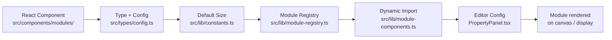
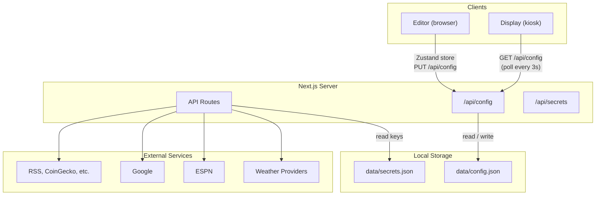

## Project Structure

```
src/
  app/
    (display)/display/       # Fullscreen kiosk view
    (editor)/editor/         # Configuration editor
    api/                     # API routes (see API Routes section below)
  components/
    modules/                 # All 39 module components + ModuleWrapper
    display/                 # ScreenRotator, ScreenRenderer, SleepOverlay
    editor/                  # Canvas, palette, property panel, settings, backgrounds
    ui/                      # Shared UI primitives (Button, Slider, Toggle, ColorPicker)
  hooks/                     # Custom React hooks
  lib/                       # Core logic (config, weather, calendar, registry, etc.)
  stores/                    # Zustand state management
  types/                     # TypeScript type definitions
data/
  config.json                # Live configuration file
public/
  backgrounds/               # Uploaded background images
scripts/                     # Install, deploy, and management scripts
```

## Architecture

### Route Groups

The app uses Next.js route groups to separate concerns:

- `(display)` — no layout chrome, just the fullscreen display
- `(editor)` — includes toolbar, sidebars, and editor controls
- `(auth)` — login and authentication pages
- `(remote)` — mobile remote control and chore tracking

### Module System

There are currently **39 modules** organized into 8 categories:

| Category | Modules |
|---|---|
| **Full Screen** | fullscreen-calendar, fullscreen-chore-chart, fullscreen-meal-planner, fullscreen-photo |
| **Time & Date** | clock, calendar, countdown, year-progress, multi-month, date |
| **Weather & Environment** | weather, moon-phase, sunrise-sunset, air-quality, rain-map |
| **News & Finance** | news, stock-ticker, crypto, sports, standings |
| **Knowledge & Fun** | dad-joke, quote, word-of-day, history |
| **Personal** | todo, sticky-note, greeting, todoist, garbage-day, affirmations, meal-planner, chore-chart |
| **Media & Display** | text, image, photo-slideshow, qr-code, iframe, display-control |
| **Travel** | traffic |

The module system follows a registry pattern. Each module is a self-contained unit:

1. **Component** — a React component in `src/components/modules/`
2. **Type** — a `ModuleType` union member in `src/types/config.ts`
3. **Config interface** — module-specific settings in `src/types/config.ts`
4. **Registration** — an entry in `src/lib/module-registry.ts` (label, icon, category, defaults)
5. **Dynamic import** — lazy loading in `src/lib/module-components.ts`

Each module requires up to 8 pieces, connected in sequence:



1. React Component (`src/components/modules/MyModule.tsx`)
2. ModuleType union (`src/types/config.ts`)
3. Config interface (`src/types/config.ts`)
4. Default size (`src/lib/constants.ts`)
5. Registry entry (`src/lib/module-registry.ts`)
6. Dynamic import (`src/lib/module-components.ts`)
7. Editor controls (`src/components/editor/PropertyPanel.tsx`)
8. (Optional) API route (`src/app/api/*/route.ts`)

### State Management

- **Editor** — Zustand store (`src/stores/editor-store.ts`) manages config, selection, and dirty state
- **Display** — server-fetched config with client-side polling (no Zustand needed)

### Data Flow



#### Editor Flow

User interactions flow through the editor canvas, which dispatches actions to the Zustand store. The store saves changes via `PUT /api/config`, which writes to `data/config.json`.

#### Display Flow

The display reads `data/config.json` via `GET /api/config` (polling every 3 seconds). The `ScreenRotator` selects the active screen, the `ScreenRenderer` lays out modules, and each `ModuleWrapper` renders its individual module component.

#### API Data Flow

Module components use the `useFetchData` hook to call API routes (e.g., `/api/weather`, `/api/calendar`), which in turn fetch data from external services (OpenWeatherMap, Google, ESPN, etc.).

### Weather Provider Abstraction

Weather data comes from a pluggable provider system in `src/lib/weather/`.

The `WeatherProvider` interface defines four methods: `getHourly`, `getForecast`, and optionally `getMinutely` and `getAlerts`. Five implementations exist:

- **OpenWeatherMapProvider** — requires API key; provides hourly and forecast data
- **WeatherAPIProvider** — requires API key; provides hourly and forecast data
- **PirateWeatherProvider** — requires API key; provides hourly, forecast, minutely precipitation, and alerts
- **NOAAProvider** — free, no API key, US only; provides hourly, forecast, and alerts
- **OpenMeteoProvider** — free, no API key, global coverage; provides hourly and forecast data

The factory function `createWeatherProvider(provider, apiKey)` instantiates the correct one. Pirate Weather (a Dark Sky replacement) additionally supports minutely precipitation data and weather alerts. NOAA uses the National Weather Service API — it's free and requires no API key, but is limited to US locations. Open-Meteo is free, requires no API key, and provides global coverage.

### API Routes

API routes live in `src/app/api/*/route.ts` and serve as server-side proxies for external services:

| Category | Routes | Purpose |
|---|---|---|
| **Auth** | `auth/login`, `auth/logout`, `auth/status`, `auth/password`, `auth/display-token`, `auth/revoke-sessions`, `auth/google`, `auth/ip-allowlist` | Authentication, session management, display token, IP allowlist |
| **System** | `system/status`, `system/version`, `system/build-id`, `system/changelog`, `system/power`, `system/upgrade`, `system/rollback`, `system/backups` | Server management and deployment |
| **Config** | `config`, `secrets` | Read/write config and manage API keys |
| **Weather** | `weather`, `rain-map` | Weather data (9 providers) and rain radar tiles |
| **Calendar** | `calendar`, `calendars` | Google Calendar events and calendar list |
| **Data** | `jokes`, `quote`, `news`, `history`, `stocks`, `crypto`, `sports`, `standings`, `todoist`, `air-quality`, `traffic` | External data proxies |
| **Display** | `display/[action]` | Remote control: wake, sleep, brightness, navigation, profiles, alerts |
| **Utility** | `backgrounds`, `geocode`, `image-proxy`, `time`, `unsplash` | Background images, geocoding, image proxying, server time, Unsplash photos |

### Display Control

Remote control uses a command queue pattern where the editor (or any HTTP client) pushes commands and the display polls to execute them.

**Command flow:** The client sends a POST request (e.g., `POST /api/display/wake`), which enqueues the command in memory. The display polls `GET /api/display/commands`, which drains the queue and returns pending commands. The display then executes each command locally.

**Status reporting:** The display periodically sends `POST /api/display/status` with its current state (screen index, screen name, display state, etc.). The editor can then read the display status via `GET /api/display/status`.

### Auth System

An authentication layer (`src/lib/auth.ts`) protects the editor and API routes. Google OAuth device flow is used for Google Calendar integration via `auth/google`.

**Password auth:** The browser sends `POST /api/auth/login` with a password, and the API responds with a session cookie.

**Google OAuth device flow:** The browser requests a device code via `POST /api/auth/google/device`, which returns a `user_code` and `verification_url`. The user enters the code at `google.com/device`. The browser polls `PUT /api/auth/google/device` until the authorization is complete, at which point tokens are stored on disk.

### Profile & Schedule System

Profiles group screens together and can activate on a schedule. Individual screens and modules also support their own scheduling so they can show/hide by day and time independent of profiles.

**Profile structure:** Each profile has an `id`, `name`, a list of `screenIds`, and an optional `schedule` (with `daysOfWeek`, `startTime`, `endTime`, and `invert` fields).

**Screen schedule:** Each screen can define an optional `schedule` (same `ModuleSchedule` shape as profiles and modules). Scheduled-off screens are filtered out of the rotation pool *before* profile resolution, so a profile that explicitly references a hidden screen still skips it. If every screen has a schedule and none currently match, the rotator falls back to all enabled screens so the kiosk never goes blank.

**Module schedule:** Each module can define a schedule with `daysOfWeek` (0=Sun through 6=Sat), `startTime`, `endTime`, and an `invert` flag (hide during the window if true).

**Screen resolution order:** Screens are first filtered by their own schedules, then profile resolution runs against the remaining set. If a scheduled profile matches the current time, the first matching profile wins; otherwise the manually selected `activeProfile` is used; otherwise all (schedule-filtered) screens rotate. Within each visible screen, modules are then filtered by their individual schedules.

## Adding a New Module

### 1. Create the component

```tsx
// src/components/modules/MyModule.tsx
'use client'

interface MyModuleProps {
  config: { myOption: string }
}

export default function MyModule({ config }: MyModuleProps) {
  return <div>{config.myOption}</div>
}
```

The component receives its `config` object as a prop. It may also receive `weather`, `calendar`, `settings`, or location props depending on the module type — check `ScreenRenderer.tsx` for the full prop-passing logic.

### 2. Add the type

In `src/types/config.ts`, add to the `ModuleType` union:

```typescript
export type ModuleType =
  | 'clock'
  | 'calendar'
  // ...
  | 'my-module'
```

And define the config interface:

```typescript
export interface MyModuleConfig {
  myOption: string
}
```

### 3. Register the module

In `src/lib/module-registry.ts`:

```typescript
import { Sparkles } from 'lucide-react'

registerModule({
  type: 'my-module',
  label: 'My Module',
  icon: Sparkles,
  category: 'Personal',
  defaultConfig: { myOption: 'Hello' },
  defaultSize: { w: 400, h: 300 },
  // defaultStyle: { fontSize: 26 },  // optional
})
```

### 4. Add the dynamic import

In `src/lib/module-components.ts`:

```typescript
'my-module': dynamic(() => import('@/components/modules/MyModule')),
```

### 5. Add editor controls

In `src/components/editor/PropertyPanel.tsx`, add a section for your module's config options:

```tsx
{module.type === 'my-module' && (
  <div>
    <label>My Option</label>
    <input
      value={module.config.myOption}
      onChange={(e) => updateModuleConfig({ myOption: e.target.value })}
    />
  </div>
)}
```

### 6. Add an API route (optional)

If your module needs external data, create a route:

```
src/app/api/my-data/route.ts
```

Then fetch it in your component using the `useFetchData` hook:

```tsx
const [data] = useFetchData('/api/my-data?param=value', 60000)
```

## Custom Hooks

| Hook | Purpose |
|---|---|
| `useFetchData(url, interval)` | Polls an API endpoint at a set interval |
| `useModuleConfig(type)` | Reads module-specific config from the editor store |
| `useRotatingIndex(length, interval)` | Cycles through an array index on a timer |
| `useScaledFontSize(base, ratio)` | Calculates responsive font sizes |
| `useSleepManager(sleep, screensaver)` | Manages display sleep/dim state |
| `useDisplayCommands()` | Polls for remote commands and reports display status |
| `useTZClock(timezone)` | Provides a live-updating `Date` for a given timezone |
| `useIdleCursor(seconds)` | Hides cursor after idle period, restores on mousemove |
| `useLiveConfig(screens, settings, profiles)` | Polls for config changes on the display |
| `useCanvasZoom()` | Manages editor canvas zoom/pan state with trackpad and keyboard support |
| `useUndoRedoShortcuts()` | Keyboard shortcuts for undo/redo (Cmd+Z, Cmd+Shift+Z) |
| `useAuthImage(src)` | Converts API-served image URLs to authenticated blob URLs |
| `useFocusTrap(ref)` | Traps keyboard focus within a modal or dialog |

## Testing

```bash
npm run test        # Run tests with Vitest
npm run lint        # Run ESLint
```

## Scripts

| Script | Description |
|---|---|
| `scripts/install.sh` | Full Raspberry Pi setup |
| `scripts/start-display.sh` | Manual server + kiosk start |
| `scripts/rotate-display.sh` | Change screen orientation |
| `scripts/deploy.sh` | Production deployment |
| `scripts/release.sh` | Version release process |
| `scripts/upgrade.sh` | Download, deploy, and restart |
